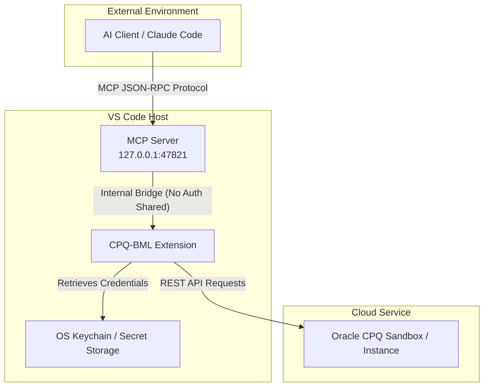

# CPQ-BML VS Code Extension

A professional, feature-rich Visual Studio Code extension for Oracle CPQ BigMachines Language (BML). This extension serves as the ultimate development environment for CPQ professionals, providing IntelliSense, syntax highlighting, robust diagnostics/linting, workspace-wide formatting, remote REST integration, and MCP-powered AI assistance.

<p align="center">
  <a href="https://marketplace.visualstudio.com/items?itemName=vikram-n.cpq-bml">
    
  </a>
  <a href="https://github.com/vikram-vn/cpq-bml/releases/latest">
    
  </a>
  <a href="https://github.com/vikram-vn/cpq-bml/releases">
    
  </a>
  <a href="https://github.com/vikram-vn/cpq-bml/blob/main/LICENSE.txt">
    
  </a>
</p>

<p align="center">
  <a href="https://marketplace.visualstudio.com/items?itemName=vikram-n.cpq-bml">
    
  </a>
  <a href="https://github.com/vikram-vn/cpq-bml/releases/latest">
    
  </a>
</p>

---


<!-- RELEASE:START -->
## 🆕 Latest Release — v1.7.0 (2026-07-02)

- Add comprehensive BML linting engine and unreachable code detection diagnostics.
- Implement settings panel UI and core linting logic for CPQ integration.
- Implement BML best-practice linting for function constraints and literal misuses.
- Add Markdown documentation transformer and BML crawler scripts.
- Reorganize BML documentation scripts into a sub-directory and add web crawler utilities.
- Add bml_crawler and bml_intellisense scripts with html-to-markdown conversion tools and linting rules.

See the full [CHANGELOG.md](CHANGELOG.md) for details.
<!-- RELEASE:END -->

## 📖 Table of Contents

- [Features at a Glance](#-features-at-a-glance)
- [Key Capabilities](#-key-capabilities)
  - [1. Language Support & IntelliSense](#1-language-support--intellisense)
  - [2. Workspace Formatter & Beautifier](#2-workspace-formatter--beautifier)
  - [3. BML Linter & Real-time Diagnostics](#3-bml-linter--real-time-diagnostics)
  - [4. Better Comments & Documentation Headers](#4-better-comments--documentation-headers)
  - [5. Interactive Settings Dashboard WebView](#5-interactive-settings-dashboard-webview)
  - [6. Remote REST Integration & Synchronization](#6-remote-rest-integration--synchronization)
  - [7. Model Context Protocol (MCP) Server for AI Integration](#7-model-context-protocol-mcp-server-for-ai-integration)
  - [8. BML Color Themes](#8-bml-color-themes)
- [⌨ Commands Reference](#-commands-reference)
- [⚙ Configuration Settings](#-configuration-settings)
- [🔧 Formatter Settings (.bmlbeautifyrc)](#-formatter-settings-bmlbeautifyrc)
- [📂 Project Structure](#-project-structure)
- [🚀 Installation & Setup](#-installation--setup)
- [💻 Local Development](#-local-development)
- [📄 License & Changelog](#-license--changelog)

---

## ✨ Features at a Glance

* 🎨 **BML Color Themes:** Four tailored editor themes offering deep semantic token coloring.
* 💡 **IntelliSense:** Context-aware auto-completion, signature help, and parameter tooltips.
* 🔍 **Linter & Diagnostics:** Real-time analysis for security (SQL Injection), deprecated APIs, and logical errors.
* 🛠 **Workspace-Wide Formatting:** Recursively beautify directories or targeted folders.
* ☁ **REST Integration:** Synchronize, compile, validate, debug, and deploy BML functions directly on remote CPQ instances.
* 🤖 **AI-Agent Connectivity (MCP):** Build or debug via AI using the secure local Model Context Protocol (MCP) server.
* 📝 **Better Comments:** Distinct visual styling for tasks, tags, directives, and function headers.

---

## 🔍 Key Capabilities

### 1. Language Support & IntelliSense

* **Rich Syntax Highlighting:** Full grammar support for BML methods, control flow statements (`if`, `elif`, `else`, `for`), database queries (`bmql`), operators, and literals.
* **Snippets Library:** Instant, context-aware code skeletons for looping constructs, common string operations, JSON manipulations, and system functions.
* **Autocomplete & Tooltips:** Signatures, return types, and parameter checklists populate as you type, matching Oracle CPQ specifications.
* **Spell Checker Integration:** Preconfigured with `cspell.json` definitions to automatically support CPQ-specific functions (`strtojavadate`, `jsonarrayrefid`, `bmql`, etc.) without triggering spelling errors.

---

### 2. Workspace Formatter & Beautifier

* **Recursive Formatting:** Run `CPQ-BML: Beautify / Format All BML Files in Workspace` (`cpqBml.beautifyWorkspace`) to format BML files recursively.
* **Folder Targeting UI:** A multi-select quick-pick picker displays workspace root paths and folders, letting you target specific modules.
* **CPQ Conventions:** Standardizes indentation, spacing, brace layouts, and enforces uppercase rules like auto-replacing the keyword `not` with the compiler-mandated `NOT`.
* **Flexible Configuration:** Formatter behavior can be overridden for specific directories using local `.bmlbeautifyrc` JSON files.

---

### 3. BML Linter & Real-time Diagnostics

The extension includes a custom BML-native static analyzer to capture defects, anti-patterns, and vulnerabilities before you upload to CPQ:

| Linter Rule Category | Diagnostic Checks & Validations | Recommendation / Fix |
| :--- | :--- | :--- |
| **SQL Injection (Vulnerability)** | Flags string concatenation inside `bmql(...)` queries. Flags `SELECT *` usage. | Recommends safe `$variable` placeholder syntax; list explicit columns. |
| **API Deprecations** | Flags outdated methods like `strtodate`, `gettabledata`, and `getpartsdata`. | Suggests `strtojavadate` and secure `bmql` database queries. |
| **Oracle Constants** | Catches JS-specific `NaN` references. | Auto-suggests CPQ-compatible `jNaN`. |
| **Return Statements** | Checks for missing return paths or invalid Commerce BML returns (missing the delimiter `\|`). | Enforces valid BML return statements and delimiter patterns. |
| **Array Boundary Safety** | Detects access on `split()` array indices without preceding `sizeofarray()` checks. | Enforces array size validation before index access. |
| **Parsing Validations** | Flags unsafe `atoi()` and `atof()` conversions. | Suggests checking numeric status first with `isnumber()`. |
| **Logic & Style** | Empty control flows (`if`, `elif`, `else`, `for`), magic literals (except `0`, `1`, `2`, `10`, `100`), and strict semicolon rules. | Recommends naming constants and formatting blocks correctly. |
| **Performance** | Nested loops, BMQL queries inside loops, string concatenation inside loops, repeated/duplicate BMQL queries on the same table. | Move queries outside loops; use `StringBuilder` (`sbappend`/`sbtostring`) for string accumulation; cache repeated queries. |
| **Design & Complexity** | Nesting depth > 3, cyclomatic complexity > 15 (counted decision points: `if`/`elif`/`for`/`and`/`or`), hardcoded URLs in string literals. | Refactor deeply nested blocks into helper functions; extract URLs into Data Tables or System Variables. |
| **Style** | Multiple statements on one line, opening/closing brace placement, `not` without parentheses around its argument, unguarded `print()` calls, lines exceeding 200 characters of code. | Enforces one-statement-per-line, collapse brace style, `not(x)` syntax, debug-flag-guarded print, and line-length limits. |
| **Safety** | Float direct equality comparison (`==`/`!=`) against a literal float, division by literal zero, `break`/`continue` outside a loop body, forbidden `_config_attributes`/`_config_attr_text` system variables. | Use a tolerance threshold for float comparison; guard division; remove misplaced loop control statements; use supported CPQ attributes instead. |
| **Syntax Errors** | Array element assignment (`arr[i] = v` is unsupported in BML), invalid member access or method calls on non-object values (e.g. `x.length`, `x.doSomething()`), `dict()` called with no type argument. | Use `append()`/`insert()` for arrays; use BML built-in functions (`sizeofarray()`, `jsonget()`, etc.) instead of dot-notation; supply a type to `dict()` (e.g., `dict("string")`). |
| **Function Calls** | Unknown bare function names (with "did you mean" typo suggestions), incorrect argument counts against Oracle's built-in signatures, mismatched argument literal types, unknown workspace `util.*` / `commerce.*` function references. | Apply Quick Fix to correct the function name; match the expected argument count and types. |
| **Dead Code & Logic** | Always-true/always-false conditions, unreachable code after unconditional `return`/`break`/`continue`/`throwerror`, duplicate `elif` branch conditions, `AND`/`OR` mixed without grouping parentheses, lonely `else { if ... }` (use `elif`), bare comparison with no effect (likely a typo for `=`). | Remove or refactor dead branches; add explicit parentheses for operator precedence; replace `else { if }` with `elif`; use assignment `=` where intended. |
| **Variable Checks** | Type-consistency violations (variable re-assigned with a conflicting literal type), variable read before its assignment in the same file (`no-undef`/useBeforeDefine, util library only), assignment to read-only CPQ system variables (`_user_*`, `_site_*`), metadata sidecar type mismatches. | Ensure consistent literal types across assignments; initialize variables before use; do not write to read-only system variables. |

#### Inline Suppressions

You can bypass specific linter rules on a granular basis using comments. Directives are **case-insensitive** and work inside both line comments and block comments:

```bml
// bml-lint-disable-file               ← suppress everything in this file
// bml-lint-disable                    ← start of suppressed block
// bml-lint-enable                     ← end of suppressed block
x = 10 / 0; // bml-lint-disable-line  ← suppress diagnostics on this line
/* bml-lint-disable-next-line */       ← suppress all diagnostics on the next line
// bml-lint-disable-next-line bml-operator-fix, bml-spelling-error
x = 10 / 0;                            ← only those two codes are suppressed
```

Supported directive styles:

| Directive | Scope |
| :--- | :--- |
| `// bml-lint-disable-file [code ...]` | Entire file, regardless of where placed |
| `// bml-lint-disable [code ...]` | From here until matching `bml-lint-enable` |
| `// bml-lint-enable [code ...]` | Re-enables a previous `bml-lint-disable` |
| `// bml-lint-disable-line [code ...]` | The line the comment is on |
| `// bml-lint-disable-next-line [code ...]` | The immediately following line |
| `/* bml-lint-disable-line */` | Same-line block comment |
| `/* bml-lint-disable-next-line */` | Block comment before the target line |

> [!TIP]
> Omitting a code list suppresses **all** diagnostics; listing one or more `bml-*` codes suppresses only those specific rules. Lightbulb **Quick Fixes** (`Ctrl+.` or `Cmd+.`) are available for many diagnostics, allowing you to auto-resolve semicolon styling, variable typos, formatting errors, or deprecated APIs instantly.

---

### 4. Better Comments & Documentation Headers

Enhance code readability by styling comments into categorized tasks, statuses, or visual callouts.

#### Custom Tag Styling

| Comment Prefix | Color / Visual Representation | Purpose / Meaning |
| :--- | :--- | :--- |
| `// !` | **Vibrant Red** (High Contrast) | Critical alert, warning, or security notice |
| `// ?` | **Soft Blue** (Italics) | Questions, design reviews, or unresolved paths |
| `// *` | **Vibrant Green** (Italics) | Highlighted note, key takeaway, or important info |
| `// //` | **Muted Strike-through** | Commented-out dead code blocks |
| `// TODO:` | **Bright Orange** | Task to be implemented |
| `// FIXME:` / `BUG:` | **Light Red (Bold)** | Code bug or issue that must be fixed |
| `// WARNING:` | **Yellow (Bold)** | High-importance action warning |
| `// HACK:` / `XXX:` | **Orange (Bold & Underlined)** | Temporary workaround or caution area |
| `// NOTE:` / `OPTIMIZE:` | **Teal (Bold)** | Performance suggestions or general context |
| `// IDEA:` | **Blue** | Design suggestion or potential improvement |

#### Directives & Block Headers

* **Lint & Formatting Directives:** Comments like `// bml-lint-disable-line` or `/* beautify ignore:start */` are styled with a distinctive purple border to keep control tags visible yet out of the way.
* **Standard Doc Headers:** Function doc blocks starting with `Function Name:`, `Description:`, `Inputs:`, or `Returns:` are automatically grouped and colorized in light blue italicized fonts.

---

### 5. Interactive Settings Dashboard WebView

Configure connections and features via a custom graphical dashboard using `CPQ-BML: Open Settings` (`cpqBml.settings.open`):

* **Connection Tab:** Input your server's site URL, authentication scheme, and active API credentials.
* **Environments Tab:** Store multiple sandboxes (e.g. `Dev`, `Test`, `UAT`, `Production`) to switch active targets.
* **Features Tab:** Toggle linting rules, Better Comments styling, and general extension assistants in a clean UI.
* **Secure Storage integration:** Connects directly with the VS Code Secret Storage API. Credentials, passwords, and tokens are saved on your OS keychain, never written in plaintext configuration files.
* **Test Connection:** A one-click check verifies remote credentials and site connectivity immediately before applying settings.

---

### 6. Remote REST Integration & Synchronization

Perform CPQ development workflows entirely inside your local editor:

* **Pull Code:** Fetch Utility Library functions and Commerce Process functions (`cpqBml.rest.pullLibraryFunctions`, `cpqBml.rest.pullCommerceFunctions`) from the remote server along with their metadata.
* **Remote Validation & Compilation:** Run `CPQ-BML: Validate Current File Against CPQ` to trigger Oracle's server-side compiler on the active document and surface syntax diagnostics locally.
* **Sandbox Debugger:** Press `CPQ-BML: Debug Current Function on CPQ` to launch a parameter picker dialog, send test values to the sandbox runtime, and review standard outputs in the terminal.
* **Deployment Controls:** Deploy modified code instantly using individual file saves, utility library batch deployments, or full commerce process configurations.

---

### 7. Model Context Protocol (MCP) Server for AI Integration

The extension runs a built-in, secure Model Context Protocol (MCP) server, allowing AI coding assistants (such as Claude Code) to securely inspect, debug, and deploy code in your workspace.



#### Security Model
Credentials, cookies, and secret tokens are kept within the extension's secure context. The MCP server does not expose these values to the AI client. It only acts as an executor, routing requests through the local extension instance.

#### AI Work Isolation
When an AI agent requests a file modification or download via MCP, the extension creates an isolated `[variableName]-AI.bml` working copy. This prevents the agent from overwriting your local scripts and ensures you can review changes via a diff tool before committing.

#### Exposed MCP Tools
* `list_util_functions`: Enumerate all remote utility library functions.
* `list_commerce_functions`: List all commerce scripts on the CPQ instance.
* `pull_function`: Fetch standard BML and save locally as `.bml` and `-meta.json` files.
* `save_function`: Apply updates to the CPQ environment.
* `validate_function`: Query the CPQ server compiler to validate changes.
* `debug_function`: Execute the function remotely with test parameters.
* `deploy_function` / `mass_deploy_util_functions`: Deploy individual or batched functions.
* `deploy_commerce_process`: Publish the entire process configuration.
* `create_util_function`: Scaffold and publish a brand new utility function.

---

### 8. BML Color Themes

Four specialized themes are bundled with the extension:
* **BML Dark**
* **BML Dark Default**
* **BML Light**
* **BML Light Default**

> [!NOTE]
> Syntax coloring is theme-driven. The extension does not force overrides onto external themes. Select one of the BML themes (`Ctrl+K Ctrl+T` / `Cmd+K Cmd+T`) to view CPQ-specific token colors.

#### Color Details
* **Categorized Functions:** Distinct colors are assigned to built-in function categories (e.g., string, math, date, DB/BMQL, array, URL, dictionary, JSON, XML).
* **Attribute Access:** CPQ member variables (such as `line.attribute` and `transaction.attribute`) are highlighted differently from general variables.
* **Operators:** Math, logical, and assignment operators are styled distinctly, helping you catch syntax typos like writing `=` instead of `==`.

---

## ⌨ Commands Reference

Use the Command Palette (`Ctrl+Shift+P` / `Cmd+Shift+P`) to trigger these actions:

| Command ID | Title | Description | Editor Toolbar Shortcut |
| :--- | :--- | :--- | :---: |
| `cpqBml.settings.open` | `CPQ-BML: Open Settings` | Launches WebView dashboard | - |
| `cpqBml.beautifyWorkspace` | `CPQ-BML: Beautify / Format All BML Files in Workspace` | Recursively formats workspace | - |
| `cpqBml.rest.changeEnvironment` | `CPQ-BML: Change Environment` | Quick-pick switch between environments | - |
| `cpqBml.rest.setPassword` | `CPQ-BML: Set CPQ Password` | Securely stores password for Basic auth | - |
| `cpqBml.rest.setAuthToken` | `CPQ-BML: Set CPQ Auth Token` | Securely stores Bearer token credentials | - |
| `cpqBml.rest.pullLibraryFunctions` | `CPQ-BML: Pull Util Library Functions from CPQ` | Downloads utility BML functions | - |
| `cpqBml.rest.pullCommerceFunctions` | `CPQ-BML: Pull Commerce Functions from CPQ` | Downloads commerce BML scripts | - |
| `cpqBml.rest.validateCurrentFile` | `CPQ-BML: Validate Current File Against CPQ` | Compiles active BML file on server | `$(check)` |
| `cpqBml.rest.debugCurrentFile` | `CPQ-BML: Debug Current Function on CPQ` | Launches live runner dialog | `$(play)` |
| `cpqBml.rest.saveCurrentFile` | `CPQ-BML: Save Current File to CPQ` | Saves buffer changes to remote CPQ | `$(cloud-upload)` |
| `cpqBml.rest.createBmlFunction` | `CPQ-BML: Create BML Function` | Scaffold BML function locally/remotely | - |
| `cpqBml.rest.deployCurrentFile` | `CPQ-BML: Deploy Current Util Function to CPQ` | Publishes utility script on server | `$(rocket)` |
| `cpqBml.rest.deployUtilFunctions` | `CPQ-BML: Mass Deploy Util Library Functions` | Pushes local utility files in batches | - |
| `cpqBml.rest.deployCommerceProcess` | `CPQ-BML: Deploy Commerce Process Setup` | Deploys active process configuration | `$(rocket)` |
| `cpqBml.rest.createOverride` | `CPQ-BML: Create Override` | Overrides standard file locally | `$(repo-forked)` |
| `cpqBml.rest.removeOverride` | `CPQ-BML: Remove Override` | Discards active local override file | `$(discard)` |
| `cpqBml.rest.clearResults` | `CPQ-BML: Clear Results Terminal` | Wipes outputs in log panel | `$(clear-all)` |
| `cpqBml.mcp.showInfo` | `CPQ-BML: Show MCP Server Connection Info` | Prints local MCP access endpoint URL | - |

---

## ⚙ Configuration Settings

Configure these options in VS Code's `settings.json` or through the Settings Editor UI:

```json
{
  "cpqBml.connection.enabled": true,
  "cpqBml.connection.siteUrl": "example.bigmachines.com",
  "cpqBml.connection.authMethod": "basic",
  "cpqBml.connection.username": "api_developer",
  "cpqBml.connection.environments": [
    {
      "name": "Dev Sandbox",
      "siteUrl": "dev.bigmachines.com",
      "username": "api_developer",
      "authMethod": "basic"
    }
  ],
  "cpqBml.rest.restVersion": "v18",
  "cpqBml.rest.commerceProcess": "oraclecpqo",
  "cpqBml.rest.commerceDocument": "transaction",
  "cpqBml.rest.pullFolder": "library",
  "cpqBml.features.lint": true,
  "cpqBml.features.comments": true,
  "cpqBml.mcp.enable": false,
  "cpqBml.mcp.port": 47821,
  "cpqBml.mcp.logToTerminal": false,
  "cpqBml.debug.logRestDetails": false,
  "cpqBml.debug.logOutputToFile": false
}
```

---

## 🔧 Formatter Settings (`.bmlbeautifyrc`)

Place a `.bmlbeautifyrc` configuration file in any directory to customize the BML formatter rules. The options are modeled after JS-beautify structures:

```json
{
  "indent_size": 2,
  "brace_style": "collapse",
  "preserve_newlines": true,
  "max_preserve_newlines": 1,
  "space_before_conditional": true
}
```

---

## 📂 Project Structure

The project has a modular design structure with clean segregation of BML editor services, REST networking, testing utilities, and AI integration:

```text
├── app/                              # Extension Core Source Code
│   └── lang/                         # Language Intelligence & Tooling
│       ├── beautify/                 # Code Formatter & Beautification Engine
│       │   ├── commandWorkspace.js   # Workspace-wide mass formatter
│       │   ├── docHeader.js          # Auto-insert /// doc block comment completion
│       │   └── index.js              # Formatting core config/integration
│       ├── comments/                 # Better Comments parser (tags, directives, headers)
│       ├── intellisense/             # IntelliSense (autocompletions, hovers, signatures)
│       │   ├── index.js              # Go to definition, References, Rename registrations
│       │   ├── workspaceIndex.js     # Codebase scanner indexing util.* & commerce.*
│       │   └── custom_snippets.json  # Smart snippet database
│       ├── lint/                     # Real-time Native Static Diagnostics
│       │   ├── lint.js               # Central rule runner pipeline
│       │   ├── nullSafety.js         # Checks nullable results of bmql() / get()
│       │   ├── typeCoercion.js       # Warns when + is used instead of ~ for string concats
│       │   └── infiniteLoop.js       # Identifies empty or non-populating loops
│       ├── mcp/                      # Model Context Protocol AI Tool Integration
│       │   ├── server.js             # Local MCP server implementation
│       │   └── tools/                # Declarative AI helper tools
│       ├── metrics/                  # Code quality analysis WebView Dashboard
│       │   ├── complexity.js         # Cyclomatic complexity & nesting depth calculations
│       │   ├── report.js             # Metrics accumulator logic
│       │   └── reportWebview.js      # WebView layout rendering
│       ├── rest/                     # Oracle CPQ REST Client Integration
│       ├── settingsPanel/            # Extension settings GUI dashboard WebView
│       ├── testing/                  # Safe sandboxed local execution & unit testing
│       │   ├── runner.js             # Sidecar *.bmltest.json executor
│       │   └── snapshot.js           # Regression snapshot comparisons
│       └── xslt/                     # XSLT preview, formatting, & linking features
│
├── test/                             # Automated Test Suites
│   ├── linter/                       # Tests for suppressions & core linter behaviors
│   ├── mcp/                          # Tests for local MCP tool server
│   └── rest/                         # Offline mocked testing for CPQ REST sync
│
├── extension.js                      # Extension Activation/Deactivation Entry-point
├── package.json                      # VS Code Extension manifest & command declarations
└── README.md                         # Project documentation
```

---

## 🚀 Installation & Setup

1. **Install from Marketplace:** Search for "CPQ-BML" in the VS Code Extensions panel (`Ctrl+Shift+X` / `Cmd+Shift+X`) and click **Install**.
2. **Initial Onboarding:** On first load, the **Settings Dashboard** will launch automatically.
3. **Set Up Environments:** Insert your site details, choose your authentication method, and verify connection.
4. **Secure Credentials:** Use the commands `CPQ-BML: Set CPQ Password` or `CPQ-BML: Set CPQ Auth Token` to securely store your passwords or keys.

---

## 💻 Local Development

If you wish to run, customize, or contribute to this extension:

### Prerequisites
* [Node.js](https://nodejs.org/) (v22 or newer recommended)
* Visual Studio Code

### Steps

1. **Clone the Repository:**
   ```bash
   git clone https://github.com/vikram-vn/cpq-bml.git
   cd cpq-bml
   ```
2. **Install Dependencies:**
   ```bash
   npm install
   ```
3. **Compile the Project:**
   ```bash
   npm run compile
   ```
4. **Run Extension Host:**
   Open the root workspace in VS Code and press **F5** (or navigate to `Run and Debug` -> `Launch Extension`). This opens an Extension Development Host window where you can test BML support immediately.

---

## 📄 License & Changelog

* **License:** This project is licensed under the [MIT License](LICENSE.txt).
* **Changelog:** Detailed version history, additions, and updates are available in [CHANGELOG.md](CHANGELOG.md).
* **Disclaimer:** This extension is an independent community project and is not affiliated with, sponsored by, endorsed by, or otherwise associated with Oracle Corporation or BigMachines.
