# BMQL

## Overview

Oracle CPQ can query system tables and user-created Data Tables from within BML by using a SQL-like syntax.

:::note
This functionality has replaced the deprecated `gettabledata()` and `getpartsdata()` functions. For more information on these and other database functions, see the topic [Direct DB Access](./DirectDBAccess.md).
:::

BMQL, Oracle CPQ's query language, is a function that contains the results of an SQL query. Click [here](http://www.w3schools.com/sql/sql_syntax.asp) for more information on SQL.

Highlights:

* A BMQL query does not cap the size of the results, unless it is an UPDATE or MODIFY statement or it uses either DISTINCT or ORDER BY. In this case, the statement can process or the result set can contain a maximum of 1,000 records.

* A BMQL query can access the parts database or user-defined tables.

* BMQL is context-sensitive and will recognize the language, currency, and selected Price Book depending on where the function is being invoked.

* BMQL can use dynamic variables for Column names, Table names, and WHERE clauses. For more information, see the topic [Dynamic BMQL Variables](./DynamicBMQLVariables.md).

BMQL functions are available to insert, delete, update, and modify Live Data Tables. When storing Transaction-related data within a Live Data Table is required as part of a business process, using BMQL functions to update Live Data Tables is recommended over using Web Services. Since the action is performed on a Live Data Table, there is no need to deploy the table after modification is complete. For more information, see [Live Data Table Statement Keywords](./LiveDataTableStatementKeywords.md).

When running insert, delete, update, or modify from a BML debugger, the returned result recordset update is simulated. The changes to data tables occur only if the BMQL statement is executed through a user action.

## Administration


## Basics


**Syntax:** bmql(sqlQuery [, stringDict])

Parameters:

| # | Parameter | Data Type                 | Description                                                                                                               |
| - | --------- | ------------------------- | ------------------------------------------------------------------------------------------------------------------------- |
| 1 | sqlQuery  | String                    | The SQL query                                                                                                             |
| 2 | [dict]    | String, Integer, or Float | **Optional:** A dictionary populated with the language context variable as a key and an overriding language as the value. |

**Return Type:** Record Set

This data type is a collection of dictionaries.  It can also be used as a function in conjunction with BMQL.

Example of bmql():

```bml
rs = recordset();
if(...) {
   rs = bmql(query1);
   }
else {
   rs = bmql(query2);
   }
return rs;
```


## Advanced


bmql(sqlQuery)

As mentioned above, this BMQL function is based on SQL syntax. In SQL, most actions performed on a database are done with a statement like: `SELECT + FROM`.

Similar to SQL, in BMQL, your "statement" would read: `SELECT(fields you want to return)FROM(which database you will be searching through)`.

When the function syntax is written as: `bmql(String sqlQuery)`, the `sqlQuery`is really the "statement", similar to the example above.

:::warning
The `sqlQuery` must be written as a String.
:::

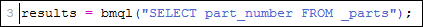

Statement Keywords


## SELECT


The SELECT statement is used to specify the columns (or fields) of desired data.

Example

```sql title="Example"
select column 1, column 2, column 3, column 4
SELECT [DISTINCT] custom_field1 from _parts
FROM dataBaseObject;
```

:::note
`dataBaseObject` refers to which object to retrieve the data from.
:::

###### Select All Columns

Oracle CPQ allows the Select * function for columns in BMQL Data Table queries. For Data Tables with a large number of columns, this greatly simplifies BMQL statements and reduces the risk of missing columns in queries. It also eliminates the need for updates if the table schema changes.

The following example shows a SELECT statement for all columns in the "customer" Data Table.

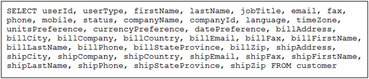

By using SELECT *, this statement can be greatly simplified as shown in the following example.

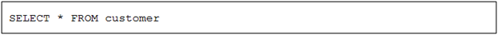

:::note
BMQL JOIN clauses do not support Select All columns functionality.
:::

###### Select All Columns in BMQL JOIN Clauses

Oracle CPQ supports the Select * function for columns in BMQL JOIN clauses for Data Table queries  with two or more tables. To use the Select * function with a Table JOIN statement, the following is required:

* Must have two deployed Data Tables to JOIN

* Both Data Tables have a column with matched data

* At least one joined column must be indexed

The following example shows a SELECT statement for joining two tables.

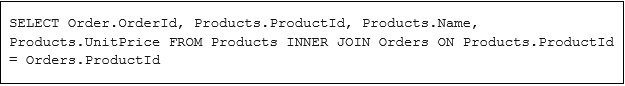

By using SELECT *, this statement can be greatly simplified as shown in the following example.

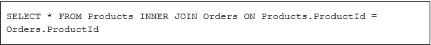


## FROM


The FROM statement is used to specify the database object from which to retrieve the data

Example

```bml title="Example"
FROM someUserCreatedTable
```


## DISTINCT


Use the DISTINCT keyword in the SELECT clause to return distinct values.

**Example:**

```sql title="Example"
SELECT [DISTINCT] custom_field1 from _parts
FROM dataBaseObject;
```

The dataBaseObject entry is description of the database object, which is the same as a Data Table. Consult the Function Wizard to see Data Table names and associated column details.

**Example:**

```sql title="Example"
SELECT [DISTINCT] field1[, field2, ..., fieldn];
FROM dataBaseObject;
[WHERE condition];
[ORDER BY field1 [ASC|DESC],[ field2 [ASC|DESC], ..., fieldn [ASC|DESC]]];
```


## ORDER BY


The ORDER BY statement is used to sort the data returned on the provided fields.

By default, fields are returned in ascending order. Use `desc`to reverse the sort order to descending and use `asc`to return the sort order to ascending.

Example

```bml title="Example"
ORDER BY column 1 desc
```

Live Data Table Statement Keywords


## DELETE


The DELETE statement is used to delete existing rows or columns into a Live Data Table. The DELETE statement is used with the FROM keyword.

Syntax

```bml title="Syntax"
RecordSet bmql(String sqlQuery [, String Dictionary contextOverride, String Dictionary fieldMap])
```

Example

```bml title="Example"
results = bmql("delete from table1 where column1 = 'value2'");
    for result in results {
    deletion_count_integer = get(result, "records_deleted");
    }
```

For DELETE statements, `results` is a records set with one integer entry that indicates the number of rows deleted.

:::warning
Executing a DELETE statement without a WHERE clause will clear all of the data in the Live Data Table.
:::


## FROM


The FROM keyword specifies the object to retrieve the data from. The FROM keyword is used with the DELETE statement.

Syntax

```bml title="Syntax"
RecordSet bmql(String sqlQuery [, String Dictionary contextOverride, String Dictionary fieldMap])
```

Example

```bml title="Example"
results = bmql("delete from table1 where column1 = 'value2'");
    for result in results {
    deletion_count_integer = get(result, "records_deleted");
    }
```

:::warning
Executing a DELETE statement without a WHERE clause will clear all of the data in the Live Data Table.
:::


## INSERT


The INSERT statement is used to add a new record into a Live Data Table. The INSERT statement is used with the INTO and VALUES keywords.

Syntax

```bml title="Syntax"
RecordSet bmql(String sqlQuery [, String Dictionary contextOverride, String Dictionary fieldMap])
```

Example

```bml title="Example"
results = bmql("insert into table1 (column1, column2) values ('value1', 11),('value2', 22)");
    for result in results {
    insert_count_integer = get(result, "records_inserted");
    records_error_string = get(results, "records_error");
    }
```

For INSERT statements, `results` is a record set with one integer entry that indicates the number of rows added. This is usually the same as the number of records in the VALUES part of the BMQL statement, but sometimes a row may fail due to duplicate natural key entries. When this occurs, a `records_error` entry is added, showing the first record that blocks the insertion as a JSON string.


## INTO


The INTO keyword is followed by the name of the Live Data Table and then a list of columns in parentheses and without quotes. These are the columns which the values statement will populate. The INTO keyword is used with the INSERT and VALUES keywords.

Syntax

```bml title="Syntax"
RecordSet bmql(String sqlQuery [, String Dictionary contextOverride, String Dictionary fieldMap])
```

Example

```bml title="Example"
results = bmql("insert into table1 (column1, column2) values ('value1', 11),('value2', 22)");
    for result in results {
    insert_count_integer = get(result, "records_inserted");
    records_error_string = get(results, "records_error");
    }
```


## MODIFY


The MODIFY statement is used to modify an existing record or create a new record in a Live Data Table. The MODIFY statement is used with the SET keyword.

Syntax

```bml title="Syntax"
RecordSet bmql(String sqlQuery [, String Dictionary contextOverride, String Dictionary fieldMap])
```

Example

```bml title="Example"
results = bmql("modify table1 set colum1 = 'new_value1', column2 = 'new_value2' where column1 = 'old_value1'");
    for result in results {
    insert_count_integer = get(result, "records_inserted");
    insert_count_integer = get(result, "records_updated");
    records_error_string = get(results, "records_error");
    }
```

For MODIFY statements, `results` is a record set with two integer entries, one with the number of rows modified and one with the number of rows added. A `records_error` entry is added when the query is valid but the Live Data Table state blocks the update.

:::warning
Executing a MODIFY statement without a WHERE clause will modify all of the data in the Live Data Table. The maximum number of records processed by a MODIFY statement with or without a WHERE clause is 1,000 records.
:::


## UPDATE


The UPDATE statement is used to update an existing record in a Live Data Table. The UPDATE statement is used with the SET keyword.

Syntax

```bml title="Syntax"
RecordSet bmql(String sqlQuery [, String Dictionary contextOverride, String Dictionary fieldMap])
```

Example

results = bmql("udpate table1 set colum1 = 'new_value1', column2 = 'new_value2' where column1 = 'old_value1'");
    for result in results {
    update_count_integer = get(result, "records_updated");
    records_error_string = get(results, "records_error");
    }

For UPDATE statements, `results`is a record set with one integer entry showing the number of rows modified. A `records_error` entry is added when the query is valid but the Live Data Table state blocks the update.

:::warning
Executing an UPDATE statement without a WHERE clause will update all of the data in the Live Data Table. The maximum number of records processed by a MODIFY statement with or without a WHERE clause is 1,000 records.
:::


## SET


The SET keyword is used to change field values in the Live Data Table. The format is the name of the column followed by the "`=`" operator and then the value to be set. For example, `string1 = 'ABC-112A'`. The SET keyword is used with MODIFY or UPDATE statements.

Syntax

```bml title="Syntax"
RecordSet bmql(String sqlQuery [, String Dictionary contextOverride, String Dictionary fieldMap])
```

Example

```bml title="Example"
results = bmql("modify table1 set colum1 = 'new_value1', column2 = 'new_value2' where column1 = 'old_value1'");
    for result in results {
    insert_count_integer = get(result, "records_inserted");
    insert_count_integer = get(result, "records_updated");
    records_error_string = get(results, "records_error");
    }
```

:::warning
Executing a MODIFY or UPDATE statements without a WHERE clause will modify or update all of the data in the Live Data Table.
:::


## VALUES


The VALUES keyword prefixes a list of records to be inserted. Each record is bracketed by parentheses and contains a list of values to be inserted. The values must be given in the same order as the columns. String values must be in single quotes. The VALUES keyword is used with the INSERT and INTO keywords.

Syntax

```bml title="Syntax"
RecordSet bmql(String sqlQuery [, String Dictionary contextOverride, String Dictionary fieldMap])
```

Example

```bml title="Example"
results = bmql("insert into table1 (column1, column2) values ('value1', 11),('value2', 22)");
    for result in results {
    insert_count_integer = get(result, "records_inserted");
    records_error_string = get(results, "records_error");
    }
```


## Operators


User operators to refine your queries. There are two kinds of operators:

* **Relational Operators:** `=`, `<>`,`<`, `>`, `<=`, `>=`, `LIKE`, `NOT LIKE`, `IN`, `NOT IN`, `IS NULL`, `IS NOT NULL`

* **Logical Operators:** `AND`, `OR`

| IS NOT NULL | This is used to find values that are not null in an array. | SELECT part_number FROM _parts WHERE part_number LIKE $var_1 **IS NOT NULL** |
| ----------- | ---------------------------------------------------------- | ---------------------------------------------------------------------------- |


## Wildcards


The symbols **%** and **_** are used as wildcards. Wildcards can only be used in a 'LIKE' query in the condition of a BMQL query. **Example:**bmql("SELECT Part FROM sammie WHERE Type LIKE '%ot'").

Three functions are available to retrieve data from the result set depending on the data type of the value being returned:

* get(string)

* getInt(integer)

* getFloat(float)


## Finding Available Tables


Within each Function Wizard, scroll down to the end of the **Behavior** section to find a link that opens a pop-up window that will show all accessible databases and Data Tables. Select the database or Data Table name to see a list of column names and whether a column can be used in the WHERE clause.

:::note
BMQL does not support a parts query that retrieves more than 500 parts from a non-default Price Book.
:::

:::tip
* The BMQL query is parsed at runtime.

* OrderBy and Distinct cannot be grouped together using AND or OR.

* For security reasons, the query cannot be built dynamically and passed into BMQL. Dynamic values can be passed in the WHERE clause of the query by preceding the variable name with a "$".
:::


## Parameters


## contextOverride


This dictionary can be populated with the language context variable as a key and an overriding language as the value. When pulling data from the _parts Data Table, this will substitute this language in place of the user's preferred language.

For a complete list of supported languages and their corresponding codes, see the topic [Language Support](./LanguageSupport.md).

If the value for the requested language is blank, the site base language will be used instead. Additionally, if the requested language is not enabled or not found, the context variable will be ignored.

**Example:**

```sql title="Example"
lang = dict("string");
put(lang, "language", "de");
results = bmql("select description from _parts where part_number = ‘Translations’", lang);
```

This will return the German description of the Translations part.

This parameter is optional.


## fieldMap


The fieldMap parameter is a string dictionary.  It is used when the WHERE clause has been completely substituted with a string variable, and there are also variables within the WHERE clause.

In this case, each variable in the dynamic WHERE clause must be passed into the fieldMap dictionary and referenced by its key in the WHERE clause.  All variables must be passed as string types, regardless of their data type in the Data Table.

**Example:**

```sql title="Example"
lang = dict(“string”);
fields = dict("string");
x_var = "6.08";
put(fields, "$field1", x_var);
where = "float1 = $field1";
results = bmql("select columnName from tableName WHERE $where", lang, fields);
```

This parameter is optional.

:::note
If the third parameter is used, the second parameter must also be defined.
:::


## JOIN Clauses


JOIN clauses in BMQL support the ANSI standard SQL syntax for JOIN clauses. A JOIN clause combines rows from two or more tables, based on a related column between them. BMQL supports the following JOIN types:

* INNER JOIN returns records that have matching values in the referenced tables.

* LEFT OUTER JOIN returns all records from the left table, and matched records from the right table.

* RIGHT OUTER JOIN returns all records from the right table, and matched records from the left table.


## Join Two Tables


Administrators can join tables using SELECT statements containing FROM and JOIN clauses. The JOIN clause can reference multiple columns from either table. For example: the following statement returns records from "Products" and "Orders" tables that have matched data in the "ProductId" field.

```sql
SELECT Order.OrderId, Products.ProductId, Products.Name, Products.UnitPrice FROM Products INNER JOIN Orders ON Products.ProductId = Orders.ProductId
```

:::note
At least one joined column for each of the join tables must be indexed or an error occurs.
:::


## JOIN Multiple Tables


JOIN clauses can also be used to join multiple tables. For example: the following statement uses LEFT OUTER JOIN and INNER JOIN to return from "Products", "Orders", and "Customers" tables.

```sql title="JOIN clauses can also be used to join multiple tables"
SELECT Orders.OrderId, Products.ProductId, Products.Name, Products.CustomerFilter, Customers.Name, Orders.Price FROM Products LEFT OUTER JOIN Orders ON Products.ProductId = Orders.ProductId INNER JOIN Customer.CustomerId = Products.CustomerFilter
```


## Dotted Notation


Dotted notation is used to select specific fields from different tables. If the column name is unique, just the column name can be referenced without using dotted notation. For example: the following statement references the unique "Name" column.

SELECT Orders.OrderId, Products.ProductId, Products.Name, Products.UnitPrice FROM Products INNER JOIN Orders ON Products.ProductId = Orders.ProductId

:::note
Even though unique names can be used without dotted notation, best practice is to use dotted notation whenever two or more tables are referenced in a BMQL query.
:::


## Enhanced ORDER BY Operation


Previously, BMQL only supported ORDER BY clauses in simple queries without dotted notation. Beginning in Release 18A,  the ORDER BY clause to supports JOIN clauses, statements with dotted notation, and statements without dotted notation that reference unique columns in BMQL.


## ORDER BY Support for JOIN Clause


ORDER BY clauses now support BMQL RIGHT OUTER JOIN, LEFT OUTER JOIN, and INNER JOIN. For example: the following statement sorts the returned JOIN results using the "Price" column.

```sql
SELECT Orders.OrderId, Products.ProductId, Products.Name, Products.UnitPrice, Orders.Quantity, Orders.Price FROM Products INNER JOIN Orders ON Products.ProductId = Orders.ProductId ORDER BY Price
```


## ORDER BY with Dotted Notation


Columns can be sorted using the ORDER BY clause and dotted notation. For example: the following statement sorts the returned JOIN results in descending order using the "Products " table "ProductId" column.

```sql
SELECT Orders.OrderId, Products.ProductId, Products.Name, Products.UnitPrice, Orders.Quantity, Order.Price FROM Products INNER JOIN Orders ON Products.ProductId = Orders.ProductId ORDER BY Products.ProductId DESC
```

:::note
* ORDER BY can be used without dotted notation if the column name is unique.

* An error message is generated when a column is specified in ORDER BY without dotted notation and that column name exists in more than one table being referenced in the BMQL query.
:::


## Sort Multiple Columns


Multiple columns can be sorted using the ORDER BY clause. For example: the following statement sorts the returned JOIN results by "Orders.CustomerId", then "Orders.Date" in descending order.

```sql title="Multiple columns can be sorted using the ORDER BY clause"
SELECT Orders.OrderId, Orders.CustomerId, Products.ProductId, Products.Name, Products.UnitPrice, Orders.Quantity, Orders.Price FROM Products INNER JOIN Orders ON Products.ProductId = Orders.ProductId ORDER BY Orders.CustomerId, Orders.Date DESC
```


## Alias Support for SELECT and FROM Clauses


Oracle CPQ 18A provides ANSI SQL JOIN support with aliasing in SELECT and FROM clauses. SQL aliases are used to give a table or a column a temporary name. Aliases are often used to make column names more readable. Aliases only exist for the duration of the query. For example: the following statement the column names for the returned results table will be renamed as "empLastName" instead of "T1.lastname", etc.

```sql
SELECT T1.lastName as empLastName, T1.firstName as empFirstName, T2.lastName as mgrLastName, T2.firstName as mgrfirstName, FROM Employee T1 INNER JOIN Employee T2 ON T1.mgrId = T2.employeeId
```


## WHERE Clauses and Parameters


## Overview


When using BMQL, your `WHERE` clauses will be your parameters.  BML variables can also be used in `WHERE` clause conditions.

The following variable data types can be used:

* string[]

* integer[]

* float[]

:::warning
The **$** symbol must precede the BML variable name when used in the query string.
:::

:::tip
Line item variables cannot be used directly in the query. 

Instead, assign line item variables to variables in BML and then use the BML variables in the query string.
:::


## WHERE Condition


The condition is the field operator. **Example:** `part_number = 'BL-5C'`.

* Use logical operators can be used to group the conditions:

```bml
field1 < 500 AND field2 = 'USD' OR field2 = 'EUR';
```

* Use parentheses to change the precedence:

```bml
field1 < 500 AND (field2 = 'USD' OR field2 = 'EUR');
```

Conditional evaluation in a WHERE clause

* Use a Boolean value with AND to conditionally evaluate the predicate in the WHERE clause.

**Syntax:** `$eval AND field = value`, where 'eval' is a Boolean variable in the script

* When 'eval' is true, the predicate 'field = value' is used in the criteria

* When 'eval' is false, the predicate is ignored

Example:

```bml title="Example"
e1 = true;
e2 = false;
rs = bmql("select... where $e1 AND f1 = v1 OR $e2 AND f2 = v2");
```

:::warning
The condition must come before the predicate.
:::

:::note
The WHERE clause is not supported for BMQL Transaction.
:::


## Conditional Evaluation


A Boolean value can be used with the AND to conditionally evaluate the predicate in the WHERE clause.

**Syntax:** $eval AND field = value, where 'eval' is a Boolean variable in the script

* When 'eval' is true the predicate 'field = value' is used in the criteria

* When 'eval' is false the predicate is ignored

**Example:**

```bml title="Example"
e1 = true;
e2 = false;
rs = bmql("select... where $e1 AND f1 = v1 OR $e2 AND f2 = v2");
```


## Using Transaction Data in Configuration


You can access Commerce transaction data, from both main documents and sub-documents, in advanced functions within Configuration.

:::note
This functionality is not supported outside of Configuration.
:::

Data Available using BMQL Transaction:

* Date

* Integer

* Float

* String

* Currency

* Summation

* Boolean

The BMQL Transaction function is context-sensitive.

* The function will automatically recognize the Transaction ID when the user arrives on the Configuration page through Commerce. 
  * It is not possible to query a separate Transaction using this function.

* Translations will be returned for menu values based on the current user’s language. 
  * For other string type attribute values, the user-entered value will be returned; translations are not defined for such inputs.

* For currency attributes, the exchange rate will be applied on the returned value if the current user’s session currency is not the same as the site's base currency.

:::note
When the user’s session currency is different from the site's base currency, exchange rates are applied to currency values being returned from advanced functions in Configuration.  

The FullAccess user should take this into account when using BMQL Transaction in advanced functions, since BMQL also applies the exchange rate on the returned value.
:::

:::warning
Approval Comments, History, RTE, HTML, and File Attachment attributes are not available through BMQL Transaction.
:::

## Use Case Examples

For all of the use cases below, we'll be using a user-created Data Table named `sammie`.

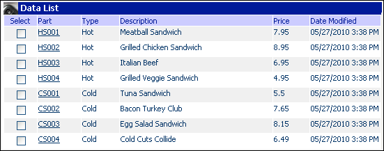


## Sample Use Case 1: Using BMQL function


In this example, let's say you'd like to run a query to return the **Price** and **Type** from the `sammie` Data Table shown above.

1. Using the information from the `sammie` Data Table, create a new script using BMQL that will return Price and Type.  Click the checkboxes in the **Select** column to select your columns and the checkboxes in the **From** column to select your database object.

2. Create a `for...loop` to loop through your record set created using the BMQL function.

3. In this example, we are using the print statement to show the results of the query.

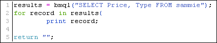

Now, you can compare the results of the query to what is on the table and see that it pulled the correct **Type** and **Price** from the table.

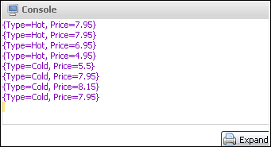

In this example, we are using the same sample case, but adding the "distinct" keyword. Remember, using distinct will only return distinct values, essentially removing any duplicates.

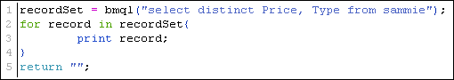

As you can see, where there were multiple sets that were the same in the first example, now those have been removed.

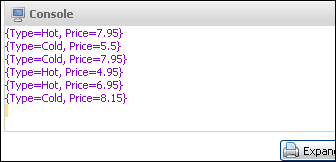


## Sample Use Case 2: Using the get function and the WHERE Clause


This example takes Sample Use Case 1 a step further by adding a `WHERE`clause to the select statement. We also add the `get()` function.

1. Using the information from the `sammie` Data Table, create a new script using BMQL that will return **Part**, **Description** and **Price** when the **Type** in the Data Table is "Hot". Click the checkboxes in the **Select** column to select your columns and the checkboxes in the **From** column to select your database object.

2. Create a `for...loop` to go through your record set created using the BMQL function.

3. Use the `get()` function with record being used like a dictionary and **Price** being the data to be returned.

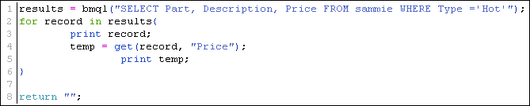

As you can see below, "record" acts like a dictionary and returns the columns and data you requested. You should also notice the `get()`function at work, returning the price for each of the records.

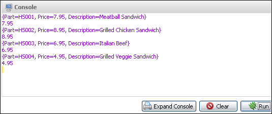


## Sample Use Case 3: Using a WHERE condition


In this example, we are going to add a condition. So, the first screen show we'll say that if the condition is true, that the predicate will query for the part number "HS001". When adding a `WHERE` condition, the syntax is `$eval AND field = value`. In this case, we are searching for part number "HS001" when the condition is True.

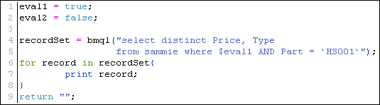
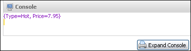

In the console, you'll notice that when the part number is "HS001", the **Price** and **Type** have been returned. We'll then evaluate what happens if the condition is False:

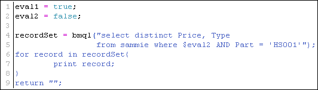
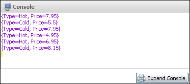

In the console, you'll notice that when the condition is False, the predicate (`Part = 'HS001`') is ignored and all other results are returned.


## Sample Use Case 4: Errors


The user can retrieve errors or warnings using the `getMessage`function.

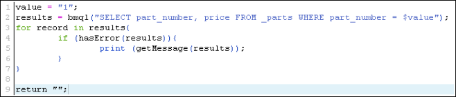


## Sample Use Case 5: Recommended Item Rule


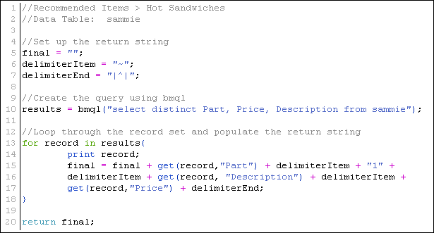


## Sample Use Case 6: Using BMQL Transaction


In this example, we'll show you how to return commerce transaction data back to configuration. The attribute Opportunity Name has been set with the value Toni's Pizza.

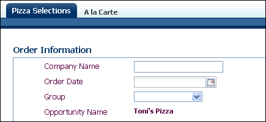

This was set through a recommendation rule using BMQL Transaction. Notice the use of `commerce.quote_process` after the `FROM` statement.  This is the variable name of the quote document from where you're querying data.  You can also use the variable name of the sub-document (for example, `line_process`).

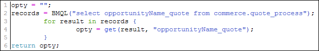

:::note
The WHERE clause is not accepted when you are returning commerce data to configuration.
:::

## Notes

:::warning
* The WHERE clause is not supported for a BMQL transaction.

* The JOIN clauses are only supported for customer-defined tables. For example, if you have a query using a JOIN clause for the sytem-defined `_parts` table, you will receive an error message.

* If the user does not arrive through Commerce, the BMQL transaction will return NULL.  This also occurs when a model is configured using SOAP.
:::

:::warning
* NULL and blank Integer values are treated as separate values:
  * NULL= 0
  * Blank = ""

* Using NULL as an attribute value is strongly discouraged.

* If you use logic that tests for NULL values in rule conditions or BML, confirm that the logic takes this difference into account.
:::

:::note
On reconfigure, BMQL Transaction will return all line items.
:::

:::tip
* BMQL is case-sensitive. Be aware of this when selecting your columns, fields, and database objects.

* Capitalize your keywords to ensure that your query string easy to read.

* For debugging BMQL, the `context paramete`r field should be populated with `"bsId=xxxxx`" where `xxxx`is a valid BSID in Commerce.
:::

## Related Topics


## See Also
