# Library Functions

## Overview

:::note
This topic covers the Library Functions  using the classic interface pages. Refer to [Util BML Library Functions List](./UtilBmlLibraryFunctionsList.md) and [Util Function Editor](./BML_Editor.md) for process administration using Redwood UI pages.
:::

The BML Function Library enables the user to write efficient and reusable custom BML functions. The user can write and store BML functions in a central library and call these functions from different areas in CPQ.

* **Util BML Library** - The functions in this library can be accessed and called throughout CPQ.

* **Commerce BML Library** - The functions in this library are accessible only to a main document-sub-document pair. Each Commerce BML library has a 1:1 relationship with a main document and sub-document pair. There can be as many Commerce BML libraries as there are document pairs in Commerce.  *The Commerce BML Library is not available until a main document has been associated with a sub-document.*

## Administration

## Using Library Functions in Configuration BML

Once a Util Library Function has been defined, it's available for use in the **Library Function(s)** tab within the Function Editor.

1. Click **Add Functions** to choose from a list of Util Functions. *A pop-up dialog will open.*

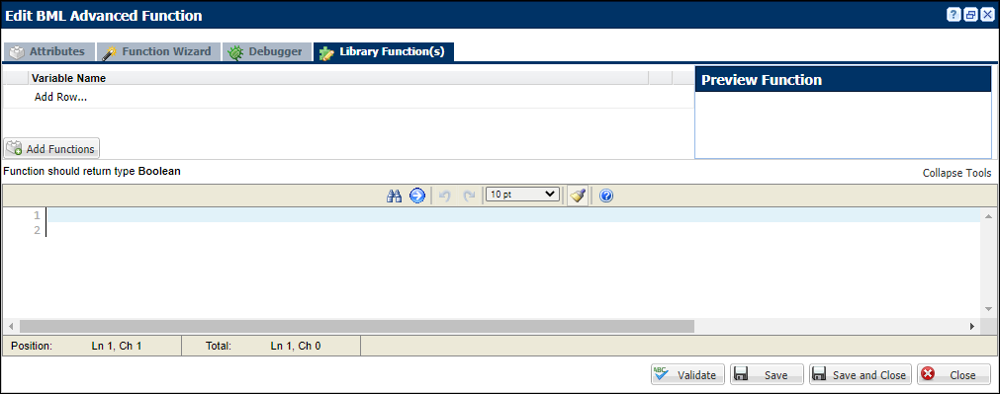

2. Click one or multiple Util Functions.

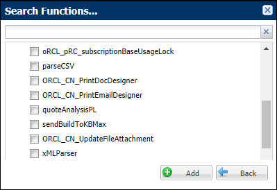

3. Return to the Util functions area and make sure you've deployed your function(s) if desired function does not appear.

## Using Library Functions in Commerce BML

When you click **Define Function** in Commerce, a window will appear asking you to select attributes.

You can select **System Variable Name**, **Variable Name for (Transaction)**, **Variable Name for (Transaction Line)**, and **Library Function(s)**.

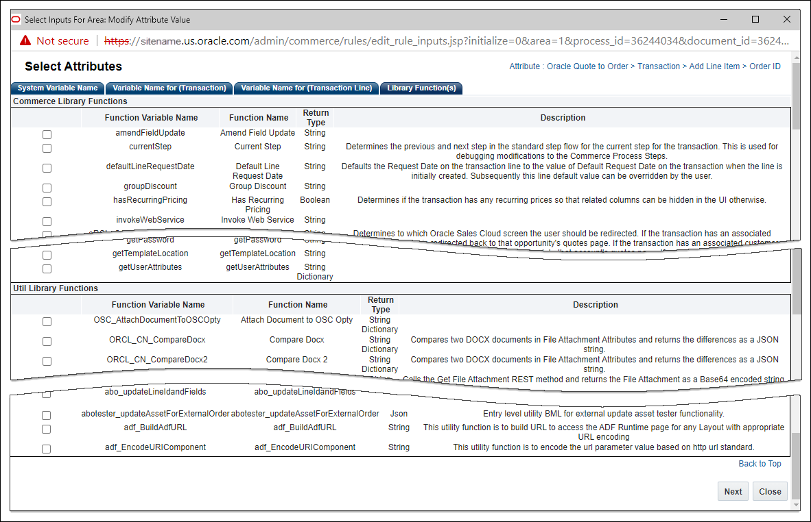

:::tip
You can add Util and Commerce Library Functions by clicking the **Reselect** button within the BML Function Editor.
:::

## Adding a Library Function

1. Click **Add Function**.

2. Choose desired function from the drop-down.

3. Select the square icon to preview the function in the pane to the right.

4. Select the blue arrow to insert the function into the **Script Definition Area**.

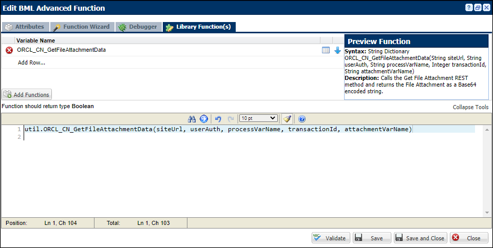

## Adding a Commerce Library Function

1. Navigate to **Admin > Commerce and Documents > Process Definition > Process** .

2. Select **Library Functions** for the appropriated document, and then click **List**.

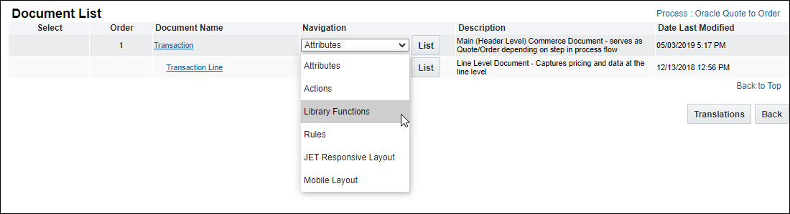

3. Select **Add** to create a new commerce library function.

4. Create a **Name**, **Variable Name**, **Description** and choose a **Return Type**.

The **Variable Name** field populates automatically. Variable names can only contain alpha-numeric characters and underscores. The entry can be changed before saving, but after saving the value is read-only.

5. Select **Add** in the **Parameter(s)** section if the function requires parameters.  *Pick a parameter name and choose a data type.*

6. Reference the parameter in the library function with the name that you specify here.

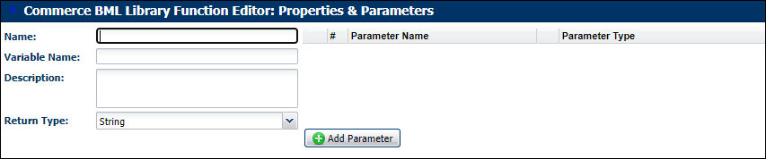

7. Select **Add Attributes** to access the main document attributes in the **Main Document Attribute** section.

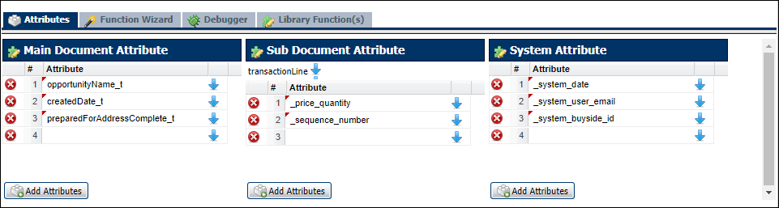

8. Select **Add Attributes** to access the sub-document and the system attributes in the **Sub-Document Attribute** and **System Attributes** sections.

:::note
The **Main Document**, **Sub-Document** and **System Attributes** sections are only available in the **Commerce Library Editor**.  They are not available in the **Util Library Function**.
:::

## Adding a Util Library Function

1. Navigate to: **Admin  > Developer Tools > BML Library**.

2. Click **Add**.

3. Create a **Name**, **Variable Name**, **Description** and choose a **Return Type**.

The **Variable Name** field populates automatically. Variable names can only contain alpha-numeric characters and underscores. The entry can be changed before saving, but after saving the value is read-only.

4. Add the necessary parameters.

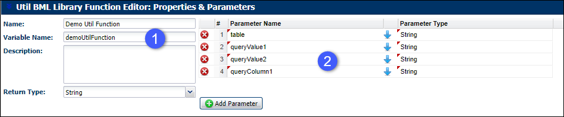

5. Create your script, adding attributes as necessary.

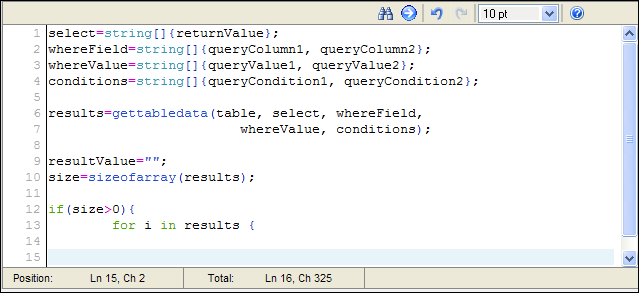

6. Select **Add** to make your new library function available for use.

## Adding a Function to Function Calls

Util and Commerce Library Function Editors use Function to Function calls. Function to Function calls allow admins to compartmentalize BML when dealing with complicated configuration or quoting scenarios. This feature will assist with the organization of BML and provides a solution to the compiled Java class size-limit issue. *Function to function calls mimic the behavior of a Modify function calling a Library function.*

1. Open the **Function** drop-down.

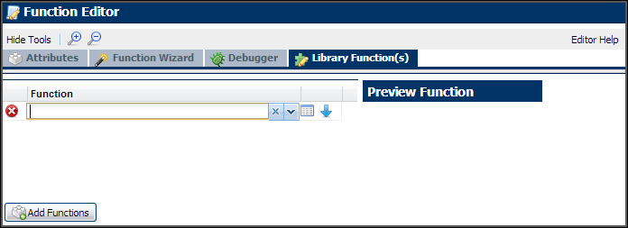

2. Select a Library Function to **Insert into BML**. The options are:
  * **Commerce Library functions:** Only available in Commerce Library Function Editors. Commerce Library functions may only be called by Commerce Library functions.
  * **Util Library functions:** Available in both Commerce and Util Library Function Editors.

3. Once the function is viewed using the **Preview Function**, click the **Insert into BML** blue arrow.

:::tip
The **Function to Function** link appears on the **Related Rules** page. When it is referenced by other Utils it will be displayed on the **Related Rules** page.
:::

:::note
Recursive validation is performed during the following for Util and Commerce Library Functions: Validate, adding, applying, or updating a function.
:::

:::warning
Util and Commerce Library functions cannot self-reference. Recursive calling of the same Util and Commerce Library functions will fail and result in a compilation error when called at any point in the reference chain. Util and Commerce Library functions will not appear in the Import list for themselves.
:::

## Copy BML Library Function

A **Copy** action button is available in Util and Commerce Libraries so that BML Library Functions can be copied and renamed.  This allows admins to manage versions and build new functions based on existing ones.

1. Navigate to one of the appropriate library
  * **Util Library**: Admin > Developer Tools > Library.
  * **Commerce Library Functions**:Admin > Process Definition > Documents > List > Transaction Level > Library Functions > List

2. Select the BML function you wish to copy by clicking its corresponding checkbox.

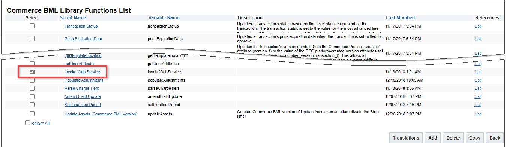

3. Click **Copy** at the bottom of the page.

4. Rename the function.

:::note
Changes can be made to the copied function, since it is a new and independent function.
:::

## Notes

:::warning
Library functions must be created before they can be added.
:::

:::note
Notes:

* Library functions can be created if there isn't a pre-defined function for what you are trying to accomplish.

* Importing a main document Commerce Library Function which imports sub-doc attributes into a BML script on the sub-doc level, will force a loop over all line items.
:::

:::note
**Custom Variable Name Conventions** Oracle  CPQ appends the "_c" suffix to custom variable names to provide more consistency for integrations with Oracle Sales.

Customers can submit a Service Request (SR) on [My Oracle Support](https://support.oracle.com/)  to disable the "_c" suffix on variable names for custom Commerce entities

* When the "_c" is disabled, the "_c" variable name suffix will not be required for newly created custom Commerce entities.

* Disabling the "_c" variable name suffix for custom Commerce entities will not change existing variable names.

* The "_c" suffix setting will not impact existing variable names when cloning a Commerce process or migrating Commerce items. Target variable names will be the same as the variable names from the source Commerce process.
:::

:::tip
* Commerce Library functions can call other Commerce Library functions. Commerce Library functions can call Util Library functions.

* Util Library functions can call other Util Library functions. Util Library functions cannot call Commerce Library functions.
:::

## Related Topics

## See Also
