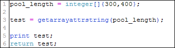
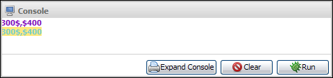
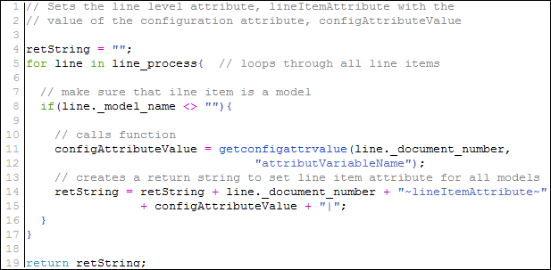
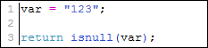

# Other Functions

## Functions

Once you've mastered the standard BML functions, you can move on to the other, advanced, functions. These advanced functions use Dictionaries and pull external information from external resources, using Data Tables and a couple of functions that are specific to either configuration or commerce.

addpartstotransaction

The "addpartstotransaction" BML function is used to add parts to a quote automatically from within a Transaction.

:::note
Notes:

* When the "`addpartstotransaction`" function is run from an action that does not save:
  * Custom prices and attributes will not be set for the line item.
  * The part cannot be added as a child of a model line.

* "`addpartstotransaction`" is only available for Advanced Modify Before/After Formulas on Commerce actions. Attempting to run this function from other actions will generate an error.

* Results in the debugger may not match behavior on the sales side, most notably for custom attributes and the document number.
:::

Syntax:

addpartstotransaction(jsonArray [, priceBookVarName [, resultAttributeArray]])

Parameters:

| Parameter            | Data Type | Description                                                                                                                                                                                                                                                                                                                                                                                                                                                                                                                                           |
| -------------------- | --------- | ----------------------------------------------------------------------------------------------------------------------------------------------------------------------------------------------------------------------------------------------------------------------------------------------------------------------------------------------------------------------------------------------------------------------------------------------------------------------------------------------------------------------------------------------------- |
| jsonArray            | Array     | An array of JSON objects, used to specify part information. In the following example, "myAttribute" is an optional item that represents a custom line level attribute. Example: { "partNumber": "part1", "quantity": 1, "price": 3.50, "parentDocNumber": 2, "myAttribute": "my custom value" } :::note **Notes:** "`price`" and "`parentDocNumber`" are optional items. * If "`price`" is not included, the price in the price book or catalog will be used. * If "`parentDocNumber`" is not included, the part will be added at the root level. ::: |
| priceBookVarName     | String    | An optional string value used for setting the Transaction Price Book. For sites with Price Books enabled, this string should be included to prevent failures on empty Transactions where a Price Book is not defined. Example: "_default_price_book" :::note **Note:** The Price Book parameter will be ignored if a transaction already has a price book defined. :::                                                                                                                                                                                |
| resultAttributeArray | String    | An optional string value for providing document attributes in the JSON result. Example: ["_part_quantity", "_document_number", "_part_number", "_price_item_price_each", "myAttribute"] Will produce a response similar to the following when adding one part: [{"_part_quantity":"1", "_document_number":"2", "_part_number":"part1", "_price_item_price_each":"3.50", "myAttribute":"my custom value"}] :::note Notes: Sub-document attributes with blank or null values are not returned in the Results Attribute string. :::                      |

:::warning
**Note:** Parameters in the JSON body of the request (e.g. "partNumber") are case sensitive.
:::

addtotransaction

The "addtotransaction" BML function is used to add Models to a Transaction using BML. This function can be used to automatically add a new Transaction Line which contains a Model which is pending configuration by the sales user.

:::note
Notes:

* The "`addtotransaction`" function can be executed in a BML function for any Commerce action.

* "`addtotransaction`" is only available for Advanced Modify Before/After Formulas on Commerce actions.

* When assigning values to Configuration attributes the following are supported: in decimals, integers, currencies, dates, booleans, and strings. Attributes which are part of an array are not supported.
:::

Syntax:

addtotransaction (items, [priceBookVarName],[resultAttributeArray])

Parameters:

| Parameter            | Data Type    | Description                                                                                                                                                                                                                                                                                                                                   |
| -------------------- | ------------ | --------------------------------------------------------------------------------------------------------------------------------------------------------------------------------------------------------------------------------------------------------------------------------------------------------------------------------------------- |
| items                | JSON Array   | An array of JSON objects, used to specify the Model information and associated Configuration fields to add to the Transaction. Each item is a new Configuration Line Item.                                                                                                                                                                    |
| priceBookVarName     | String       | A string value used for setting the Transaction Price Book. For sites with Price Books enabled, this string is required for the Transaction. If Price Books are disabled, this will default to "`_default_price_book`". Example: "mycustom_price_book"                                                                                        |
| resultAttributeArray | String Array | An optional string array which contains a list sub-document attribute variable names that you want returned after the Line Item is created. Example: ["_part_quantity", "_document_number", "_price_item_price_each", "myAttribute"] **Default**: _document_number, _part_number, _price_quantity, _price_item_price_each, _parent_doc_number |

**Return Type:** JSON Array

Example:

```bml title="Example"
configAttrs1 = json; //initial config attribute values for the first model
jsonput(configAttrs1 , "connectivity", "WiFi/Bluetooth");
jsonput(configAttrs1 , "storage", "128GB");
jsonput(configAttrs1 , "dataplan", "100GB");

modelLine1 = json; // item values for the first model to be added
jsonput(modelLine1 , "_model_variable_name", "vario5000");
jsonput(modelLine1 , "_model_product_line_var_name", "tablets");
jsonput(modelLine1 , "_model_segment_var_name", "varioTablets");
jsonput(modelLine1 , "_price_quantity", 5);
jsonput(modelLine1 , "_price_unit_price_each": 599);
jsonput(modelLine1 , "_config_attr_values", configAttrs1);

configAttrs2 = json; //initial config attribute values for the second model
jsonput(configAttrs2 , "connectivity", "WiFi/Bluetooth/4G LTE");
jsonput(configAttrs2 , "storage", "256GB");
jsonput(configAttrs2 , "dataplan", "100GB");

modelLine2 = json; // item values for the second model to be added
jsonput(modelLine2 , "_model_variable_name", "vPhablet");
jsonput(modelLine2 , "_model_product_line_var_name", "phablets");
jsonput(modelLine2 , "_model_segment_var_name", "varioTablets");
jsonput(modelLine2 , "_price_quantity", 10);
jsonput(modelLine2 , "_price_unit_price_each": 849);
jsonput(modelLine2 , "_config_attr_values", configAttrs2);

items = jsonarray; // items to added to the transaction
jsonarrayappend(items , modelLine1 );
jsonarrayappend(items , modelLine2 );

// list of attributes that we want returned
resultAttributeArray = jsonarray("[\"_document_number\", \"_part_quantity\",
\"_price_item_price_each\"]");

//adds the two models above to the transaction using the default price book
resultArray = addtotransaction(items, "_default_price_book",
resultAttributeArray);

print(resultArray);
//prints a sample response which looks like this

// [{"_document_number":"2", "_price_quantity":"5",
"_price_unit_price_each":"599.00"},
// {"_document_number":"3", "_price_quantity":"10",
"_price_unit_price_each":"849.00"}]
```

generatehmacmessage

The "generateHmacMessage" BML function is used to  create Hash-based Message Authentication Codes for use in securing outbound web service calls to public web services. The "generateHmacMessage" function supports five types of hashing algorithms including: SHA-256, SHA-384, SHA-512, SHA-1, and MD5.

:::note
Notes:

* This BML function can be used with a Digital Assistant Integration.  You can use BMQL to retrieve a key value from an integration that has been enabled. Refer to [Digital Assistant Integration](./DigitalAssistantIntegration.md).

* This function may be used to "sign" callouts, such as for a JSON Web Token (JWT) signature.
:::

Syntax:

generatehmacmessage("message", "key", ["algorithm"]);

Parameters:

| Parameter | Data Type | Description                                                                                                                                                                                                                 |
| --------- | --------- | --------------------------------------------------------------------------------------------------------------------------------------------------------------------------------------------------------------------------- |
| message   | String    | The message to be authenticated by the cryptographic hash function. This is an optional parameter and an empty string is allowed. Null values are automatically converted to an empty string.                               |
| key       | String    | The secret key that authenticates the message between inbound and outbound web services. This parameter is optional.                                                                                                        |
| algorithm | String    | The designate for the secure message Authentication standard. This parameter is optional and defaults to SHA256. Valid values are: * SHA256 (Default) * SHA384 * SHA512 * SHA1 * MD5 :::note Values are case sensitive. ::: |

**Return Type:** String

Example:

```bml title="Example"
key = "cfthsnkjsavjiCe=";
algo = "MD5";
hmac = generatehmacmessage(inputmessage, key, algo);
print(hmac);
//prints eaf3702517fef48d3f114f32a3c3394b
```

getarraystr

This function returns the delimited string for array attributes with $,$ as the delimiter.

:::note
This function is only used for Configuration attributes.
:::

Syntax:

getarrayattrstring(SingleArray arrayIdentifier)

Parameters:

| Parameter       | Data Type | Description            |
| --------------- | --------- | ---------------------- |
| arrayIdentifier | String[]  | The given input array. |

**Return Type:** String

Example of getarraystr:




getattachmentdata

This function returns the file name (filename), file
 content (filecontent), and MIME type (mimetype) of a given file attachment
 attribute in a dictionary of <anytype>. The file content can be
 retrieved as a bytearray or as Base64 encoded string based on the input
 parameters.

Syntax:

Dict<anytype> getattachmentdata(String attachmentId [, Boolean asBytes]

| Parameter                                       | Data Type | Description                                                                                                          |
| ----------------------------------------------- | --------- | -------------------------------------------------------------------------------------------------------------------- |
| attachmentId                                    | String    | The ID of the attachment returned. This ID is returned in the reference to the attachment attribute in BML.          |
| asBytes                                         | Boolean   | If true, the returned datatype will be a bytearray; If false, the returned datatype will be a Base64 encoded String. |
| Optional, the default is false if not provided. |           |                                                                                                                      |

Example:

```bml title="Example"
//consider 'maindocFileAttachment' as main document attachment attribute and 'subdocFileAttachment' as sub document attachment attribute
mainattachment = getattachmentdata(maindocFileAttachment);
print get(mainattachment ,"filename", "string"); // Prints the file name of main attachment attribute
print get(mainattachment ,"filecontent", "string"); // Prints the file content of main attachment attribute as Base64 encoded String
print get(mainattachment ,"mimetype", "string"); // Prints the mime type of main attachment attribute
//To access the file attached to sub document attachment attribute
for line in lineItems {
 subdocattachment = getattachmentdata(line.subdocFileAttachment);
}
```

getconfigattrvalue

This function retrieves the values of configuration attributes in Commerce.

Syntax:

getconfigattrvalue(configAttrVarname)

-OR-

getconfigattrvalue([documentNumber], configAttrVarname)

Parameters:

| Parameter         | Data Type | Description                                                                      |
| ----------------- | --------- | -------------------------------------------------------------------------------- |
| [documentNumber]  | Integer   | **Optional:** Represents the transaction number.                                 |
| configAttrVarName | String    | Variable name of the configuration attribute from which you are retrieving data. |

**Return Type:** String

:::note
In case of menu attributes, the returned value is the menu item variable name.
:::

Example:



:::note
In case of menu attributes, the returned value is the menu item variable name.
:::

:::warning
The System Attribute _config_attr_info has to be selected as a rule input.  If it is not selected and getConfigAttrVal is used, a compile error is shown to the user.
:::

getoldvalue

Retrieves an old value for given variable name containing old value and document number.

Syntax:

getoldvalue(variableName [, documentNumber])

Parameters:

| Parameter        | Data Type | Description                                              |
| ---------------- | --------- | -------------------------------------------------------- |
| variableName     | String    | Variable name containing old value.                      |
| [documentNumber] | Integer   | **Optional:** Defaults to 1, which is the main document. |

**Return Type:** String

It will return empty string for the following cases:
* When it is called from debugger
* If the document with the given document number does not exist
* If the variable with the given variable name does not exist in the document

Examples:

pre1 = getoldvalue("_quote_bill_to_address");

pre2 = getoldvalue("_price_net_price", 2);

getreasonstatus

This function returns the status of the reason variable name in an approval sequence.

Syntax:

Integer getreasonstatus(String)

Parameters:

| Parameter     | Data Type | Description                                                           |
| ------------- | --------- | --------------------------------------------------------------------- |
| reasonVarName | String    | This is the variable name of the reason within the approval sequence. |

**Return Type:** Integer (associated with one of the following statuses):

* **BM_REASON_STATUS_INVALID**: No reason exists in admin reason tree with given variable name.

* **BM_REASON_STATUS_INACTIVE**: Reason exists in admin reason tree but the condition for the reason is not met, therefore no record for it exists in the user-side tree.

* **BM_REASON_STATUS_PENDING**: Reason exists in the user-side reason tree and there are pending approvals.

* **BM_REASON_STATUS_APPROVED**: Reason exists in the user-side tree and it is approved by all approvers, therefore the reason is completely approved.

* **BM_REASON_STATUS_REJECTED**: Reason exits in user-side tree, but has been rejected by at least one approver.

getuuid

This function generates unique IDs for assets tracked in
 Asset-Based Ordering. Every asset is tracked in ABO using
 an asset key. When a unique ID is generated, it becomes the asset key for an
 asset. The number of asset keys to generate is dependent on the count
 parameter in the function.

Syntax:

String[] getuuid(Integer count)

| Parameter | Data Type | Description                           |
| --------- | --------- | ------------------------------------- |
| count     | Integer   | The number of unique IDs to generate. |

Example:

getuuid(2); // Generates string array with 2 unique IDs.

Output:

[6bafc278-25fd-495f-8360-67bcfb8776b0, 65abced9-5c47-47c6-bf18-ab96fb73935f]

importtransactiondata

Imports the transaction data. If the transaction with the given bsid doesn't exists, then it throws an exception.

Syntax:

importtransactiondata(Long bsid)

Parameters:

| Parameter | Data Type | Description                                                |
| --------- | --------- | ---------------------------------------------------------- |
| bsId      | Integer   | Use this parameter to specify the Commerce Transaction ID. |

Return Type: Boolean

Example:

```bml title="Example"
importtransactiondata(12345); // Where 12345 is the bsid
```

invoke

This function invokes global table functions.

Syntax:

invoke(globalTableFunction, [delimitedData, [defaultData]])

Parameters:

| Parameter           | Data Type | Description                                   |
| ------------------- | --------- | --------------------------------------------- |
| globalTableFunction | Function  | The table function to invoke.                 |
| [delimitedData]     | String    | The parameters, passed as a delimited string. |
| [defaultData]       | String    |                                               |

Return Type: Boolean

Example:

The following script invokes the global function someGlobalFunction. The parameters are passed as a delimited string. If a valid string is not returned by someGlobalFunction, the default string is "error_in_rule"

```bml
params = "";
params = var_frequency + "~" + "model number";
return invoke("someGlobalFunction",params,"error_in_rule");
```

isnull

Evaluates whether a particular Object is null or not. Returns true if argument passed is null.

Syntax:

isnull(String (or Date (or Array or (dict))))

Parameters:

| Parameter | Data Type                       | Description                             |
| --------- | ------------------------------- | --------------------------------------- |
| obj       | String, Date, Array, Dictionary | The Object to examine for a null state. |

**Return:** Boolean

Example:



This evaluates to false.

If `getconfigattrvalue` is called for a non-existing attribute, it returns null. If the return value is passed to `isnull`, it will return true.

logtime

Writes an event to the Performance Log table, which is visible by filtering on "BML" for the Event Type. This logging will only occur when executed outside of the debugger.

Syntax:

logtime(tag, timeElapsed)

Parameters:

| Parameter   | Data Type | Description                                                                                                                                                             |
| ----------- | --------- | ----------------------------------------------------------------------------------------------------------------------------------------------------------------------- |
| tag         | String    | The tag to be logged. This parameter has a 128 character limit. If more than 128 characters are passed into the function, the 129th and later characters are truncated. |
| timeElapsed | Integer   | The time elapsed for the event, saved in the log.                                                                                                                       |

**Return Type:** Boolean

print

Prints into the console window of the Function Editor. **Example Use Case:**  For debugging.

Syntax:

print(String(or Array(or Dictionary(or Numeric(or Date(or Boolean))))) varName)

Parameters:

| Parameter | Data Type                                            | Description                                       |
| --------- | ---------------------------------------------------- | ------------------------------------------------- |
| varName   | String, Array, Dictionary, Numeric, Date, or Boolean | The item to print to the Function Editor console. |

Return Type: Boolean

Examples:

To display "abba" in the console window in the Function Editor.

```bml
print("abba")
```

To display [1,2,3,4,5] in the console window.

```bml
intArray = integer[]{1,2,3,4,5};
print(intArray); //
```

To display {key1=X, key2=Y} in the console window.

```bml
testDict =dict("string");
put(testDict,"key1","X");
put(testDict,"key2","Y");
print textDict;//
```

sbappend

This function attaches a new element to the end of the string builder object. This function is related to the following BML string builder functions: "`[stringbuilder](./stringbuilder.md)`" and "`[sbtostring](./sbtostring.md)`".

Syntax:

sbappend(stringBuilder, [string[, stringArray[, stringBuilder]]])

Parameters:

Any combination of `String`, `StringArray`, and `StringBuilder` items.

| Parameter     | Data Type | Description                                      |
| ------------- | --------- | ------------------------------------------------ |
| string        | String    | Represents the given input string.               |
| stringArray   | String    | Represents the given input array.                |
| stringBuilder | String    | Represents the given input stringbuilder object. |

**Return Type:** String

| Example                                                                                                                                                                                | Output         |
| -------------------------------------------------------------------------------------------------------------------------------------------------------------------------------------- | -------------- |
| sb = stringbuilder; xyz = string[]{"x", "y", "z"}; a123 = string[]{"1", "2", "3"}; sbappend(sb, xyz, "a", "b", "c", a123); print(sb);                                                  | xyzabc123      |
| When using the "sbappend" function, the first parameter (i.e. the source stringbuilder) will have its value modified before the function is completed. Refer to the following example. |                |
| sb1 = stringbuilder("one"); sbappend(sb1, "test", sb1); print(sb1);                                                                                                                    | onetestonetest |

sbtostring

This function converts the finished stringbuilder element to a string.

Syntax:

sbtostring(stringBuilder)

Parameters:

Any combination of `String`, `StringArray`, and `StringBuilder` items.

| Parameter     | Data Type | Description                                      |
| ------------- | --------- | ------------------------------------------------ |
| string        | String    | Represents the given input string.               |
| stringArray   | String    | Represents the given input array.                |
| stringBuilder | String    | Represents the given input stringbuilder object. |

**Return Type:** String

| Example                                                                                      | Output                       |
| -------------------------------------------------------------------------------------------- | ---------------------------- |
| sb = stringbuilder("1", "~", "myVarName", "~", "MyVarNames value." ); return sbtostring(sb); | 1~myVarName~MyVarNames value |

setattributevalue

This function sets a Commerce attribute value on a Main document or Sub-document. The "setattributevalue" function is supported for the following:

* Advanced Default (Main document Commerce attributes)

* Advanced Default - Before Formulas (Sub-document Commerce attributes)

* Advanced Default - After Formulas (Sub-document Commerce attributes)

* Advanced Modify - Before Formulas ( Main document Commerce Modify actions)

* Advanced Modify - After Formulas (Main document Commerce Modify actions)

* Advanced Modify - Before Formulas (Sub-document Commerce Modify actions)

* Advanced Modify - After Formulas (Sub-document Commerce Modify actions)

* Commerce BML Libraries (Function Category = Others)

:::tip
This function is used to set Commerce attributes only.
:::

Main Document Syntax:

setattributevalue(mainDocAttrVarName, value)

Sub-Document Syntax:

setattributevalue(documentNumber, subDocAttrVarName, value)

Parameters:

| Parameter          | Data Type                                  | Description                                                                                                                                                                                                                                                                                                                                                       |
| ------------------ | ------------------------------------------ | ----------------------------------------------------------------------------------------------------------------------------------------------------------------------------------------------------------------------------------------------------------------------------------------------------------------------------------------------------------------- |
| mainDocAttrVarName | String                                     | The attribute variable name to set the value on the Main document.                                                                                                                                                                                                                                                                                                |
| documentNumber     | Integer                                    | Unique document number used as an identifier for the Transaction Line Item. This is required when the BML function is used for setting a sub-document value. This parameter can be an Integer or String "integer". For example, both "2" and 2 are valid entries.                                                                                                 |
| subDocAttrVarName  | String                                     | The attribute variable name to set the value on the Sub-document.                                                                                                                                                                                                                                                                                                 |
| value              | String Float Integer Currency Date Boolean | The value you want set for the specified attribute. The type of value must match the type of the Commerce attribute. Array sets are represented by JSON array reference IDs which are created by the `jsonarrayrefid`function. Date attributes can be either BML Date objects or Text values. Currency and Float attributes can be both Float and Integer values. |

Example:

To set the value of an array set containing a text field, and a single row, named arraySet:

```bml
newRow = json;
jsonput(newRow, "textField", "example");
jsonarrayappend(arraySet, newRow);
setattributevalue(1, "arraySet", jsonarrayrefid(arraySet));
```

:::note
Notes:

* The `setattributevalue` call is supported within the BML Library only if it is referenced from an Advanced Modify or Advanced Default function.

* The `setattributevalue` function is not supported for Dynamic Menu attributes.
:::

stringbuilder

The BML string builder object can be used to generate large strings. In some implementations, large strings were built using string concatenation, including loops or other functional blocks. This method can cause performance issues and negative impacts on system memory. The BML string builder object contains three BML functions to build large strings more efficiently: "`[stringbuilder](./stringbuilder.md)`", "`[sbappend](./sbappend.md)`", and "`[sbtostring](./sbtostring.md)`".

The `stringbuilder` functions initializes string builder objects.

Syntax:

stringbuilder([string[, stringArray[, stringBuilder]]])

Parameters:

Any combination of `String`, `StringArray`, and `StringBuilder` items.

| Parameter     | Data Type | Description                                      |
| ------------- | --------- | ------------------------------------------------ |
| string        | String    | Represents the given input string.               |
| stringArray   | String    | Represents the given input array.                |
| stringBuilder | String    | Represents the given input stringbuilder object. |

**Return Type:** String

| Example                                                                           | Output |
| --------------------------------------------------------------------------------- | ------ |
| sb = stringbuilder("a", "b", "c"); print(sb);                                     | abc    |
| xyz = string[]{"x", "y", "z"}; sb = stringbuilder(xyz, "a", "b", "c"); print(sb); | xyzabc |

throwerror

This function stops the execution of a BML script and
 displays either a business logic error or a system error to the end user. In
 the case of a system error, a generic error message displays and the actual
 error message is logged to the error log file.

:::note
Oracle
 does not recommend using this function in Configuration or Commerce rules. When the rules are triggered from quote transaction screens, the
 error does not always display to the user.
:::

Syntax:

throwerror(String errorMessage [, Boolean isSystemError])

Parameters:

| Parameter     | Data Type | Description                                                                                                                                                                                                    |
| ------------- | --------- | -------------------------------------------------------------------------------------------------------------------------------------------------------------------------------------------------------------- |
| errorMessage  | String    | The error to display to the end user.                                                                                                                                                                          |
| isSystemError | Boolean   | (optional) The flag to select an error type. If false, errorMessage is displayed to the user. If true, a system error is thrown and errorMessage is printed in the error log file. The default value is false. |

Examples

| Input                                                                    | Output                                                                                               |
| ------------------------------------------------------------------------ | ---------------------------------------------------------------------------------------------------- |
| throwerror("This is a custom error!!");                                  | Message displayed to the user "This is a custom error!!"                                             |
| throwerror("This is a system error!!",true);                             | Message displayed to the user: "An unknown error has occurred. Please contact system administrator." |
| The error log contains the following message: "This is a system error!!" |                                                                                                      |

validatequoteforagreement

This function validates that all prerequisites are satisfied prior to creation of an agreement.

* The sales user should be able to validate the quote for agreement for potential validation errors during Create Agreement action before submitting it for approval. Hence, a new BML function "validatequoteforagreement" is introduced to validate quote for agreements.

* The function can be invoked from Commerce rule actions, Advanced Modify - Before Formulas and Advanced Modify - After Formulas.

* Function performs the general, header, and line validations. [See validations](./validations.md)

* Functions takes no parameters and returns an array of strings which contains all the validation errors.

* Validation errors are set in the CmData object of the quote. Hence, the admin does not need to do anything other than calling this method to populate the validation errors.

* The array of validation errors are returned only for debugging purposes or if the admin wants to do anything additional based on these error messages in the BML.

Syntax:

String[] validatequoteforagreement()

Example:

```bml title="Example"
// Calling the validation function from the action of a validation rule.
errors = validatequoteforagreement();
for error in errors { // only for debugging purpose
    print(error);
}
return dict("dict<string>");
```

Sample Response:

```bml
['Contract Name' cannot be empty., 'Customer Company Name' cannot be empty., Following parts have line items with overlapping date ranges: iPhone]
```

Validations:

* General

All the required agreement attributes should be explicitly mapped in case of non std process.

* Header Level

  * Agreement Name field cannot be empty.

  * Customer Id field cannot be empty.

  * Customer Name field cannot be empty.

  * Agreement start date should be before agreement end date.

* Line Level

  * Part Number field cannot be empty.

  * Charge Type field cannot be empty.

  * Price Period field cannot be empty for charges where Price Type != One Time.

  * Usage UOM field cannot be empty for Usage charges.

  * For parts with Service Duration Type "F" and "O", multiple line items of the same part should have mutually exclusive date ranges.

  * For parts with Service Duration Type "V", multiple line items of the same part with same service duration and service duration period should have mutually exclusive date ranges.

## Notes

:::warning
* NULL and blank Integer values are treated as separate values:
  * NULL= 0
  * Blank = ""

* Using NULL as an attribute value is strongly discouraged.

* If you use logic that tests for NULL values in rule conditions or BML, confirm that the logic takes this difference into account.
:::

## Related Topics

See Also