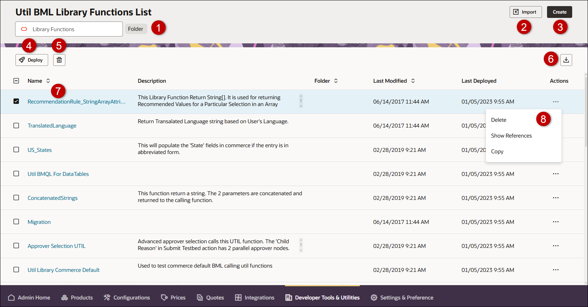

# Util BML Library Functions List (Redwood)

## Overview

The BML Function Library enables the user to write efficient and reusable custom BML functions. The user can write and store BML functions in a central library and call these functions from different areas in CPQ.

* **Util BML Library** - The functions in this library can be accessed and called throughout Oracle CPQ.

* **Commerce BML Library** - The functions in this library are accessible only to a main document-sub-document pair. Each Commerce BML library has a 1:1 relationship with a main document and sub-document pair. There can be as many Commerce BML libraries as there are document pairs in Commerce.  The Commerce BML Library is not available until a main document has been associated with a sub-document. Refer to [Commerce Library Functions](../Quotes/LibraryFunctions.md).

The Util BML Library Functions List page displays a list of available BML functions, a description of the function,  folder for the BML function, date the function was last modified, date the function was last deployed, and actions available for the function.

To access the Util BML Library Functions List, navigate to: **Admin Home > Developer Tools & Utilities > BML Library**

| Item | Description                                                                                                                                                                                                                                                                                                                                                                                                                                                                                        |
| ---- | -------------------------------------------------------------------------------------------------------------------------------------------------------------------------------------------------------------------------------------------------------------------------------------------------------------------------------------------------------------------------------------------------------------------------------------------------------------------------------------------------- |
| 1    | Enter search criteria to filter BML library functions. Select the **Folder** button to filter by folder.                                                                                                                                                                                                                                                                                                                                                                                           |
| 2    | Import BML function(s). Refer to [Bulk Uploads](../Administration/Bulk_Uploads.md).                                                                                                                                                                                                                                                                                                                                                                                                                |
| 3    | Create a new BML function. Refer to [BML Function Editor](FunctionEditor/BML_Editor.md).                                                                                                                                                                                                                                                                                                                                                                                                           |
| 4    | Access the Deployment Center to deploy the selected function(s).                                                                                                                                                                                                                                                                                                                                                                                                                                   |
| 5    | Delete the selected function(s).                                                                                                                                                                                                                                                                                                                                                                                                                                                                   |
| 6    | Export the selected function(s). The Download Status page opens showing the status of the export data request.                                                                                                                                                                                                                                                                                                                                                                                     |
| 7    | Click on the function name link to edit the function. Refer to [BML Function Editor](FunctionEditor/BML_Editor.md).                                                                                                                                                                                                                                                                                                                                                                                |
| 8    | Click on the Actions ellipsis to delete the function, show references for the function, and copy (save as) or rename the selected function. * Deleting a library function provides pop-up for you to cancel or confirm the deletion. * Showing References displays the specific rule references for the selected library function. * Copying a function opens the Create Util Function page with the copied function data displayed. Refer to [BML Function Editor](FunctionEditor/BML_Editor.md). |

## Notes

:::warning
Library functions must be created before they can be added.
:::

:::note
Notes:

* Library functions can be created if there isn't a pre-defined function for what you are trying to accomplish.

* Importing a main document Commerce Library Function which imports sub-doc attributes into a BML script on the sub-doc level, will force a loop over all line items.
:::

:::note
**Custom Variable Name Conventions** Oracle  CPQ appends the "_c" suffix to custom variable names to provide more consistency for integrations with Oracle Sales.

Customers can submit a Service Request (SR) on [My Oracle Support](https://support.oracle.com/)  to disable the "_c" suffix on variable names for custom Commerce entities

* When the "_c" is disabled, the "_c" variable name suffix will not be required for newly created custom Commerce entities.

* Disabling the "_c" variable name suffix for custom Commerce entities will not change existing variable names.

* The "_c" suffix setting will not impact existing variable names when cloning a Commerce process or migrating Commerce items. Target variable names will be the same as the variable names from the source Commerce process.
:::

:::tip
* Commerce Library functions can call other Commerce Library functions. Commerce Library functions can call Util Library functions.

* Util Library functions can call other Util Library functions. Util Library functions cannot call Commerce Library functions.
:::

:::tip
The **Function to Function** link appears on the **Related Rules** page. When it is referenced by other Utils it will be displayed on the **Related Rules** page.
:::

## Related Topics

See Also