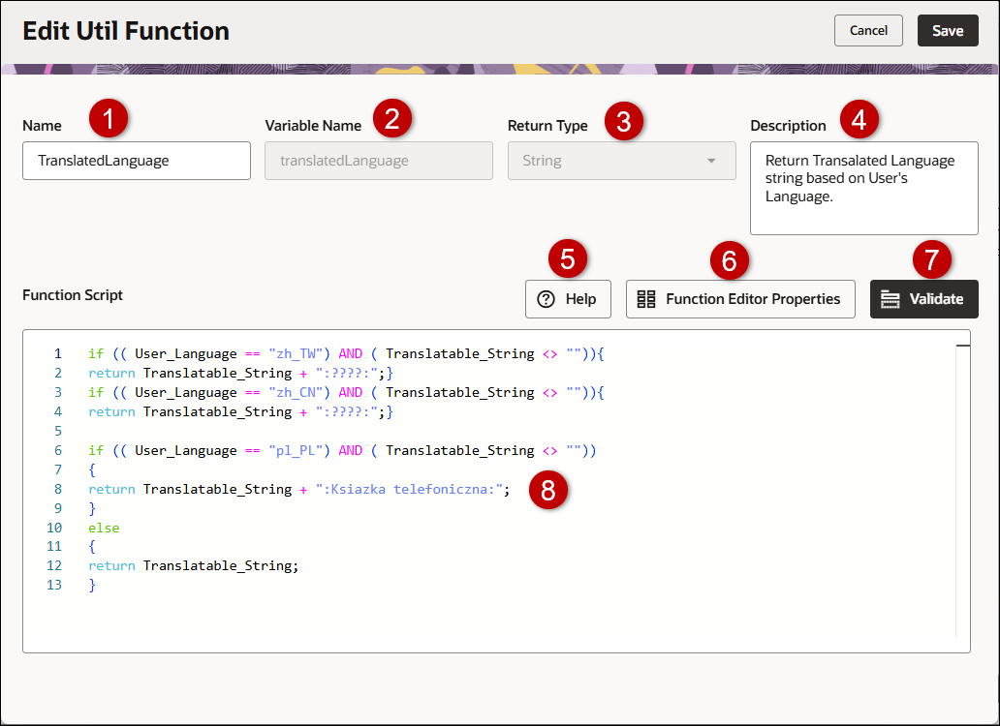
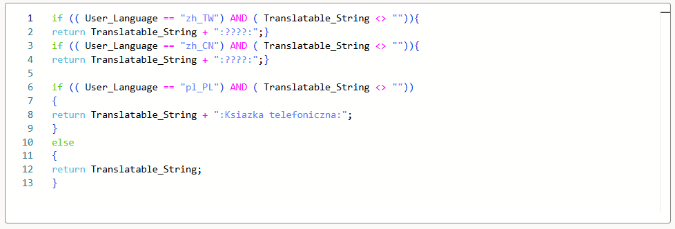
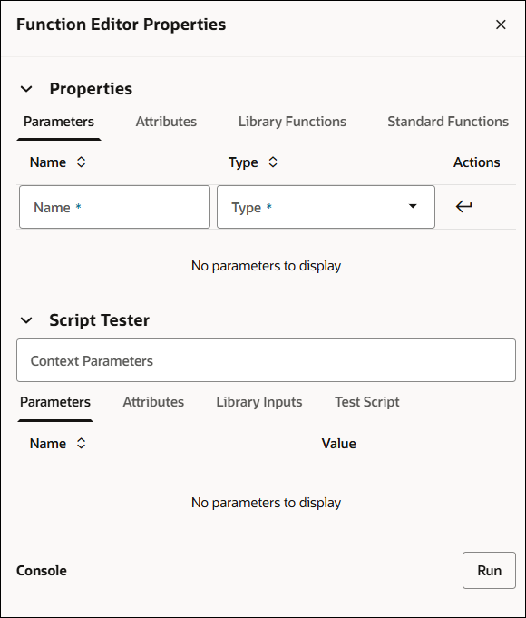

# Util Function Editor (Redwood)

## Overview

:::note
This topic covers the Util Funtion Editor using the Redwood interface pages. Refer to[Library Functions,](Library_Functions.md) [Function Editor Basics](FunctionEditorBasics.md), and [Function Wizard](FunctionWizard.md) for process administration using the classic interface pages.
:::

The Function Editor contains a list of pre-defined BML functions that are available for use in advanced scripting.  There are some variations in the Function Editor, depending on where you are located within the application:  Commerce, Configuration, Commerce Library, or Util Library. The Function Editor allows you to create a new function or edit an existing function. You can access the Create Util Function page or Edit Util Function page from the [Util BML Library Functions List](UtilBmlLibraryFunctionsList.md).

Util and Commerce Library Function Editors use Function to Function calls. Function to Function calls allow admins to compartmentalize BML when dealing with complicated configuration or quoting scenarios. This feature will assist with the organization of BML and provides a solution to the compiled Java class size-limit issue. *Function to function calls mimic the behavior of a Modify function calling a Library function.*

To access the Util Function Editor, navigate to: **Admin Home > Developer Tools & Utilities > BML Library**

* To edit or view an exiting function, click on the applicable function name link in the [Util BML Library Functions List](UtilBmlLibraryFunctionsList.md) page.

* To create a new function, click **Create**  in the [Util BML Library Functions List](UtilBmlLibraryFunctionsList.md) page.

* To copy an existing function, click on the Actions ellipsis and select **Copy**for the appropriate function in the [Util BML Library Functions List](UtilBmlLibraryFunctionsList.md) page.

| Item | Description                                                                                                                                                                                  |
| ---- | -------------------------------------------------------------------------------------------------------------------------------------------------------------------------------------------- |
| 1    | The function name.                                                                                                                                                                           |
| 2    | The function variable name.                                                                                                                                                                  |
| 3    | The category type the function script will return. For example, array, boolean, date, dictionary, math, etc. Refer to [BML Functions List](BMLFunctionsList.md) for category function links. |
| 4    | The description of the function.                                                                                                                                                             |
| 5    | Displays a complete list of the out-of-the-box functions. Refer to [BML Functions List](BMLFunctionsList.md) for a description of the functions.                                             |
| 6    | Manages the function properties and runs a test the function script.                                                                                                                         |
| 7    | Validates the function script.                                                                                                                                                               |
| 8    | The function script definition area. Refer to [Script Definition and Syntax Colors](scriptArea.md).                                                                                          |

## Script Definition and Syntax Colors

BML can be typed directly into the Script Definition Area.  Save your changes after writing/editing the script.

The box on the left defines the position of the character based on its line and index. Character indexes begin with 0.

The  code is displayed in different colors. For example:

| Color | Definition                                                     |
| ----- | -------------------------------------------------------------- |
| Black | Variable names, float and integer variables                    |
| Pink  | Numeric Operators                                              |
| Aqua  | Literals or Data Types (string, float, integer, boolean, etc.) |
| Blue  | Functions and string variables                                 |
| Green | Conditional Functions                                          |
| Gray  | Comments                                                       |

## Administration

## Create or Edit a  Library Function

:::note
To add a Commerce Library Function using the Redwood UI, refer to [Commerce Library Functions](LibraryFunctions.md).
:::

Complete the following steps to create a library function.

1. Navigate to: **Admin Home > Developer Tools & Utilities > BML Library** and select one of the following:

  1. To create a library function,click **Create**.

  2. To edit an existing library function, click the name of the function link under the **Name** column.

2. Enter the  **Name**, **Variable Name**, **Description** and select a **Return Type**.

3. Enter your script into the **Function Script** section.

4. Click **Function Editor Properties** to select and enter Parameters, Attributes, Library Functions or Standard Functions for the function script.

## Parameters

In the function editor, you can select parameters to include within your code. To enter a parameter:

  1. Open the **Properties** section and click on the **Parameters** tab.

insert pic

  2. Enter the **Name** and select the **Type**.  Navigate through the Type drop-down list to find the desired function category or start typing the parameter name. The type list will filter for you.

  3. Click the **Submit**  icon to enter the parameter into the Function Script.

  4. Click the **Delete**  icon to remove a parameter from the properties list.

---

## Attributes

In the function editor, you can select attributes to include within your code.  These attributes are specific to the product family that you are working in.  For example, when you are in Configuration, you can select from a standard product line, model, account, user or configuration attributes.
To enter an attribute:

  1. Open the **Properties** section and click on the **Attributes** tab.

  2. Enter the **Name** of the  attribute. Navigate through the drop-down list to find the desired attribute or start typing the attribute name. The attribute list will filter for you.

  3. Click the **Submit** icon to enter the attribute into the Function Script.

  4. Click the **Delete** icon to remove an attribute from the properties list.

---

## Library Functions

Once a Util Library Function has been defined, it's available for use in the **Library Function(s)** tab within the Function Editor.

To enter a Library  function:

  1. Open the **Properties** section and click on the **Library Functions** tab.

  2. Select the applicable library function from the **Name** menu. Navigate through the Util Library folder to find the desired library function or start typing the function name. The library function list will filter for you.

  3. Click the **Submit** icon to enter the library function into the Function Script.

  4. Click the **Delete** icon to remove a library function from the properties list.

---

## Standard Functions

Util and Commerce Library Function Editor use Function to Function calls. Function to Function calls allow admins to compartmentalize BML when dealing with complicated configuration or quoting scenarios. This feature will assist with the organization of BML and provides a solution to the compiled Java class size-limit issue. *Function to function calls mimic the behavior of a Modify function calling a Library function.*

To enter a standard function:

  1. Open the **Properties** section and click on the **Standard Functions** tab.

  2. Select the standard function **Category**. Navigate through the drop-down list to find the desired category or start typing the category name. The category list will filter for you.

  3. Select the **Function**. Navigate through the drop-down list to find the desired standard function or start typing the function name. The function list will filter for you.

A description, the syntax, and an example of the standard function displays.

  4. Click  **Insert into editor** to enter the standard function into the Function Script.

---

5. Test and debug the function script.

The test script provides a way to test a BML Library function when array type attributes are input parameters.  Within the Test Script, you can populate your own complex data objects and pass it to the library functions to analyze the results.  Test Scripts can also be used to compute multiple iterations of the library functions and print each.

  1. Open the **Script Tester** section.

  2. Enter applicable **Context Parameters**.

  3. Click on the **Parameters**, **Attributes**, and **Library Inputs** tabs to view the designated function properties.

  4. Click on the **Test Script** tab and enter the function script to test into the **Test Script**.

  5. Click on the **Use Test Script** radio button to test the function script entered into the Test Script.

  6. Click **Run**.

  7. The results of the test are displayed in the Console section. If the script has errors, a message indicating the error displays.

  8. Click  **Insert into editor** to enter the standard function into the Function Script.

6. To test your Function Script, click **Validate**. A "Validation Successful" message or error message displays at the bottom of the page.

7. Click **Save**.

The [Util BML Library Functions List](UtilBmlLibraryFunctionsList.md) page is displayed.

8. Click **Deploy** to deploy the new library function.

---

## NOTES:

:::warning
Library functions must be created before they can be added.
:::

:::warning
Util and Commerce Library functions cannot self-reference. Recursive calling of the same Util and Commerce Library functions will fail and result in a compilation error when called at any point in the reference chain. Util and Commerce Library functions will not appear in the Import list for themselves.
:::

:::note
Recursive validation is performed during the following for Util and Commerce Library Functions: Validate, adding, applying, or updating a function.
:::

:::note
Changes can be made to the copied function, since it is a new and independent function. This allows admins to manage versions and build new functions based on existing ones
 Note the function name and variable name of the copied function must be different from the existing function.
:::

:::note
**Custom Variable Name Conventions** Oracle  CPQ appends the "_c" suffix to custom variable names to provide more consistency for integrations with Oracle Sales.

Customers can submit a Service Request (SR) on [My Oracle Support](https://support.oracle.com/)  to disable the "_c" suffix on variable names for custom Commerce entities

* When the "_c" is disabled, the "_c" variable name suffix will not be required for newly created custom Commerce entities.

* Disabling the "_c" variable name suffix for custom Commerce entities will not change existing variable names.

* The "_c" suffix setting will not impact existing variable names when cloning a Commerce process or migrating Commerce items. Target variable names will be the same as the variable names from the source Commerce process.
:::

:::tip
* Commerce Library functions can call other Commerce Library functions. Commerce Library functions can call Util Library functions.

* Util Library functions can call other Util Library functions. Util Library functions cannot call Commerce Library functions.
:::

## Related Topics

## See Also
