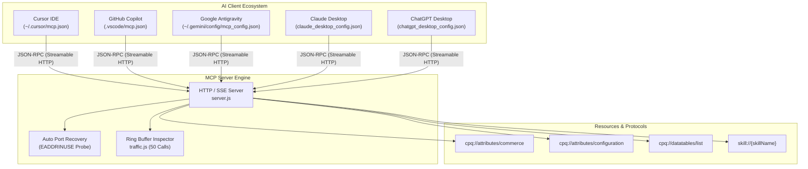
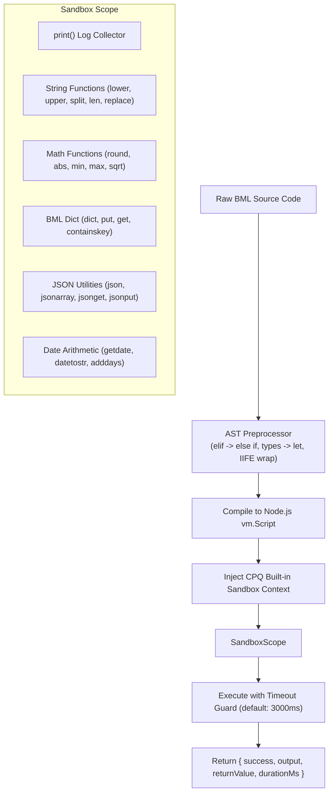
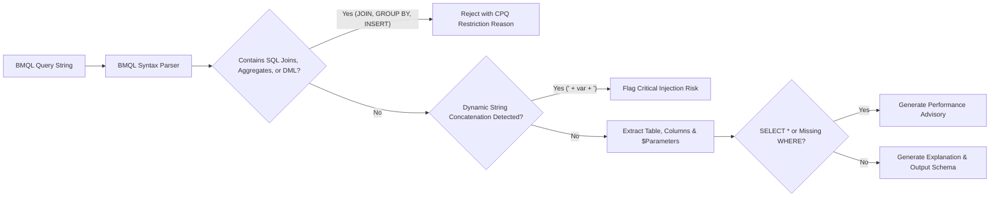
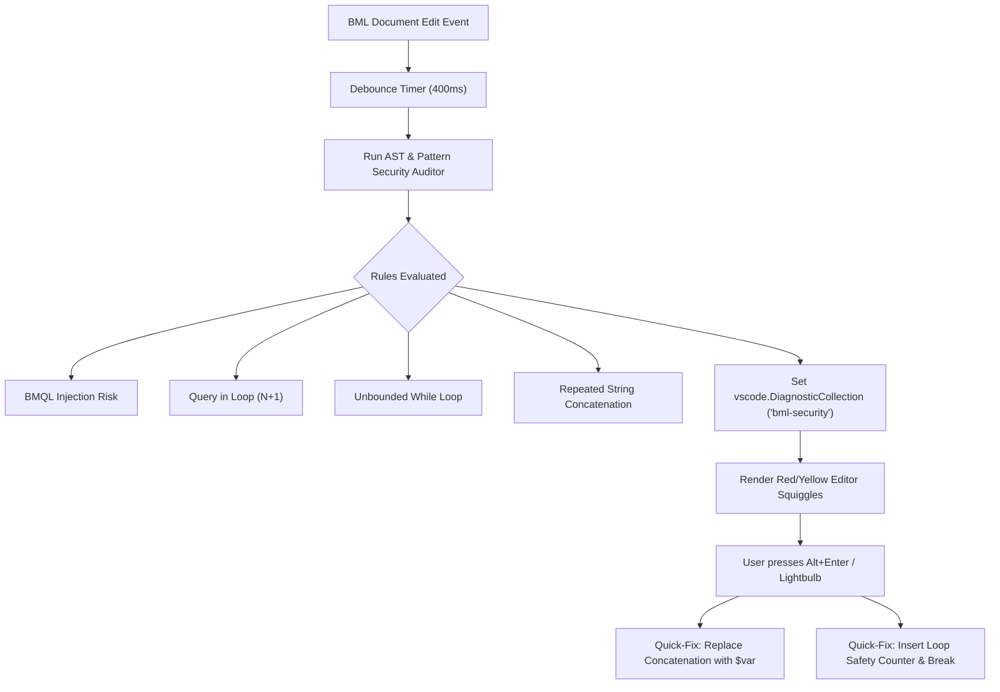
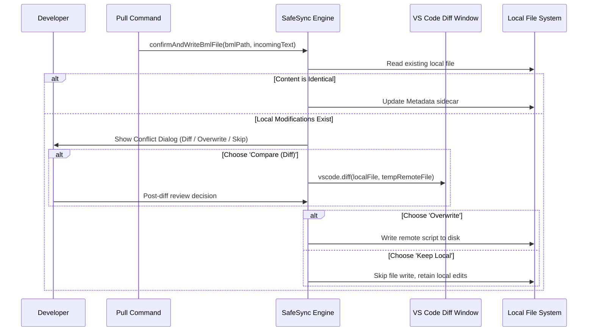
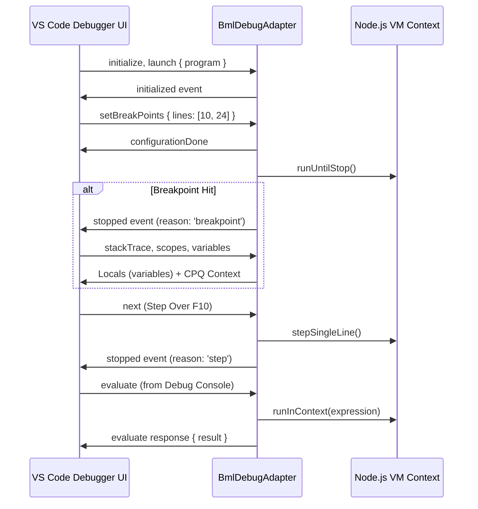

# Oracle CPQ BML Advanced Architectures & Subsystems

Comprehensive technical architecture reference for the advanced subsystems introduced in CPQ-BML: Multi-AI MCP integration, local logic evaluation, offline BMQL validation, AST security diagnostics, call hierarchy, safe synchronization, and CI/CD automation.

---

## Table of Contents
1. [Multi-Client MCP & Native Resource Architecture](#1-multi-client-mcp--native-resource-architecture)
2. [Local BML Pure Logic Evaluator & Sandbox](#2-local-bml-pure-logic-evaluator--sandbox)
3. [Offline BMQL Query Validator & Explainer Pipeline](#3-offline-bmql-query-validator--explainer-pipeline)
4. [Real-Time AST Security Diagnostics & Quick-Fix Engine](#4-real-time-ast-security-diagnostics--quick-fix-engine)
5. [Semantic Call Hierarchy & Dependency Graph Provider](#5-semantic-call-hierarchy--dependency-graph-provider)
6. [Safe Synchronization & 3-Way Diff Architecture](#6-safe-synchronization--3-way-diff-architecture)
7. [Automated BML Function & Sidecar Scaffolding](#7-automated-bml-function--sidecar-scaffolding)
8. [Standalone CI/CD Quality Gate CLI](#8-standalone-cicd-quality-gate-cli)
9. [BML Debug Adapter Protocol (DAP) Engine](#9-bml-debug-adapter-protocol-dap-engine)
10. [Native VS Code Test Explorer (`vscode.TestController`)](#10-native-vs-code-test-explorer-vscodetestcontroller)
11. [Interactive Data Table Grid Editor (`vscode.CustomTextEditorProvider`)](#11-interactive-data-table-grid-editor-vscodecustomtexteditorprovider)
12. [AST Parser, Semantic Tokens & F2 Symbol Rename](#12-ast-parser-semantic-tokens--f2-symbol-rename)
13. [Dynamic Instance Type Definitions (`cpq.d.bml`)](#13-dynamic-instance-type-definitions-cpqdbml)
14. [Static Performance & Timeout Profiler](#14-static-performance--timeout-profiler)

---

## 1. Multi-Client MCP & Native Resource Architecture

The CPQ-BML MCP Server provides an HTTP SSE and Streamable HTTP JSON-RPC transport (`127.0.0.1:<port>`) supporting multi-client auto-registration across desktop AI applications.



### Architectural Highlights
- **Dynamic Port Synchronization**: The active port is read directly from `cpqBml.mcp.port`. If modified in Settings, registered AI clients receive updated endpoints automatically.
- **Port Collision Recovery**: On `EADDRINUSE`, the server automatically probes the next available port, updates the configuration, notifies the user, and synchronizes client config files.
- **Safe Path Discovery**: AI configs are only written if the target AI application exists on the developer's system, avoiding directory pollution in clean workspaces.
- **Native MCP Resources**: Implements `resources/list` and `resources/read` handlers for read-only metadata browsing.

---

## 2. Local BML Pure Logic Evaluator & Sandbox

The Local Evaluator provides an offline JavaScript VM sandbox pre-configured with Oracle CPQ BML built-in runtime functions:



### Key Integrations
- **BML Scratchpad Webview (`cpqBml.openScratchpad`)**: Interactive dual-panel sandbox editor with live `print()` logs, return value inspection, and runtime latency measurements.
- **Editor Selection Runner (`cpqBml.runBmlLocally`)**: Instantly executes highlighted BML code and prints outputs directly to the `BML Scratchpad` output channel.
- **MCP Tool `evaluate_bml_logic`**: Enables AI models to test and verify BML algorithms offline before proposing code modifications.

---

## 3. Offline BMQL Query Validator & Explainer Pipeline

Validates BMQL queries against Oracle CPQ database engine standards without requiring a live server connection:



### Enforced CPQ BMQL Restrictions
- Rejects SQL table `JOIN` operations (BMQL queries single Data Tables).
- Rejects SQL aggregate functions (`COUNT`, `SUM`, `AVG`, `GROUP BY`, `HAVING`).
- Rejects SQL sorting clauses (`ORDER BY` is not supported in standard BMQL; sorting must occur in BML arrays/recordsets).
- Rejects DML statements (`INSERT`, `UPDATE`, `DELETE`; Data Tables are modified via REST or bulk feeds).
- Enforces parameterized variables (`$varName`) over dynamic string concatenation.

---

## 4. Real-Time AST Security Diagnostics & Quick-Fix Engine

Provides instantaneous editor squiggles and lightbulb quick-fixes (`Alt+Enter`) as code is edited:



---

## 5. Semantic Call Hierarchy & Dependency Graph Provider

Implements `vscode.CallHierarchyProvider` for workspace-wide function navigation (`Shift+Alt+H`):

- **Incoming Calls**: Traverses all `.bml` files in the workspace index to identify every call site referencing `util.<functionName>` or `commerce.<functionName>`.
- **Outgoing Calls**: Parses the active function body using symbol extraction to resolve all downstream library functions and Data Tables called by the function.
- **Go to Definition (`F12`) & References (`Shift+F12`)**: Resolves both workspace library scripts and in-file local variables, function parameters, and docHeader signatures.

---

## 6. Safe Synchronization & 3-Way Diff Architecture

Guards against accidental loss of uncommitted local code during REST pulls:



---

## 7. Automated BML Function & Sidecar Scaffolding

Guarantees dual-file integrity when creating new CPQ library functions:
- Prompts for function name, description, return type (CPQ type dropdown), and typed parameters (`name:Type`).
- Automatically generates:
  1. `<name>/<name>.bml` with standardized docHeader block comments and stubbed return value.
  2. `<name>/<name>-meta.json` with synchronous parameter schemas and return types.
- Auto-opens the scaffolded `.bml` file and positions cursor directly inside the function body.

---

## 8. Standalone CI/CD Quality Gate CLI

The extension ships with a standalone Node.js CLI executable located at `bin/cpq-bml.js`:

```bash
# Scan workspace or directory for security violations in CI
npx cpq-bml audit . --min-score=75 --format=pretty

# Output JSON report for CI dashboard integration
npx cpq-bml audit . --format=json

# Offline BMQL query validation in scripts
npx cpq-bml validate "SELECT partNumber FROM Parts WHERE active = $isActive"
```

- **Exit Code 0**: Clean audit, all files pass threshold.
- **Exit Code 1**: Critical security risks, BMQL injections, or failing audit scores detected.

---

## 9. BML Debug Adapter Protocol (DAP) Engine

The extension implements the native VS Code Debug Adapter Protocol via `app/lang/debug/bmlDebugAdapter.js`:



- **Zero Heavy Dependencies**: Implemented natively via `vscode.DebugAdapterInlineImplementation` without heavy external adapter runtimes.
- **Scope Inspector**: Inspects primitives, collections, BML `dict`, and `json` structures live in the VS Code Variables pane.

---

## 10. Native VS Code Test Explorer (`vscode.TestController`)

Seamless BML unit test discovery and execution directly in the native VS Code Testing sidebar (`app/lang/test/`):
- **Test File Convention**: Any file named `*.test.bml`.
- **Inline Annotations**: Identifies individual test cases using `// @test "description"`.
- **BML Assertions**: Native support for `assert.equals(actual, expected)`, `assert.isTrue(condition)`, and `assert.notNull(value)`.
- **Test Results**: Visual green/red pass/fail indicators, failure diffs, and test duration metrics.

---

## 11. Interactive Data Table Grid Editor (`vscode.CustomTextEditorProvider`)

Full spreadsheet-style editor for Oracle CPQ Data Table files (`*.dt.json`, `*.dt.csv`):
- **Live Spreadsheet View**: Filter, search, and edit cells inline with keyboard navigation.
- **Schema Enforcement**: Visual validation against CPQ column definitions.
- **Dual Format Support**: Synchronous read/write for both JSON and standard CSV tabular exports.
- **Direct Actions**: "Push to CPQ" button for immediate REST API upload.

---

## 12. AST Parser, Semantic Tokens & F2 Symbol Rename

High-speed recursive descent AST parser (`app/lang/ast/`):
- **Strict BML Compliance**: Models BML statements (`for`, `if`, `elif`, `else`, `return`, `print`, `bmql`), sized arrays (`String[10]`, `String[]{...}`), and logical operators (`AND`, `OR`, `NOT`).
- **Semantic Highlighting**: Distinguishes built-in CPQ functions (`put`, `get`, `urldata`, `recordset`), library calls (`util.myFunc`), and local variables.
- **F2 Symbol Rename**: Scope-safe variable and parameter renaming across entire BML files.

---

## 13. Dynamic Instance Type Definitions (`cpq.d.bml`)

Auto-introspects connected Oracle CPQ environments via `app/lang/intellisense/schemaIntrospector.js`:
- **Discovers**:
  - Document 1 (Transaction / Header) attributes.
  - Document 2 (Line Item / SubDoc) attributes.
  - Configuration attributes and Data Table schemas.
- **Outputs**:
  - `.cpq/schema.json` (machine-readable schema cache).
  - `cpq.d.bml` (typed comments and stubs for developer reference).
- **IntelliSense Integration**: Automatically enriches autocomplete suggestions with the client's live custom attributes.

---

## 14. Static Performance & Timeout Profiler

Real-time diagnostic analyzer (`app/lang/profiler/bmlProfiler.js`) protecting against CPQ 5-second commerce script timeouts:
- **Unsupported 'while' Detection**: Flags `while` loops as fatal errors since Oracle CPQ BML only supports `for item in array`.
- **BMQL in Loops ($O(N)$ Antipattern)**: Detects repeated database lookups inside loops.
- **String Concatenation in Loops**: Recommends `stringbuilder` or array joining to prevent memory thrashing.
- **Nesting Limits**: Flags loop nesting $> 3$ and block nesting $> 5$.
- **CLI Command**: `cpq-bml profile [path]`.
