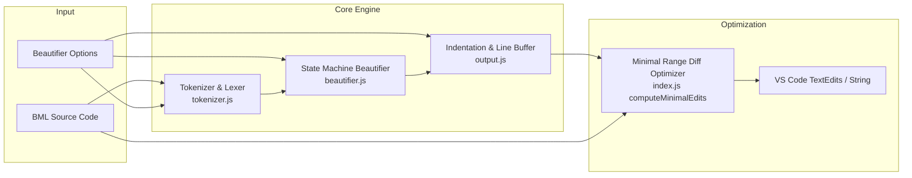
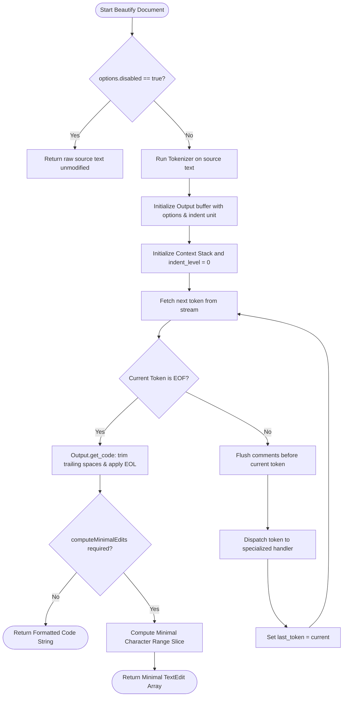
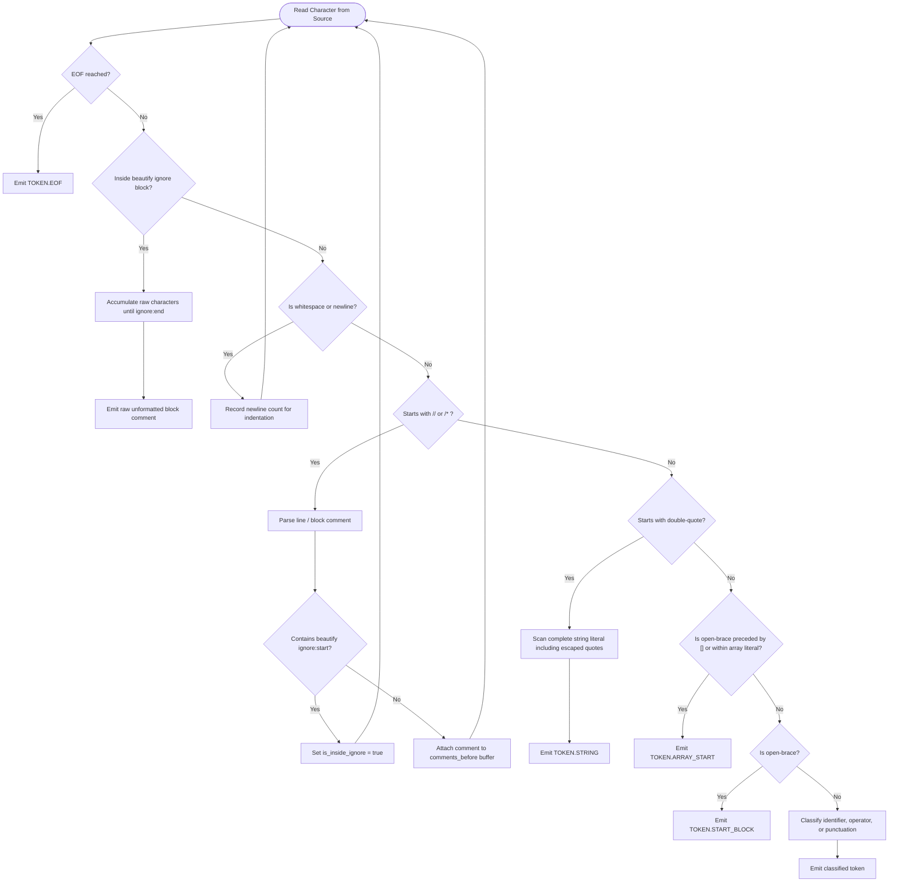
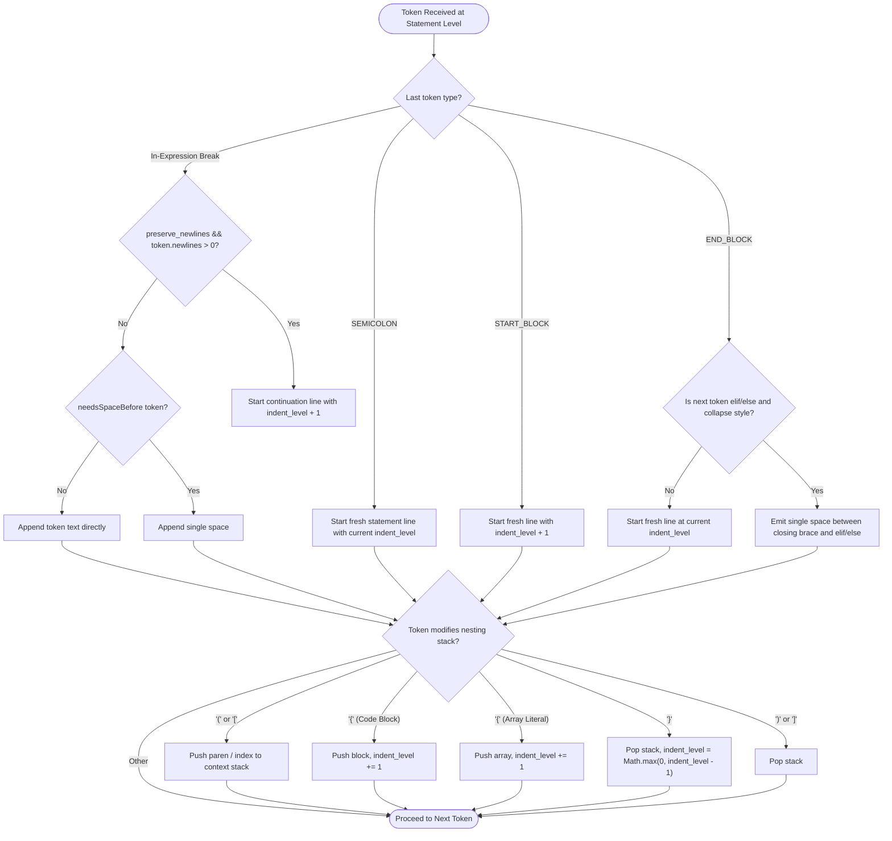
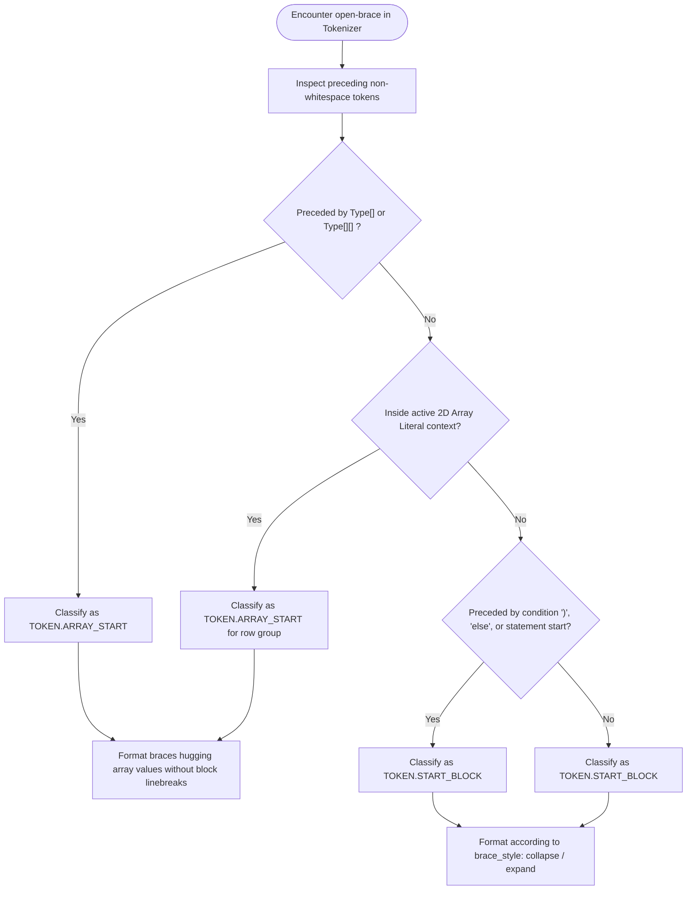
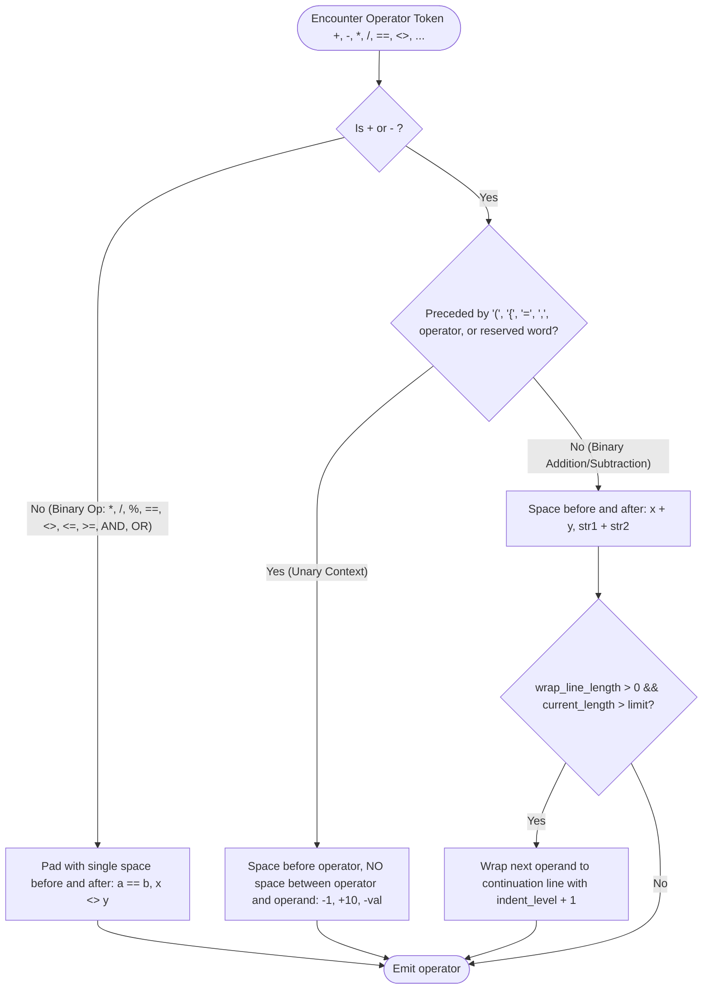
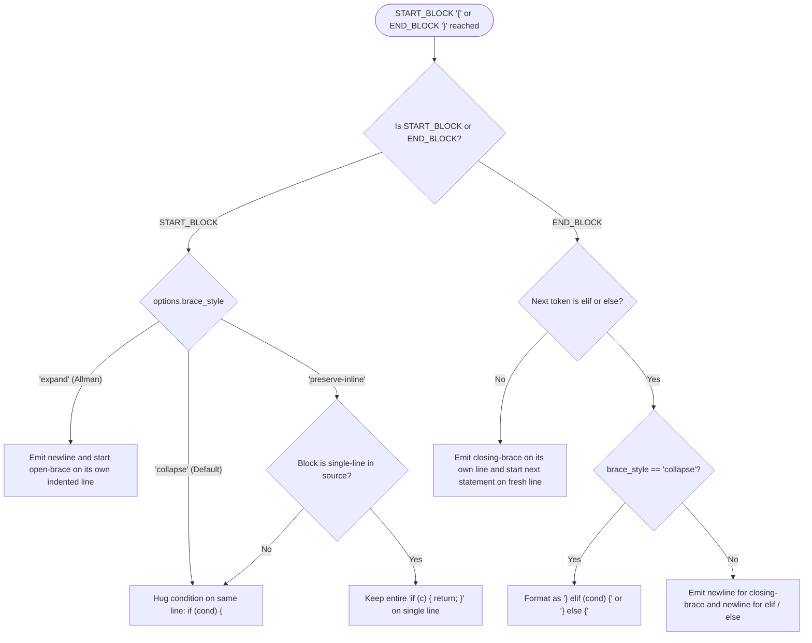
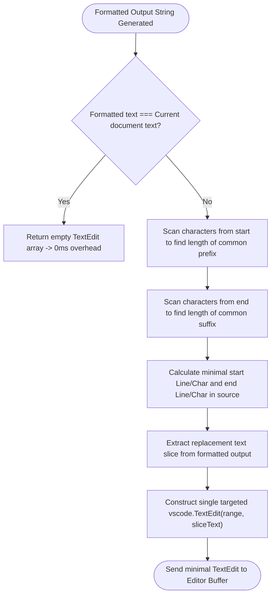

# Oracle CPQ BML Beautifier: Architecture & Control Flow Graphs

## Table of Contents
1. [Overview & High-Level Architecture](#1-overview--high-level-architecture)
2. [Top-Level Formatting Lifecycle (CFG 1)](#2-top-level-formatting-lifecycle-cfg-1)
3. [Tokenizer & Directive Processing (CFG 2)](#3-tokenizer--directive-processing-cfg-2)
4. [Statement-Level Indentation & Context State Machine (CFG 3)](#4-statement-level-indentation--context-state-machine-cfg-3)
5. [Array Literal vs Block Start Disambiguation (CFG 4)](#5-array-literal-vs-block-start-disambiguation-cfg-4)
6. [Operator Spacing & Unary vs Binary Disambiguation (CFG 5)](#6-operator-spacing--unary-vs-binary-disambiguation-cfg-5)
7. [Brace Style & Block Hugging Flow (CFG 6)](#7-brace-style--block-hugging-flow-cfg-6)
8. [Minimal Range Edit Diffing Optimizer (CFG 7)](#8-minimal-range-edit-diffing-optimizer-cfg-7)
9. [Configuration Options Reference](#9-configuration-options-reference)

---

## 1. Overview & High-Level Architecture

The **BML Beautifier** is a deterministic, high-performance source code formatter specifically built for Oracle CPQ's BML language. It operates in four modular stages:

---

## 2. Top-Level Formatting Lifecycle (CFG 1)

This control flow graph shows the entry-point execution path when a document is formatted (e.g. on manual format, format-on-save, or MCP tool call):

---

## 3. Tokenizer & Directive Processing (CFG 2)

The tokenizer converts the raw character stream into classified tokens (`WORD`, `RESERVED`, `OPERATOR`, `STRING`, `START_BLOCK`, `ARRAY_START`, `START_EXPR`, `SEMICOLON`, `COMMA`, `DOT`, `COMMENT`) while handling ignore directives (`/* beautify ignore:start */` ... `/* beautify ignore:end */`):

---

## 4. Statement-Level Indentation & Context State Machine (CFG 3)

The Beautifier maintains a strict context stack (`'block'`, `'array'`, `'paren'`, `'condition'`, `'index'`) to track nesting levels and calculate indentation:

---

## 5. Array Literal vs Block Start Disambiguation (CFG 4)

BML supports 1D array literals (`String[]{ "a", "b" }`) and 2D nested array literals (`Integer[][]{ {1, 2}, {3, 4} }`). The beautifier disambiguates array braces from standard executable code blocks:

---

## 6. Operator Spacing & Unary vs Binary Disambiguation (CFG 5)

BML operators (`==`, `<>`, `<=`, `>=`, `<`, `>`, `+`, `-`, `*`, `/`, `%`) and logical keywords (`AND`, `OR`, `NOT(c)`) are formatted with strict mathematical rules:

---

## 7. Brace Style & Block Hugging Flow (CFG 6)

The beautifier dynamically formats block braces and `elif` / `else` chains according to `brace_style`:

---

## 8. Minimal Range Edit Diffing Optimizer (CFG 7)

To prevent whole-document replacement, IDE lag, and cursor jumps on format-on-save, `computeMinimalEdits` isolates only the changed character range:

---

## 9. Configuration Options Reference

| Option | Type | Default | Description |
| :--- | :--- | :--- | :--- |
| `indent_size` | `Integer` | `4` | Number of spaces or tab width for each indentation level. |
| `indent_char` | `String` | `' '` | Indentation character (`' '` or `'\t'`). |
| `indent_with_tabs` | `Boolean` | `false` | When `true`, uses tabs for indentation. |
| `brace_style` | `String` | `'collapse'` | `'collapse'` (1TBS/K&R style), `'expand'` (Allman style), or `'preserve-inline'`. |
| `space_before_conditional` | `Boolean` | `true` | When `true`, formats `if (condition)` instead of `if(condition)`. |
| `space_in_paren` | `Boolean` | `false` | When `true`, adds space inside parentheses: `( x )` vs `(x)`. |
| `space_in_empty_paren` | `Boolean` | `false` | When `true`, adds space in empty parentheses: `func( )` vs `func()`. |
| `preserve_newlines` | `Boolean` | `true` | Preserves developer-authored blank lines between logical sections. |
| `max_preserve_newlines` | `Integer` | `2` | Maximum consecutive blank lines allowed. |
| `end_with_newline` | `Boolean` | `true` | Ensures document ends with a trailing newline. |
| `wrap_line_length` | `Integer` | `0` | Maximum line length before wrapping binary `+` expression chains (`0` = disabled). |
| `enforce_semicolons` | `Boolean` | `false` | Strictly `false` during formatting to prevent automatic semantic modifications. |
| `uppercase_reserved_words`| `Boolean` | `true` | Normalizes logical keywords (`AND`, `OR`, `NOT`). |
