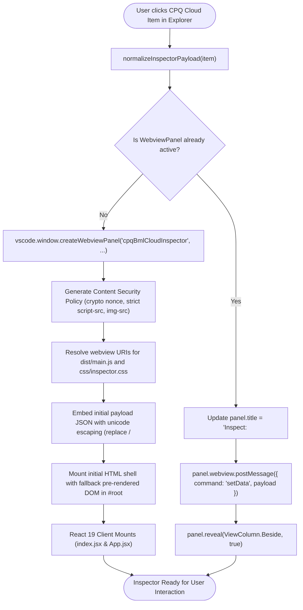
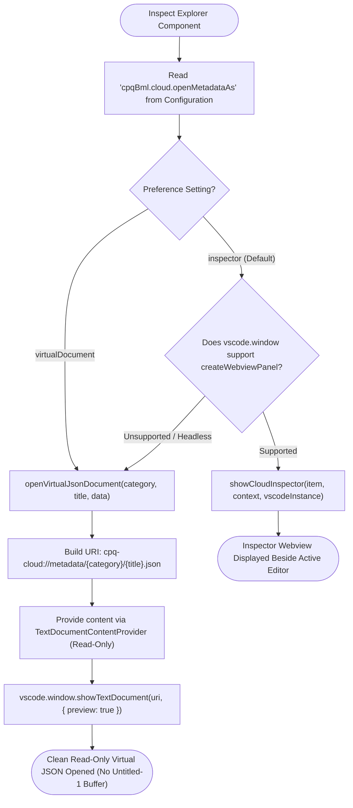
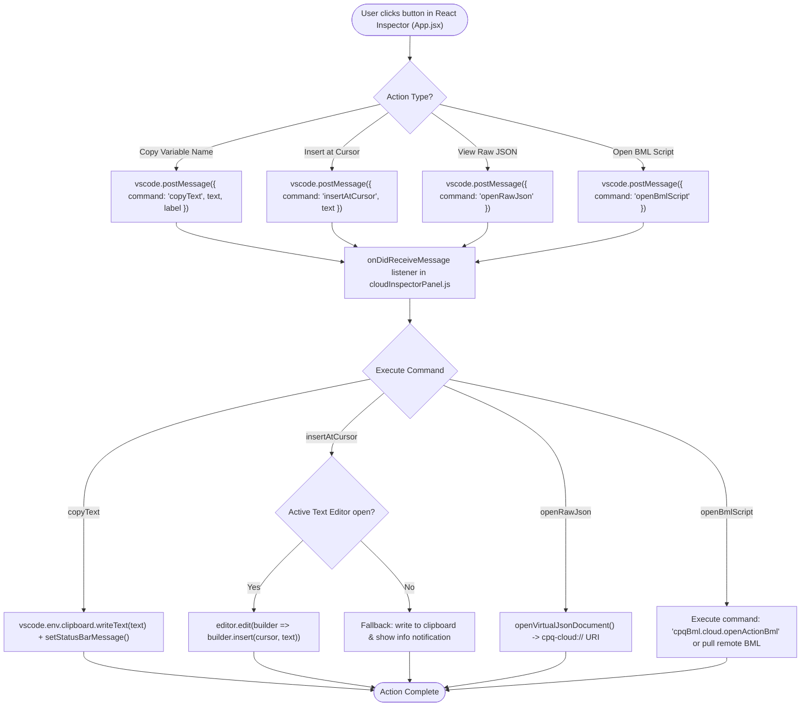

# Oracle CPQ BML Cloud Property Inspector: Architecture, Webview & Control Flow Graphs

## Table of Contents
1. [Overview & High-Level Architecture](#1-overview--high-level-architecture)
2. [Webview Lifecycle, CSP & React Hydration (CFG 1)](#2-webview-lifecycle-csp--react-hydration-cfg-1)
3. [Preference-Based Navigation & Virtual Document Fallback (CFG 2)](#3-preference-based-navigation--virtual-document-fallback-cfg-2)
4. [Bi-Directional Message Bus & Editor Actions (CFG 3)](#4-bi-directional-message-bus--editor-actions-cfg-3)
5. [Security, XSS Defense & Negative Edge Case Resilience (CFG 4)](#5-security-xss-defense--negative-edge-case-resilience-cfg-4)
6. [Inspector UI Features & Component Catalog Matrix](#6-inspector-ui-features--component-catalog-matrix)
7. [Configuration Settings & Developer Workflow Examples](#7-configuration-settings--developer-workflow-examples)

---

## 1. Overview & High-Level Architecture

When browsing Oracle CPQ components in the **Cloud Explorer** (Commerce Actions, Attributes, Integrations, Transactions, Parts, Data Tables, and Library Functions), developers previously experienced an annoying behavior: clicking an item opened an unsaved, dirty `Untitled-1.json` editor tab.

The **CPQ Cloud Property Inspector** replaces this with a dedicated, high-performance **React 19 + Pure CSS** webview panel paired with a **Read-Only Virtual Document Provider** (`cpq-cloud://`), ensuring zero dirty editor buffers while providing live search, one-click variable copying, and direct cursor code injection:

```mermaid
graph LR
    subgraph Cloud Explorer Tree View
        EXPLORER["Cloud Explorer Node<br/>Action, Attribute, Part, Integration"]
    end

    subgraph Dispatcher & Preference Router
        ROUTER["inspectItemAccordingToPreference()<br/>cloudInspectorPanel.js"]
        NORM["normalizeInspectorPayload()<br/>(category, title, variableName, type)"]
    end

    subgraph Webview Architecture (React 19 + CSS)
        PANEL["WebviewPanel Manager<br/>cloudInspectorPanel.js"]
        HTML["HTML Shell & CSP Nonce<br/>cloudInspectorHtml.js"]
        REACT["React 19 UI (src/App.jsx)<br/>css/inspector.css"]
        BUS["vscode.postMessage Client Bridge"]
    end

    subgraph Read-Only Virtual Document Subsystem
        VIRT["cloudDocumentProvider.js<br/>scheme: 'cpq-cloud'"]
        DOC["Read-Only JSON Document<br/>(no dirty buffer!)"]
    end

    EXPLORER -->|"Click or Context Menu"| ROUTER
    ROUTER -->|"mode === 'inspector'"| NORM
    NORM --> PANEL
    PANEL --> HTML
    HTML --> REACT
    REACT --> BUS
    BUS -->|"copyText / insertAtCursor / openRawJson"| PANEL

    ROUTER -->|"mode === 'virtualDocument'"| VIRT
    VIRT --> DOC
    PANEL -.->|"View Raw JSON fallback"| VIRT
```

---

## 2. Webview Lifecycle, CSP & React Hydration (CFG 1)

Ensures secure panel instantiation with Content Security Policy (CSP), cryptographic nonces, and instantaneous state hydration:



---

## 3. Preference-Based Navigation & Virtual Document Fallback (CFG 2)

Allows developers to customize their navigation workflow between the rich visual React Inspector and lightweight read-only virtual JSON tabs:



---

## 4. Bi-Directional Message Bus & Editor Actions (CFG 3)

Handles asynchronous messaging between the React UI in the webview and the VS Code Extension Host:



---

## 5. Security, XSS Defense & Negative Edge Case Resilience (CFG 4)

Defensive validation protecting against malformed metadata, circular structures, and script injection attacks:

```mermaid
flowchart TD
    IncomingData(["Raw Explorer Node or Message"]) --> ValidateType{"Input Type & Structure?"}

    ValidateType -->|"null / undefined"| SafeDefault["normalizeInspectorPayload: assign safe default object"]
    ValidateType -->|"Circular Object"| SafeJSON["getInspectorHtml: catch JSON.stringify circular exception"]
    ValidateType -->|"HTML in Title/Desc"| EscapeHTML["escapeHtml(): convert <, >, &, \", ' to entities"]
    ValidateType -->|"Script tags in JSON"| UnicodeEscape["Escape </script> as \\u003c/script> in initialData"]

    ValidateType -->|"Malformed Message"| GuardMessage["Wrap message handler in try/catch block"]
    ValidateType -->|"Empty text on copy"| SkipClipboard["Bypass clipboard API call without throwing"]

    SafeDefault --> RenderPipeline["Proceed through rendering or dispatch pipeline"]
    SafeJSON --> RenderPipeline
    EscapeHTML --> RenderPipeline
    UnicodeEscape --> RenderPipeline
    GuardMessage --> RenderPipeline
    SkipClipboard --> RenderPipeline

    RenderPipeline --> StableHost(["Webview and Host remain 100% resilient"])
```

---

## 6. Inspector UI Features & Component Catalog Matrix

| Component Category | Supported Metadata Properties | Interactive Inspector Capabilities |
| :--- | :--- | :--- |
| **Commerce Actions** | Name, Variable Name, Action Type (`Modify`, `Back`, `Save`), Process, Document, Script associations | Live property search, Copy variable name, Insert at cursor, Open BML Script, View raw JSON. |
| **Commerce Attributes** | Variable Name, Display Name, Data Type (`Float`, `String`, `Currency`), Default Value, Menu Options | Filter properties, Copy attribute token, Insert token into condition/action script, View menu values table. |
| **Integrations** | Integration Name, Type (`REST`, `SOAP`, `BOCS`), Process, Document, Endpoint URL | Copy endpoint/variable, View headers & request mapping parameters. |
| **Transactions** | Transaction ID, Quote Number, Process, Status, Created By, Last Modified | Copy transaction ID, Quick filter transaction attributes. |
| **Parts** | Part Number, Description, Price, Currency, Custom Attributes | Copy part number, Insert part lookup logic into BML scratchpad or active script. |
| **Data Tables** | Table Name, Description, Columns List, Primary Keys, Row Count | Copy table name, Scaffold parameterized BMQL query directly from table schema. |
| **Library Functions** | Function Name, Variable Name, Return Type, Folder/Package, Description | Open BML script, View function signature, Copy call syntax `util.<folder>.<fn>()`. |

---

## 7. Configuration Settings & Developer Workflow Examples

### A. Extension Settings (`settings.json`)

```json
{
  // Choose how Cloud Explorer items are displayed on click
  "cpqBml.cloud.openMetadataAs": "inspector", // Options: "inspector" | "virtualDocument"

  // Auto-reveal inspector beside active editor
  "workbench.editor.openSideBySideDirection": "right"
}
```

### B. Developer Workflow Examples

#### 1. Instant Variable Name Insertion
1. Open a BML script in the editor (`calcPricing.bml`).
2. In the **Cloud Explorer**, click on any Commerce Attribute (e.g. `discountPercent_t`).
3. In the Property Inspector panel that opens beside your editor, click **Insert at Cursor**.
4. The exact attribute variable name is injected directly into your active code block without leaving the keyboard.

#### 2. Filtering Complex Integration Metadata
1. In the **Cloud Explorer**, click an outbound REST Integration.
2. In the Inspector header, type `endpoint` or `token` in the **Filter Properties...** search box.
3. The property table filters in real time to reveal matching parameters and endpoint URLs.
4. Click **Copy** to grab the target property value.

#### 3. Reading Full JSON without Cluttering Editor Tabs
1. Click **View Raw JSON** in the Inspector footer.
2. A read-only virtual document (`cpq-cloud://metadata/action/cleanSave_t.json`) opens in preview mode.
3. Review the full schema, format, or copy sections without ever prompting an "Unsaved Changes" dialog when closing.
