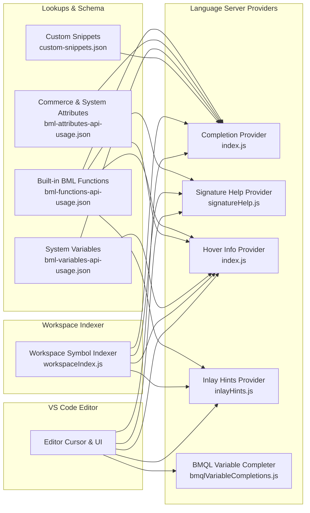
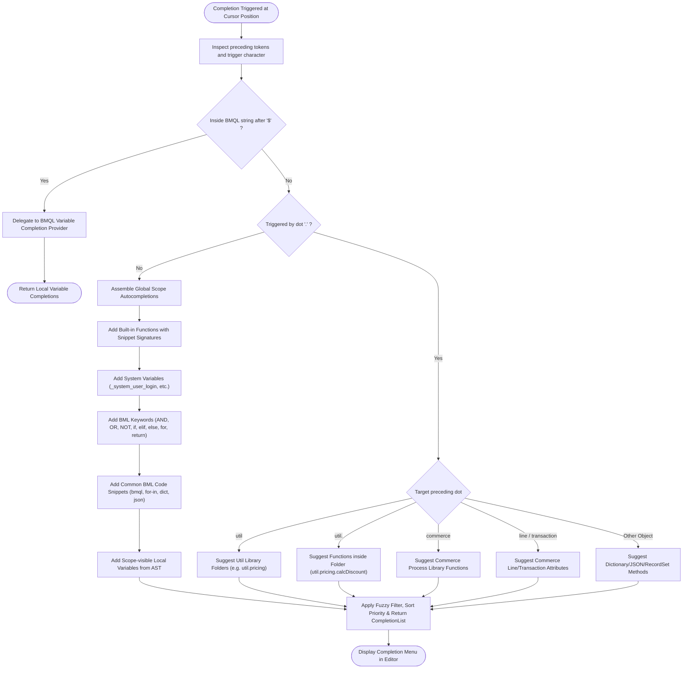
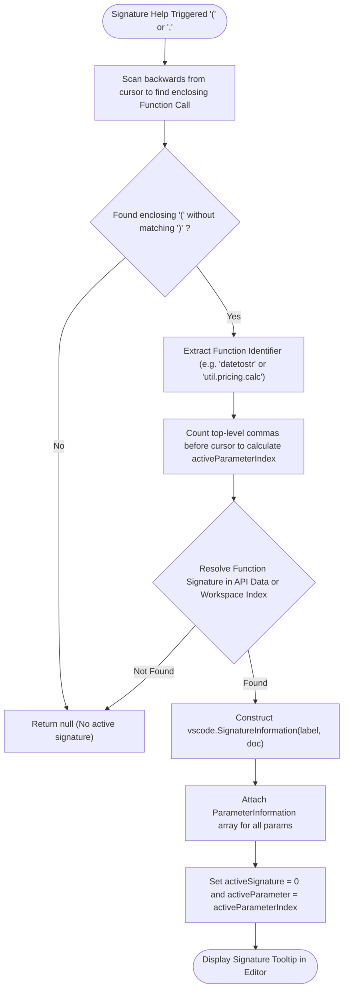
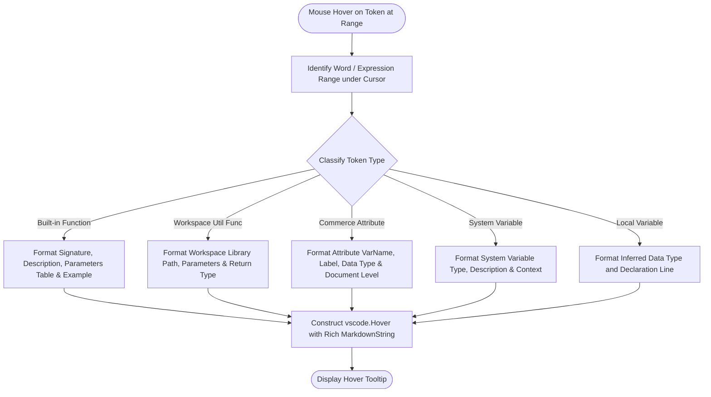
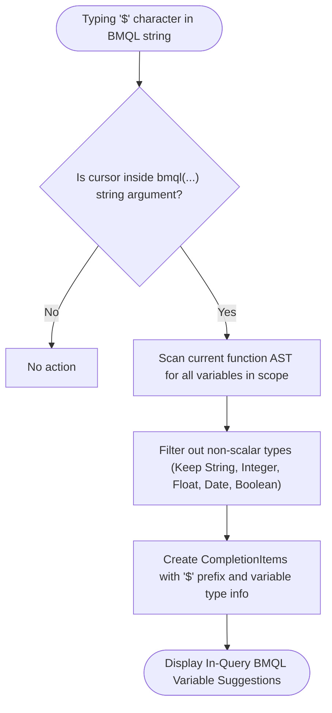
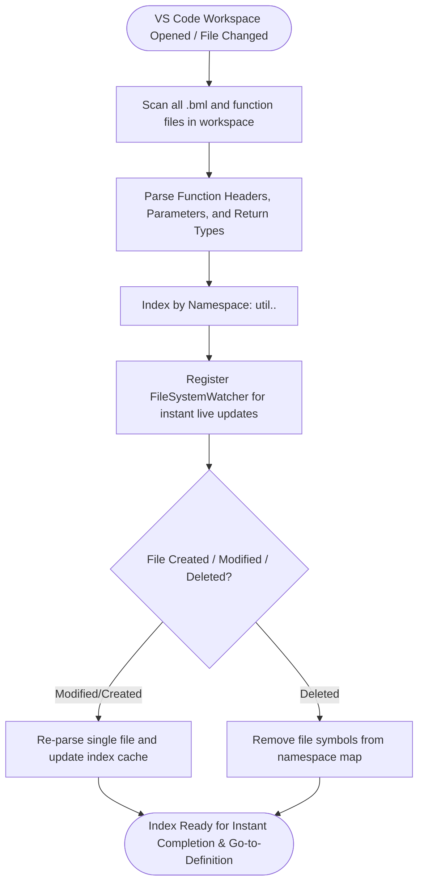
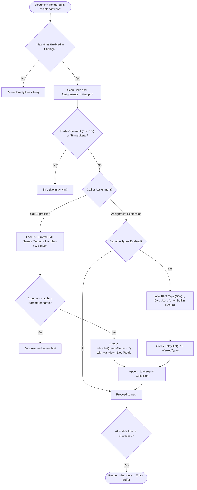

# Oracle CPQ BML IntelliSense: Architecture, Providers & Control Flow Graphs

## Table of Contents
1. [Overview & High-Level Architecture](#1-overview--high-level-architecture)
2. [Completion Item Provider Lifecycle (CFG 1)](#2-completion-item-provider-lifecycle-cfg-1)
3. [Signature Help & Parameter Hinting (CFG 2)](#3-signature-help--parameter-hinting-cfg-2)
4. [Hover Information Provider Flow (CFG 3)](#4-hover-information-provider-flow-cfg-3)
5. [BMQL Dynamic Variable Autocompletion Flow (CFG 4)](#5-bmql-dynamic-variable-autocompletion-flow-cfg-4)
6. [Workspace Library Indexing & Cross-File Symbol Resolution (CFG 5)](#6-workspace-library-indexing--cross-file-symbol-resolution-cfg-5)
7. [Inlay Parameter Hints Provider (CFG 6)](#7-inlay-parameter-hints-provider-cfg-6)
8. [Lookup Catalogs & Data Sources](#8-lookup-catalogs--data-sources)
9. [Practical Usage Examples & Snippets](#9-practical-usage-examples--snippets)

---

## 1. Overview & High-Level Architecture

The **BML IntelliSense** subsystem provides IDE intelligence for Oracle CPQ BML, powering code completions, signature tooltips, hover documentation, cross-file definition navigation, inlay parameter hints, and BMQL variable auto-suggestions:



---

## 2. Completion Item Provider Lifecycle (CFG 1)

This control flow graph shows how completions are resolved and prioritized when triggered (by keystroke or trigger characters `.`, `$`, `"`):



---

## 3. Signature Help & Parameter Hinting (CFG 2)

Active parameter position tracking and parameter signature tooltip generation:



---

## 4. Hover Information Provider Flow (CFG 3)

Displays rich markdown documentation, return types, parameter tables, and usage examples on mouse hover:



---

## 5. BMQL Dynamic Variable Autocompletion Flow (CFG 4)

Provides intelligent variable suggestions when typing dynamic SQL variables (`$`) inside BMQL queries:



---

## 6. Workspace Library Indexing & Cross-File Symbol Resolution (CFG 5)

Maintains a fast in-memory index of all BML util libraries and commerce process scripts across the workspace:



---

## 7. Inlay Parameter & Type Hints Provider (CFG 6)

Renders inline parameter names at function call sites and inferred data types at variable assignments:



### Inlay Hint Features & Capabilities
* **Curated BML Knowledge Names**: 100% of all standard BML functions mapped (`replace(str, oldValue, newValue)`, `split(str, separator)`, `append(array, element)`, `fmod(dividend, divisor)`).
* **Dynamic Variadic Overload Support**: Variadic functions like `sbappend` dynamically generate `stringBuilder: sb, value1: "a", value2: "b"`.
* **Smart Redundancy Suppression**: Redundant hints like `record: record` or `"fieldName": "fieldName"` are automatically hidden.
* **Comment & String Safety**: Zero hints rendered inside single-line comments (`//`), block comments (`/* */`), or string literals.
* **Interactive Tooltips**: Hovering over any parameter hint displays its function summary and syntax signature.
* **Variable Type Inference**: Optional inline type annotations for RHS constructors, BMQL queries, and function returns.

---

## 8. Lookup Catalogs & Data Sources

| Catalog File | Purpose | Size / Symbols |
| :--- | :--- | :--- |
| **`bml-functions-api-usage.json`** | Built-in functions, descriptions, parameters, return types, and code examples. | 363 KB (~150+ functions) |
| **`bml-attributes-api-usage.json`** | Standard commerce line/transaction attributes, descriptions, and data types. | 228 KB (~500+ attributes) |
| **`bml-variables-api-usage.json`** | System session variables, system configuration keys, and runtime variables. | 19 KB (~50+ variables) |
| **`bml-util-attributes-api-usage.json`** | Util library standard properties and configurations. | 10 KB |
| **`function-param-data-types.json`** | Fast lookup mapping for function parameter validation. | 1 KB |
| **`function-return-types.json`** | Fast lookup mapping for return type inference. | 1 KB |
| **`custom-snippets.json`** | Pre-packaged snippets for BMQL, conditionals, dictionaries, JSON, and web services. | 3.8 KB |

---

## 9. Practical Usage Examples & Snippets

### Triggering IntelliSense in VS Code
* **Trigger Autocomplete**: Press `Ctrl+Space` (Windows/Linux) or `Cmd+Space` (macOS).
* **Trigger Signature Help**: Press `Ctrl+Shift+Space` (Windows/Linux) or `Cmd+Shift+Space` (macOS) inside function parentheses `( ... )`.
* **Go to Definition**: Press `F12` or `Ctrl+Click` on any `util.<folder>.<func>()` call.

---

### Example 1: Workspace Util Library Autocompletion

Type `util.` to see all library folders, then type `.` to see functions:

```javascript
// Step 1: Type 'util.' -> Suggestions: [pricing, approval, bom, common]
// Step 2: Type 'util.pricing.' -> Suggestions: [calcDiscount, getTierRate, applyMargin]
finalDiscount = util.pricing.calcDiscount(line, basePrice);
```

---

### Example 2: In-Query BMQL Dynamic Variable Autocompletion

Inside a `bmql(...)` query string, type `$` to get intelligent suggestions of local variables in scope:

```javascript
statusFilter = "ACTIVE";
minPrice = 50.0;

// Type '$' inside query string -> Auto-suggests: [$statusFilter, $minPrice]
rs = bmql("SELECT part_number, price FROM Parts WHERE status = $statusFilter AND price >= $minPrice");
```

---

### Example 3: Function Signature Help Tooltip

When opening parentheses or typing commas, IntelliSense displays the parameter signature and highlights the active parameter:

```javascript
// Typing '(' or ',' triggers parameter documentation:
// datetostr(date: Date, [format: String], [timezone: String]) -> String
resultStr = datetostr(getdate(), "yyyy-MM-dd HH:mm:ss", "America/New_York");
```

---

### Example 4: Rich Hover Tooltips

Hovering over standard built-in functions displays markdown tables with parameter descriptions and working code examples:

```javascript
// Hovering over 'urldata' displays:
/**
 * urldata(url, method, [headers], [data]) -> String
 * 
 * Sends an HTTP/HTTPS REST request to an external web service.
 * 
 * Parameters:
 * - url (String): Target HTTP/HTTPS endpoint
 * - method (String): "GET", "POST", "PUT", "DELETE"
 * - headers (dict): Header key-value pairs (e.g. Authorization, Content-Type)
 * - data (String): Request body payload
 * 
 * Returns: String response payload
 */
response = urldata("https://api.example.com/v1/orders", "POST", headerDict, jsonPayload);
```

---

### Example 5: Built-in Code Snippets (11 Domain Categories)

Type any snippet prefix and press `Tab` or `Enter` to expand pure skeleton templates with sequential `$1` &rarr; `$2` &rarr; `$0` tab-stops:

* **Control Flow**: `if`, `ifelse`, `ifelseif`, `forin`, `forin-idx`, `range`
* **Dictionaries**: `dict` (with all 20 type choices), `dict-iter`, `dict-get-default`
* **JSON & JSONPath**: `json-new`, `json-put`, `jsonget-typed`, `json-iter`, `jsonpath-get`, `jsonpath-get-typed`, `jsonarray-new`, `jsonarray-append`, `jsonarray-get-typed`
* **BMQL & Database**: `bmql-select`, `bmql-select-in`, `bmql-safe`, `bmql-update`, `bmql-insert`, `bmql-delete`
* **REST & Web Services**: `urldata-get`, `urldata-post`, `urldata-auth-bearer`, `urldata-auth-basic`
* **XML & XSLT**: `xml-read`, `xml-transform`
* **Commerce BML**: `commerce-return`, `commerce-line-iter`, `commerce-delimit-return`
* **Utilities & Guards**: `sb-concat`, `split-safe`, `null-guard`, `try-atoi`, `try-atof`, `round-currency`
* **Dates**: `date-format`, `date-parse`
* **Documentation**: `doc-func`, `doc-file`

---

### Example 6: JSONPath & BMQL Contextual Parameter Autocompletions

When entering string literals inside specialized BML function calls, IntelliSense suggests tailored templates:

* **`jsonpathgetsingle(jsonObj, "")` / `jsonpathgetmultiple(jsonObj, "")`**: Auto-suggests aggregations (`$.array.min()`, `$.array.max()`, `$.array.sum()`, `$.array.stddev()`), boolean filters (`[?(@.active == true)]`), set filters (`[?(@.field in ['A', 'B'])]`), and slices (`[:2]`, `[1:3]`).
* **`bmql("")`**: Auto-suggests complete query patterns including `IN ($arrayVar)`, `BETWEEN $min AND $max`, `LIKE $pattern`, and fully dynamic `$columns FROM $table WHERE $where` substitutions.

> 📖 For full skeleton templates, variable mirroring flows, and keyboard navigation rules, see the dedicated **[BML Snippets Catalog](BML_Snippets.md)**.


