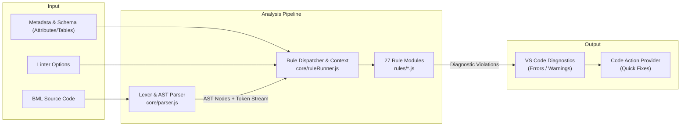
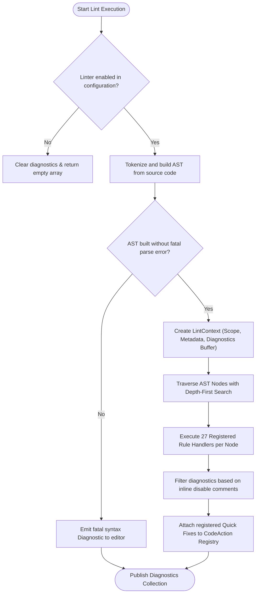
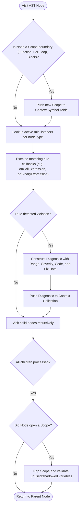
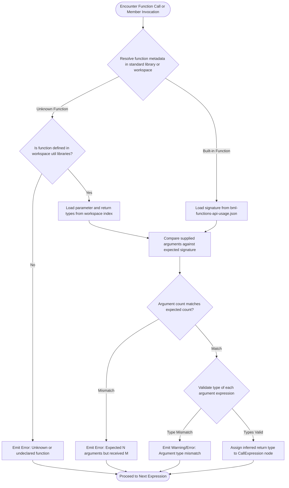
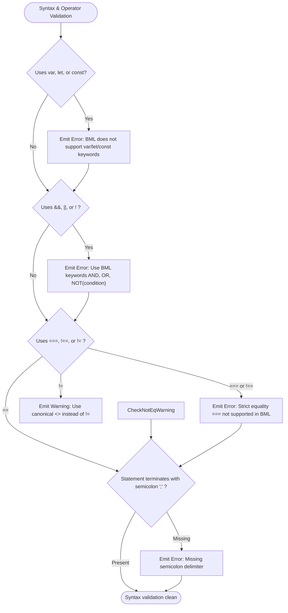
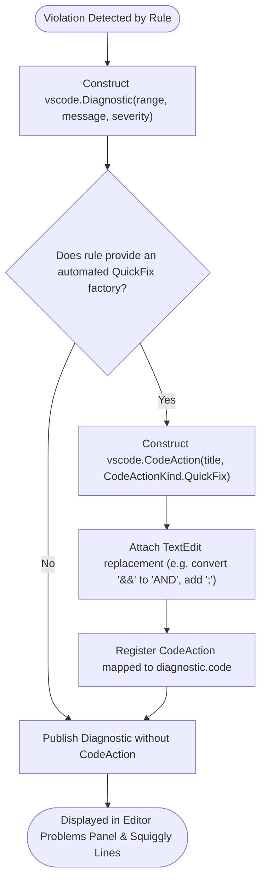

# Oracle CPQ BML Linter: Architecture, Rules & Control Flow Graphs

## Table of Contents
1. [Overview & High-Level Architecture](#1-overview--high-level-architecture)
2. [Document Linting Lifecycle (CFG 1)](#2-document-linting-lifecycle-cfg-1)
3. [AST Traversal & Rule Visitor Pipeline (CFG 2)](#3-ast-traversal--rule-visitor-pipeline-cfg-2)
4. [Type Inference & Function Signature Validation (CFG 3)](#4-type-inference--function-signature-validation-cfg-3)
5. [Performance & Anti-Pattern Analysis (CFG 4)](#5-performance--anti-pattern-analysis-cfg-4)
6. [Syntax & Operator Enforcement (CFG 5)](#6-syntax--operator-enforcement-cfg-5)
7. [Diagnostic Pipeline & Quick Fix Provider (CFG 6)](#7-diagnostic-pipeline--quick-fix-provider-cfg-6)
8. [Comprehensive Rule Catalog (27 Built-in Rules)](#8-comprehensive-rule-catalog-27-built-in-rules)
9. [Practical Usage Examples & Quick Fix Workflows](#9-practical-usage-examples--quick-fix-workflows)

---

## 1. Overview & High-Level Architecture

The **BML Linter** is a static analysis engine for Oracle CPQ BML. It parses source code into an Abstract Syntax Tree (AST), executes 27 rule visitors, computes diagnostic ranges (Errors, Warnings, Information, Hints), and provides automated Code Actions (Quick Fixes):



---

## 2. Document Linting Lifecycle (CFG 1)

This control flow graph illustrates the end-to-end execution path when a BML document is linted (e.g. on file open, keystroke debounce, save, or MCP `lint_function` call):



---

## 3. AST Traversal & Rule Visitor Pipeline (CFG 2)

The rule runner visits AST nodes using an event-driven visitor pattern (`enterNode` / `leaveNode`):



---

## 4. Type Inference & Function Signature Validation (CFG 3)

The type checker validates operand compatibility, function parameter counts and types, return types, and dictionary key/value safety:



---

## 5. Performance & Anti-Pattern Analysis (CFG 4)

Validates Oracle CPQ architectural constraints including loop nesting depth &le; 3, block nesting depth &le; 5, BMQL query placement outside loops, and 1,000-record query caps:

```mermaid
flowchart TD
    AnalyzePerf(["Analyze Performance & Complexity Rules"]) --> CheckLoopDepth{"Loop nesting depth > 3?"}
    CheckLoopDepth -->|"Yes"| EmitLoopDepth["Emit Warning: Excessive loop nesting (depth > 3)"]
    CheckLoopDepth -->|"No"| CheckBlockDepth{"Block nesting depth > 5?"}

    CheckBlockDepth -->|"Yes"| EmitBlockDepth["Emit Warning: Excessive condition/block nesting (depth > 5)"]
    CheckBlockDepth -->|"No"| CheckBMQLNode{"Is node a BMQL query expression?"}

    CheckBMQLNode -->|"Yes"| CheckInsideLoop{"Is BMQL query inside a for-loop body?"}
    CheckInsideLoop -->|"Yes"| EmitNPlusOne["Emit Warning: BMQL query inside loop causes N+1 query overhead"]
    CheckInsideLoop -->|"No"| CheckBMQLCap{"Query uses UPDATE, MODIFY, DISTINCT, or ORDER BY?"}

    CheckBMQLCap -->|"Yes"| EmitCapInfo["Emit Info: BMQL operations are capped at 1,000 records"]
    CheckBMQLCap -->|"No"| CheckArraySize{"Array declaration exceeds limits (5000 rows / 50 cols)?"}

    CheckArraySize -->|"Yes"| EmitArrayLimit["Emit Warning: Exceeds default BML array size limits"]
    CheckArraySize -->|"No"| PerfClean(["Performance validation clean"])

    EmitLoopDepth --> CheckBlockDepth
    EmitBlockDepth --> CheckBMQLNode
    EmitNPlusOne --> CheckBMQLCap
    EmitCapInfo --> CheckArraySize
    EmitArrayLimit --> PerfClean
```



---

## 6. Syntax & Operator Enforcement (CFG 5)

Enforces strict BML language grammar, catching unsupported C-style operators, variable declaration keywords, equality operators, and missing statement delimiters:



---

## 7. Diagnostic Pipeline & Quick Fix Provider (CFG 6)

Translates lint violations into VS Code Diagnostics and generates automated single-click Quick Fixes:



---

## 8. Comprehensive Rule Catalog (27 Built-in Rules)

| Category | Rule File | Rule ID | Severity | Description | Quick Fix? |
| :--- | :--- | :--- | :--- | :--- | :---: |
| **Syntax & Operators** | `semicolon.js` | `bml-semicolon` | Error | Requires all statements to terminate with `;`. | Yes |
| | `operators.js` | `bml-unsupported-operator` | Error | Flags unsupported `&&`, `||`, `!`, `===`, `!==`. | Yes |
| | `assignment.js` | `bml-var-keyword` | Error | Prohibits JavaScript variable declaration keywords (`var`, `let`, `const`). | Yes |
| | `mixedOperators.js` | `bml-mixed-operators` | Warning | Requires parentheses when mixing arithmetic and boolean operators. | No |
| **Type Safety** | `typeCheck.js` | `bml-type-mismatch` | Error | Validates variable assignment and expression type compatibility. | No |
| | `typeCheck.js` | `bml-dict-put-type-mismatch` | Error | Validates value type inserted via `put()` matches declared `dict("<type>")` element type. | No |
| | `typeCheck.js` | `bml-array-bounds-error` | Error | Statically flags constant index access exceeding declared or initialized array size. | No |
| | `typeCheckOperands.js` | `bml-operand-type-mismatch` | Error | Validates operand types for binary operators (`+`, `-`, `*`, `/`). | No |
| | `metadataTypes.js` | `bml-metadata-type` | Warning | Validates attribute and custom field access against CPQ schema definitions. | No |
| | `nullSafety.js` | `bml-null-safety` | Warning | Warns on uninitialized scalar/dictionary access without null-checks. | No |
| **Functions & Signatures** | `functions.js` | `bml-unknown-function` | Error | Flags invocations of unknown or misspelled built-in/library functions. | No |
| | `functionSignature.js` | `bml-signature-mismatch` | Error | Validates argument counts and parameter types against function signatures. | No |
| | `workspaceFunctions.js`| `bml-workspace-function` | Warning | Validates cross-library `util.<folder>.<name>()` calls across workspace. | No |
| **Performance & Limits** | `performance.js` | `bml-performance-loop-depth` | Warning | Warns when loop nesting depth exceeds 3. | No |
| | `performance.js` | `bml-performance-block-depth`| Warning | Warns when block/condition nesting depth exceeds 5. | No |
| | `performance.js` | `bml-performance-bmql-in-loop`| Warning | Flags BMQL database queries executed inside loop bodies (N+1 query). | No |
| | `performance.js` | `bml-performance-bmql-cap` | Info | Informs of 1,000-record query processing limit on `UPDATE`/`MODIFY`/`ORDER BY`. | No |
| **Logic & Dead Code** | `constantConditions.js`| `bml-constant-condition` | Warning | Flags conditions that always evaluate to `true` or `false`. | No |
| | `unreachable.js` | `bml-unreachable-code` | Warning | Flags code placed after an unconditional `return`, `break`, or `throwerror`. | Yes |
| | `duplicateBranches.js` | `bml-duplicate-branch` | Warning | Flags identical conditional branches in `if / elif / else` structures. | No |
| | `infiniteLoop.js` | `bml-infinite-loop` | Warning | Detects loops with non-advancing conditions. | No |
| | `lonelyIf.js` | `bml-lonely-if` | Warning | Recommends flattening `else { if (...) }` into `elif (...)`. | Yes |
| | `unusedExpressions.js` | `bml-unused-expression` | Warning | Flags statements that evaluate expressions without assigning or returning. | No |
| **Scope & Variables** | `useBeforeDefine.js` | `bml-use-before-define` | Error | Flags variable references prior to initial assignment. | No |
| | `shadowedVariables.js` | `bml-shadowed-variable` | Warning | Flags inner block variables shadowing outer scope variables. | No |
| | `variables.js` | `bml-unused-variable` | Hint | Flags declared variables that are never read in subsequent code. | Yes |
| **Domain & System** | `commerceAttributes.js`| `bml-commerce-attribute` | Warning | Validates standard commerce attribute names (`_document_number`, etc.). | No |
| | `systemVariables.js` | `bml-system-variable` | Warning | Validates standard system variables (`_system_user_login`, etc.). | No |
| | `strings.js` | `bml-unescaped-string` | Warning | Validates string escaping and multi-line concatenation safety. | No |
| | `comments.js` | `bml-comment-formatting` | Hint | Validates JSDoc parameter documentation completeness. | No |
| | `style.js` | `bml-style-conventions` | Hint | Enforces canonical BML formatting and naming conventions. | Yes |

---

## 9. Practical Usage Examples & Quick Fix Workflows

### How to Apply Quick Fixes in VS Code
1. Place cursor on the squiggly line under the error or warning.
2. Press `Ctrl+.` (Windows/Linux) or `Cmd+.` (macOS) or click the 💡 **Lightbulb** icon.
3. Select the recommended Quick Fix to apply the correction automatically.

---

### Example 1: Unsupported Logical Operators (`bml-unsupported-operator`)

#### Problematic Code:
```javascript
// ERROR: && and || and ! are not supported in BML
if (discount > 0.10 && !isExpired || isManager) {
    return true;
}
```

#### Lightbulb Quick Fix Action:
* Select `"Replace unsupported logical operators with BML keywords (AND, OR, NOT)"`

#### Fixed Code:
```javascript
if (discount > 0.10 AND NOT(isExpired) OR isManager) {
    return true;
}
```

---

### Example 2: JavaScript Declaration Keywords (`bml-var-keyword`)

#### Problematic Code:
```javascript
// ERROR: BML does not use var, let, or const
var customerName = "Acme Corp";
const discountRate = 0.15;
let isApproved = true;
```

#### Lightbulb Quick Fix Action:
* Select `"Remove JS declaration keyword (var/let/const)"`

#### Fixed Code:
```javascript
customerName = "Acme Corp";
discountRate = 0.15;
isApproved = true;
```

---

### Example 3: Missing Statement Delimiter (`bml-semicolon`)

#### Problematic Code:
```javascript
// ERROR: Missing semicolon delimiter
totalPrice = unitPrice * quantity
return totalPrice
```

#### Lightbulb Quick Fix Action:
* Select `"Insert missing semicolon ';'" `

#### Fixed Code:
```javascript
totalPrice = unitPrice * quantity;
return totalPrice;
```

---

### Example 4: Performance Anti-Pattern: BMQL Inside Loop (`bml-performance-bmql-in-loop`)

#### Anti-Pattern Code (Causes N+1 Database Hits):
```javascript
// WARNING: BMQL query inside for-loop degrades performance
for part in partsList {
    rs = bmql("SELECT price FROM Parts WHERE part_number = $part");
    for row in rs {
        totalPrice = totalPrice + getfloat(row, "price");
    }
}
```

#### Recommended Refactored Pattern (Batch Query Before Loop):
```javascript
// Fetch all parts once outside loop
rs = bmql("SELECT part_number, price FROM Parts WHERE status = 'ACTIVE'");
priceDict = dict("float");

for row in rs {
    pNum = get(row, "part_number");
    pPrice = getfloat(row, "price");
    put(priceDict, pNum, pPrice);
}

// In-memory loop with zero database latency
for part in partsList {
    if (containskey(priceDict, part)) {
        totalPrice = totalPrice + get(priceDict, part);
    }
}
```

---

### Example 5: Function Signature & Type Validation (`bml-signature-mismatch`)

#### Problematic Code:
```javascript
// ERROR: datetostr expects (Date, String), received (String, Integer)
formattedDate = datetostr("2026-08-29", 123);
```

#### Fixed Code:
```javascript
currDate = getdate();
formattedDate = datetostr(currDate, "yyyy-MM-dd");
```

---

### Example 6: Inline Rule Suppression

Disable specific rules for intentional patterns:

```javascript
// bml-lint-disable-next-line bml-performance-loop-depth
for i in level1 {
    for j in level2 {
        for k in level3 {
            for m in level4 {
                // Nested iteration
            }
        }
    }
}
```

---

### Customizing Linter Rules in `.vscode/settings.json`

```json
{
  "cpqBml.lint.enabled": true,
  "cpqBml.lint.maxLoopDepth": 3,
  "cpqBml.lint.maxBlockDepth": 5,
  "cpqBml.lint.rules": {
    "bml-semicolon": "error",
    "bml-unsupported-operator": "error",
    "bml-performance-bmql-in-loop": "warning",
    "bml-unused-variable": "hint"
  }
}
```

---

### Calling Linter via MCP Tool (`lint_function`)

```json
{
  "name": "lint_function",
  "arguments": {
    "functionName": "calcTieredDiscount"
  }
}
```

