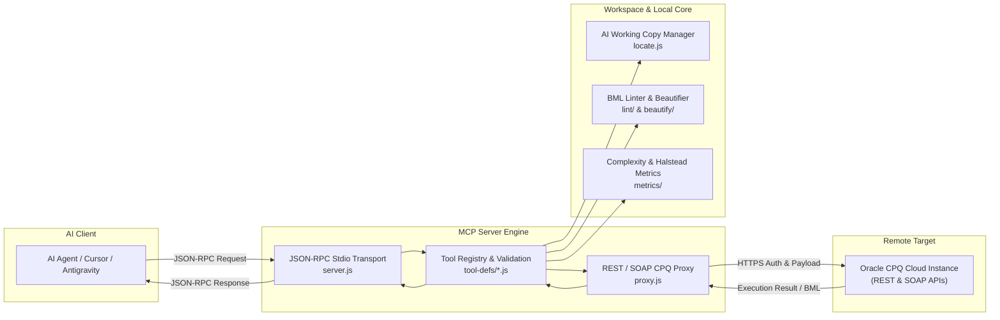
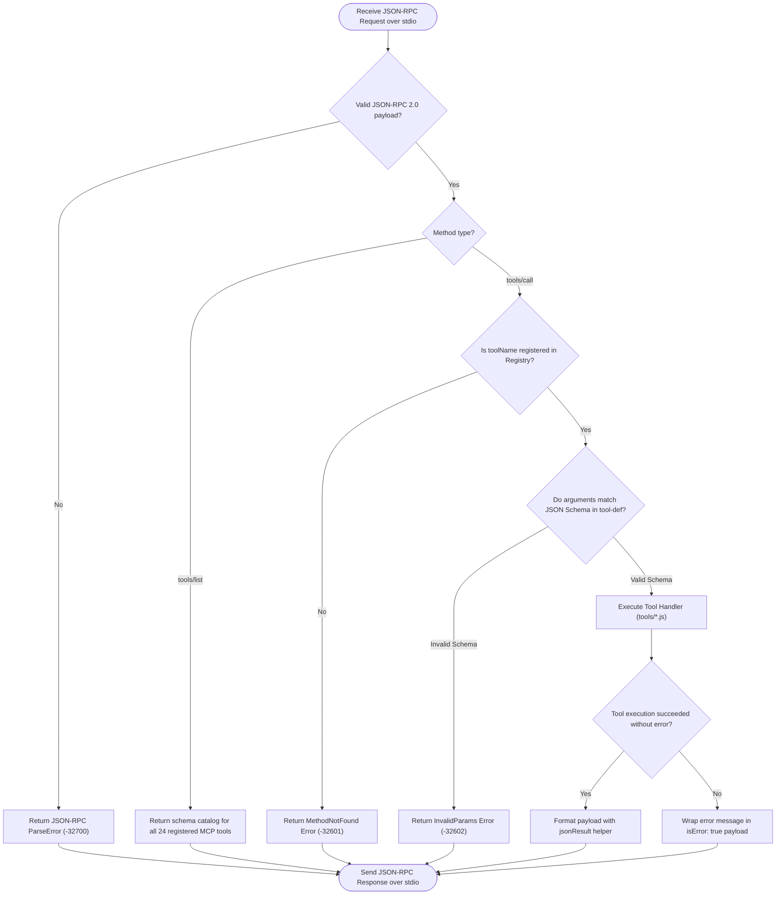
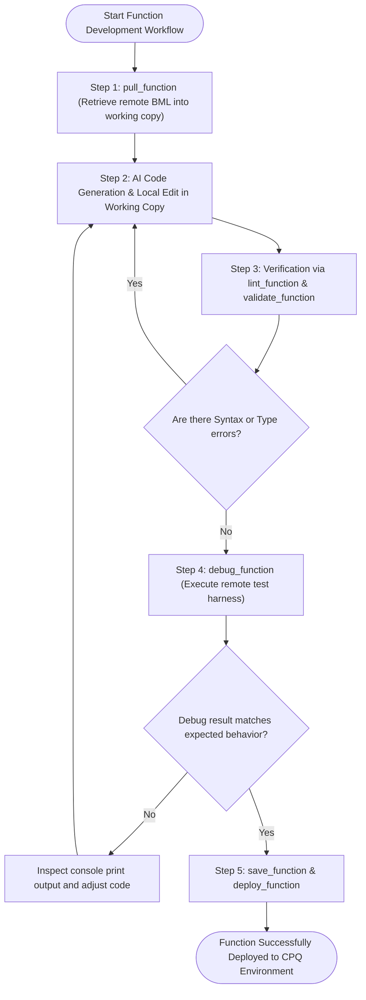
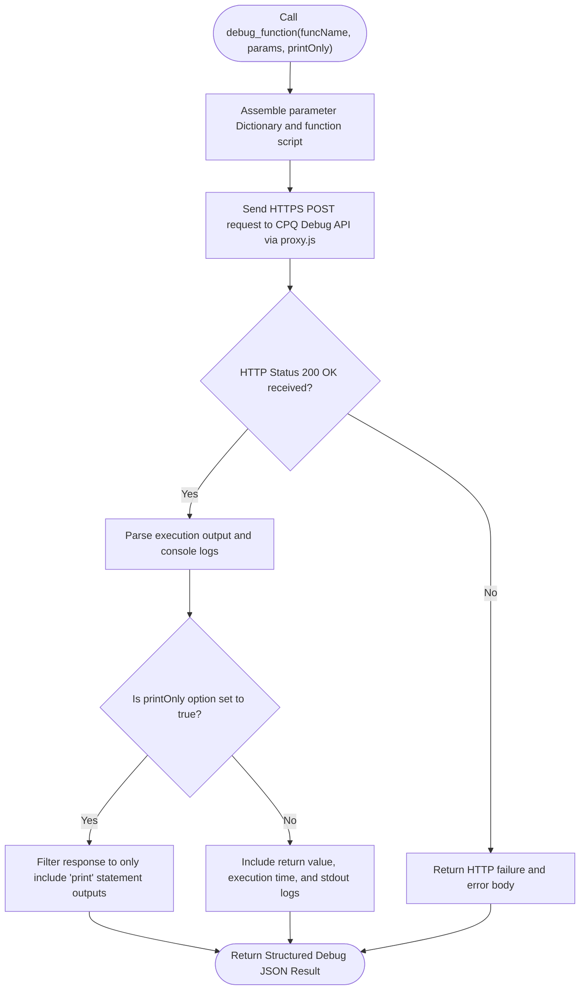
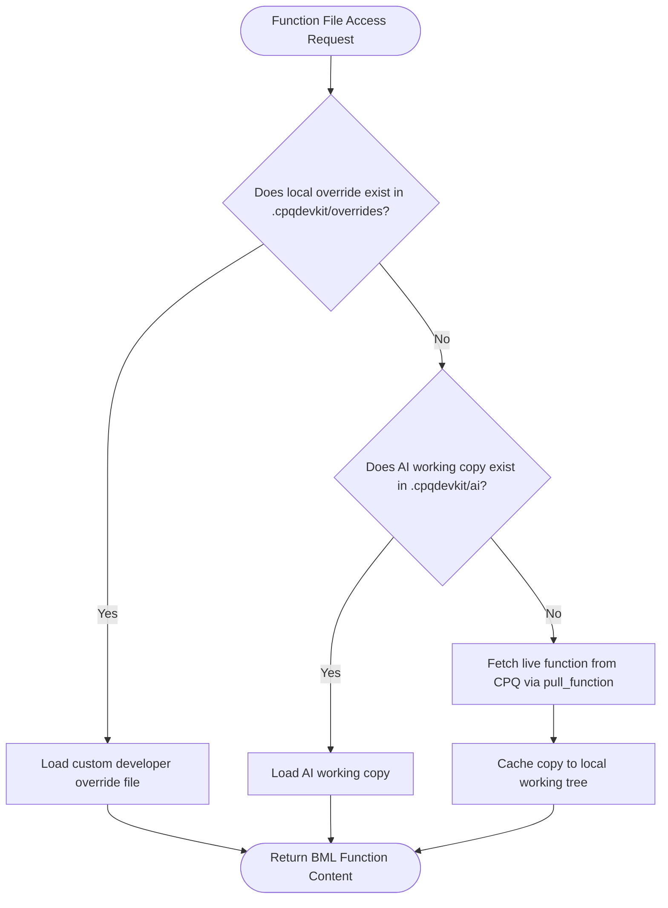
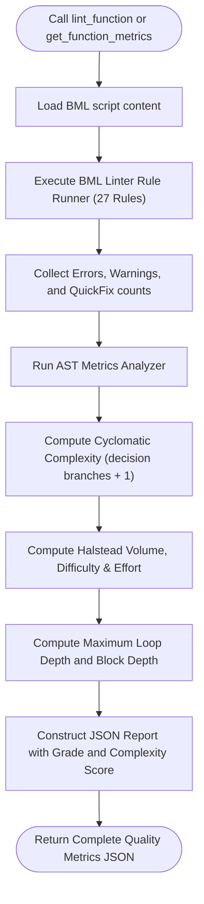
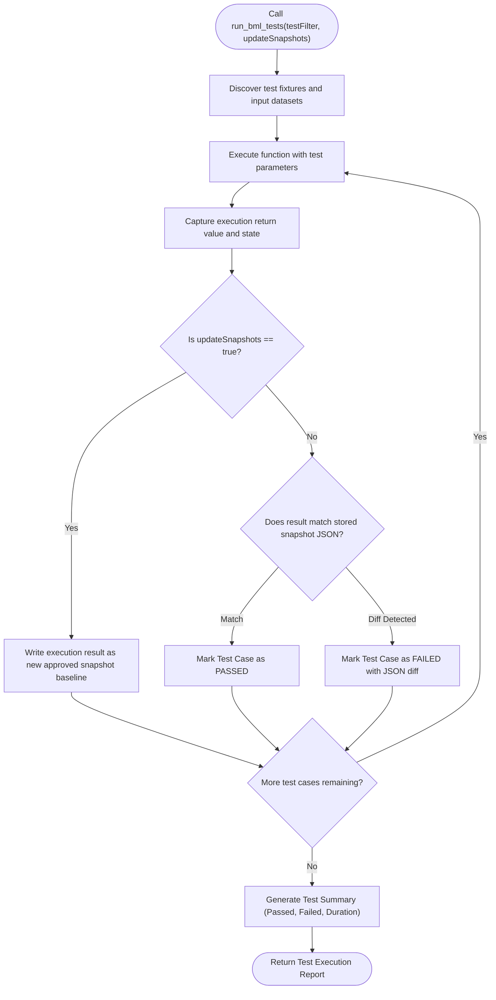

# Oracle CPQ BML MCP Server: Architecture, Tools & Control Flow Graphs

## Table of Contents
1. [Overview & High-Level Architecture](#1-overview--high-level-architecture)
2. [MCP Server Request & Tool Dispatch Lifecycle (CFG 1)](#2-mcp-server-request--tool-dispatch-lifecycle-cfg-1)
3. [5-Stage BML Function Lifecycle Flow (CFG 2)](#3-5-stage-bml-function-lifecycle-flow-cfg-2)
4. [Remote Debug Execution & Output Extraction (CFG 3)](#4-remote-debug-execution--output-extraction-cfg-3)
5. [Working Copy & Local Override State Machine (CFG 4)](#5-working-copy--local-override-state-machine-cfg-4)
6. [Static Analysis & Code Quality Pipeline (CFG 5)](#6-static-analysis--code-quality-pipeline-cfg-5)
7. [Regression Testing & Snapshot Verification (CFG 6)](#7-regression-testing--snapshot-verification-cfg-6)
8. [Comprehensive MCP Tool Catalog (24 Tools)](#8-comprehensive-mcp-tool-catalog-24-tools)

---

## 1. Overview & High-Level Architecture

The **CPQ-BML MCP Server** exposes the full lifecycle of Oracle CPQ BML development as Model Context Protocol (MCP) tools via JSON-RPC over `stdio`. It connects AI coding agents directly to the local workspace, BML AST compiler, and remote Oracle CPQ instances:

---

## 2. MCP Server Request & Tool Dispatch Lifecycle (CFG 1)

This control flow graph shows how incoming tool invocations are authenticated, schema-validated, executed, and formatted:

---

## 3. 5-Stage BML Function Lifecycle Flow (CFG 2)

The recommended 5-stage lifecycle workflow for AI agents developing BML functions:

---

## 4. Remote Debug Execution & Output Extraction (CFG 3)

The `debug_function` tool runs functions on the remote Oracle CPQ debug engine, with optional `printOnly: true` filtering:

---

## 5. Working Copy & Local Override State Machine (CFG 4)

Manages the separation between remote CPQ source, local overrides, and AI ephemeral working copies:

---

## 6. Static Analysis & Code Quality Pipeline (CFG 5)

Calculates AST diagnostics, cyclomatic complexity, Halstead metrics, and nesting depths via MCP:

---

## 7. Regression Testing & Snapshot Verification (CFG 6)

Automates remote and local unit tests and compares execution snapshots against baselines:

---

## 8. Comprehensive MCP Tool Catalog (24 Tools)

| Category | Tool Name | Parameters | Description |
| :--- | :--- | :--- | :--- |
| **Lifecycle** | `pull_function` | `functionName`, `type` | Pulls a single BML function from CPQ into local working copy. |
| | `pull_functions` | `functionNames` | Batch-pulls multiple functions simultaneously. |
| | `save_function` | `functionName`, `code` | Saves the working copy to the CPQ environment. |
| | `validate_function` | `functionName`, `code` | Compiles and validates syntax remotely on CPQ. |
| | `debug_function` | `functionName`, `params`, `printOnly` | Executes function in remote debug harness with inputs. |
| | `deploy_function` | `functionName` | Deploys validated function to target CPQ environment. |
| | `mass_deploy_util_functions`| `folderName` | Deploys all util library functions in bulk. |
| | `deploy_commerce_process` | `processName` | Deploys commerce process definitions and scripts. |
| | `create_util_function` | `name`, `folder`, `returnType` | Creates a new util function skeleton in CPQ. |
| | `create_override` | `functionName`, `code` | Creates a local developer override file. |
| | `remove_override` | `functionName` | Removes local override, reverting to base. |
| | `reset_ai_copy` | `functionName` | Discards AI modifications and restores original copy. |
| | `list_local_functions` | `filter` | Lists all local BML functions in workspace. |
| **Formatting & Quality** | `format_bml` | `code`, `options` | Formats BML code with deterministic beautifier. |
| | `lint_function` | `functionName` | Runs 27 static analysis rules on single function. |
| | `lint_all_functions` | `severityThreshold` | Runs static analysis across entire workspace. |
| | `get_function_metrics` | `functionName` | Computes Cyclomatic complexity, Halstead, nesting depth. |
| **Lookups & Diff** | `lookup_bml_reference` | `query` | Searches standard built-ins, attributes, and variables. |
| | `explain_function` | `functionName` | Provides structured explanation of function purpose. |
| | `diff_function` | `functionName`, `target` | Computes diff between working copy and remote base. |
| | `search_functions` | `query`, `searchType` | Full-text / symbol search across all workspace functions. |
| **Testing & Snapshots** | `run_bml_tests` | `testFilter`, `updateSnapshot` | Executes unit test suites against BML functions. |
| | `update_snapshot` | `testName` | Updates baseline snapshot fixture for regression testing. |
| **Connection & Status** | `get_connection_status` | `testConnection` (optional) | Reports whether CPQ credentials are configured (never exposes secret values or instance URLs). |
| | `list_util_functions` | `folder` | Lists remote util functions from CPQ instance. |
| | `list_commerce_functions` | `process` | Lists remote commerce process functions. |
