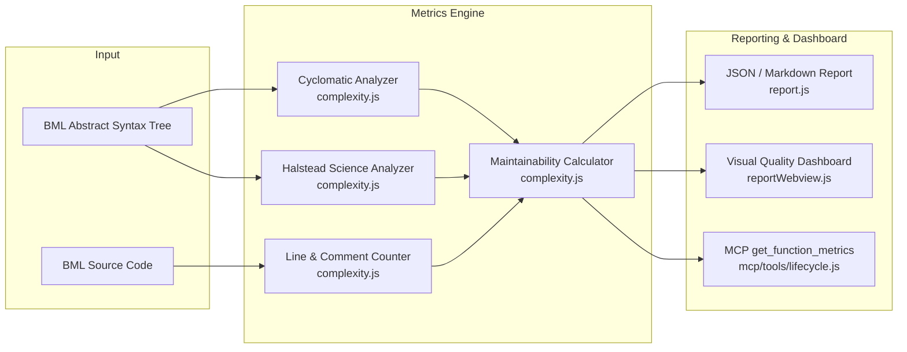
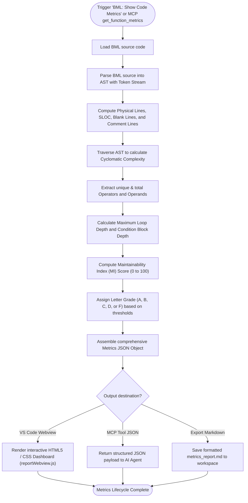
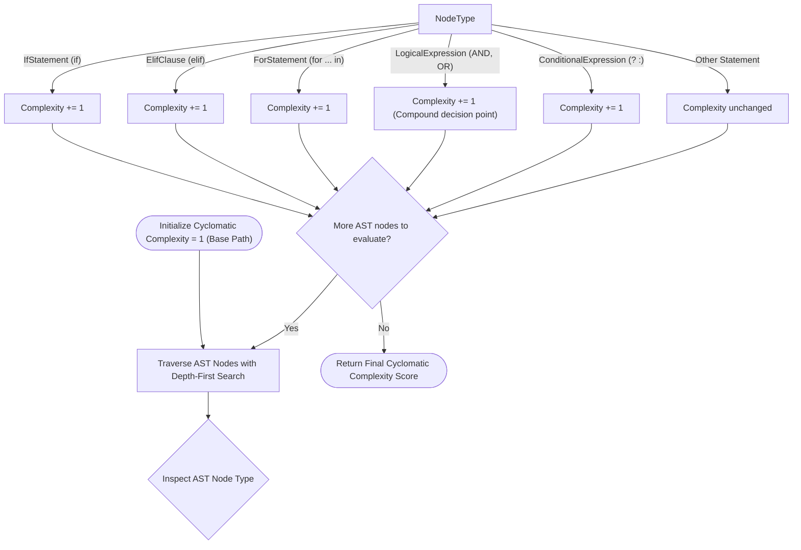
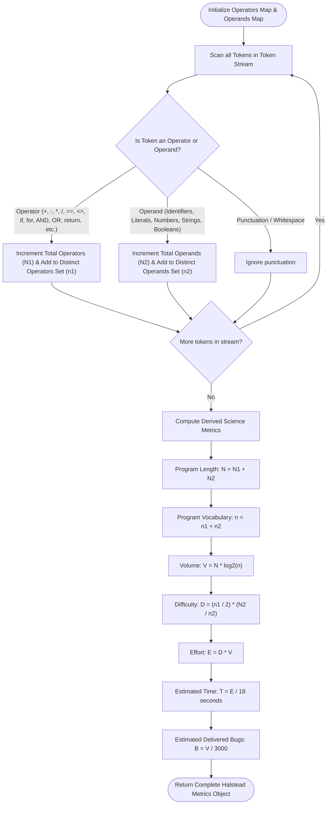
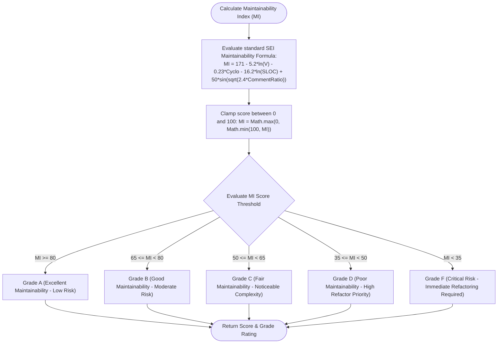
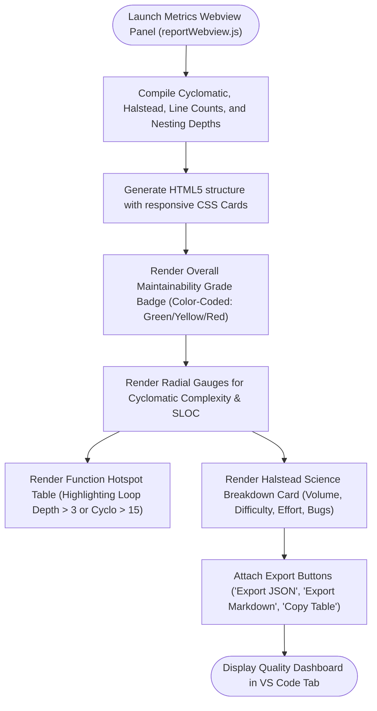

# Oracle CPQ BML Code Metrics: Architecture, Formulas & Control Flow Graphs

## Table of Contents
1. [Overview & High-Level Architecture](#1-overview--high-level-architecture)
2. [Metrics Analysis & Quality Report Lifecycle (CFG 1)](#2-metrics-analysis--quality-report-lifecycle-cfg-1)
3. [Cyclomatic Complexity Calculation (CFG 2)](#3-cyclomatic-complexity-calculation-cfg-2)
4. [Halstead Complexity & Effort Computation (CFG 3)](#4-halstead-complexity--effort-computation-cfg-3)
5. [Maintainability Index & Letter Grade Rating (CFG 4)](#5-maintainability-index--letter-grade-rating-cfg-4)
6. [Interactive Webview Dashboard Rendering (CFG 5)](#6-interactive-webview-dashboard-rendering-cfg-5)
7. [Mathematical Formulas & Rating Thresholds](#7-mathematical-formulas--rating-thresholds)

---

## 1. Overview & High-Level Architecture

The **BML Metrics Subsystem** analyzes BML source code to measure software complexity, code volume, maintainability, and architectural risk. It computes McCabe Cyclomatic Complexity, Halstead Software Science metrics, nesting depths, and Maintainability Index (MI), rendering an interactive visual quality dashboard:

---

## 2. Metrics Analysis & Quality Report Lifecycle (CFG 1)

This control flow graph shows how metrics are gathered and aggregated across a single script or entire workspace:

---

## 3. Cyclomatic Complexity Calculation (CFG 2)

Calculates McCabe Cyclomatic Complexity based on decision nodes and boolean operators:

---

## 4. Halstead Complexity & Effort Computation (CFG 3)

Measures operator/operand frequencies to calculate vocabulary, volume, difficulty, and programming effort:

---

## 5. Maintainability Index & Letter Grade Rating (CFG 4)

Combines Halstead Volume, Cyclomatic Complexity, and Source Lines of Code into a single quality score:

---

## 6. Interactive Webview Dashboard Rendering (CFG 5)

Renders real-time visual progress gauges, complexity breakdown charts, and hotspot tables:

---

## 7. Mathematical Formulas & Rating Thresholds

### Cyclomatic Complexity ($v(G)$)
$$v(G) = 1 + \text{Decision Nodes}$$
Where decision nodes include: `if`, `elif`, `for`, `AND`, `OR`, `? :`.

| Cyclomatic Complexity | Risk Level | Interpretation |
| :--- | :--- | :--- |
| **1 &ndash; 10** | Low Risk | Simple, easy to test and maintain. |
| **11 &ndash; 20** | Moderate Risk | Moderately complex; requires thorough unit tests. |
| **21 &ndash; 50** | High Risk | Complex; candidate for refactoring. |
| **> 50** | Untestable / Critical | Unstable and extremely difficult to verify. |

---

### Halstead Software Science Measures
- **Program Vocabulary**: $n = n_1 + n_2$
- **Program Length**: $N = N_1 + N_2$
- **Calculated Program Length**: $\hat{N} = n_1 \log_2(n_1) + n_2 \log_2(n_2)$
- **Volume**: $V = N \times \log_2(n)$
- **Difficulty**: $D = \frac{n_1}{2} \times \frac{N_2}{n_2}$
- **Effort**: $E = D \times V$
- **Time to Code**: $T = \frac{E}{18} \text{ (seconds)}$
- **Delivered Bugs**: $B = \frac{V}{3000}$

---

### Maintainability Index (MI)
$$\text{MI} = 171 - 5.2 \ln(V) - 0.23 \times v(G) - 16.2 \ln(\text{SLOC}) + 50 \times \sin\left(\sqrt{2.4 \times \text{Comment Ratio}}\right)$$

| MI Score | Grade | Color | Health Status |
| :--- | :---: | :---: | :--- |
| **80 &ndash; 100** | **A** | 🟢 Green | Highly maintainable, clean code. |
| **65 &ndash; 79** | **B** | 🟢 Green | Good health, standard maintenance. |
| **50 &ndash; 64** | **C** | 🟡 Yellow | Moderate complexity; monitor growth. |
| **35 &ndash; 49** | **D** | 🟠 Orange | High complexity; refactoring recommended. |
| **0 &ndash; 34** | **F** | 🔴 Red | Critical debt; urgent refactoring required. |
