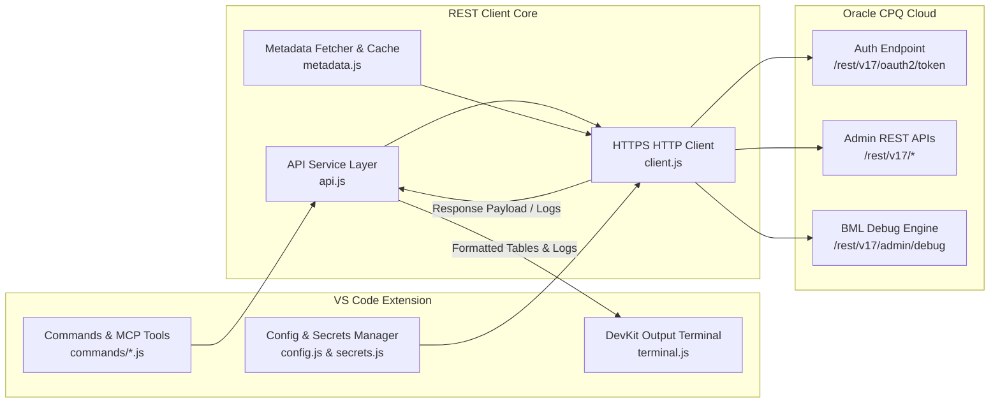
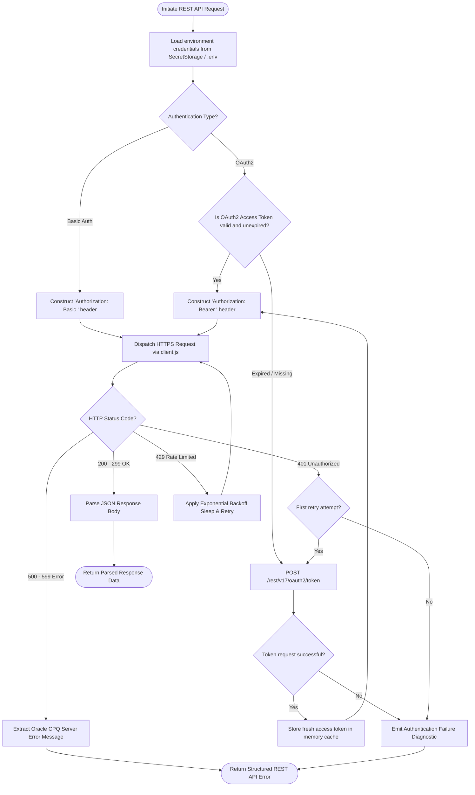
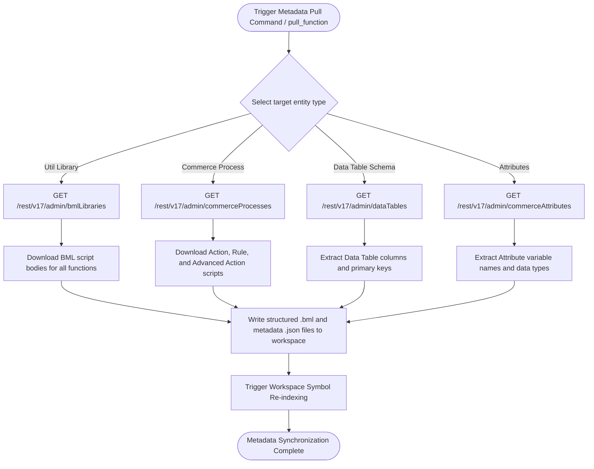
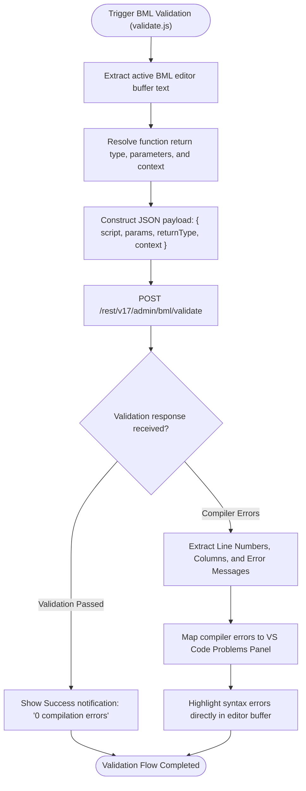
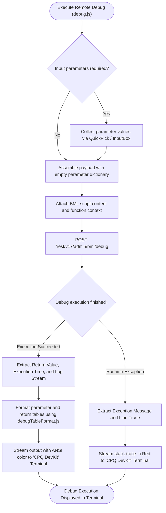
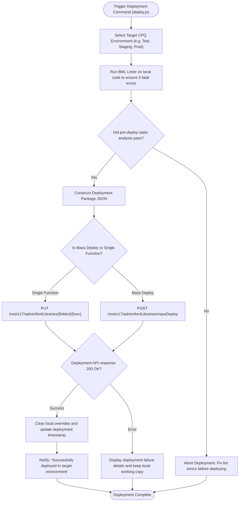
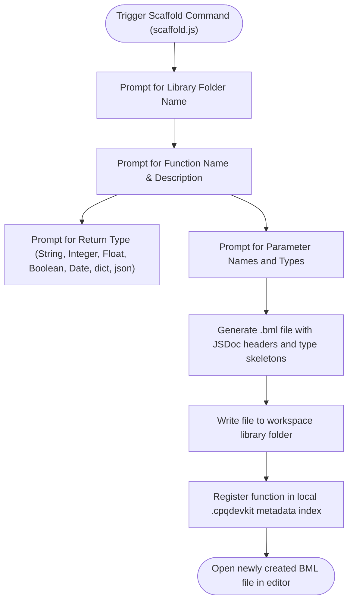

# Oracle CPQ BML REST API: Architecture, Commands & Control Flow Graphs

## Table of Contents
1. [Overview & High-Level Architecture](#1-overview--high-level-architecture)
2. [REST API Request & Authentication Flow (CFG 1)](#2-rest-api-request--authentication-flow-cfg-1)
3. [Metadata Synchronization Pipeline (CFG 2)](#3-metadata-synchronization-pipeline-cfg-2)
4. [Remote BML Compilation & Validation Flow (CFG 3)](#4-remote-bml-compilation--validation-flow-cfg-3)
5. [Remote Debug Execution & Terminal Formatting (CFG 4)](#5-remote-debug-execution--terminal-formatting-cfg-4)
6. [Multi-Environment Deployment Pipeline (CFG 5)](#6-multi-environment-deployment-pipeline-cfg-5)
7. [Workspace Scaffolding & Local Override Flow (CFG 6)](#7-workspace-scaffolding--local-override-flow-cfg-6)
8. [Oracle CPQ REST Endpoint Catalog](#8-oracle-cpq-rest-endpoint-catalog)

---

## 1. Overview & High-Level Architecture

The **CPQ REST API Client** is the communication backbone between the CPQ-BML extension and Oracle CPQ Cloud instances. It manages multi-environment configuration, secure credential storage, metadata caching, remote BML validation, debug execution, and deployment:



---

## 2. REST API Request & Authentication Flow (CFG 1)

Handles request construction, OAuth2 / Basic Authentication, token refresh, exponential backoff retries, and network error handling:



---

## 3. Metadata Synchronization Pipeline (CFG 2)

Synchronizes remote CPQ data dictionaries, commerce attributes, and util libraries with the local workspace:



---

## 4. Remote BML Compilation & Validation Flow (CFG 3)

Validates BML scripts directly against Oracle CPQ Cloud's server-side compiler:



---

## 5. Remote Debug Execution & Terminal Formatting (CFG 4)

Executes BML functions in the cloud debug environment and formats return values and stdout logs:



---

## 6. Multi-Environment Deployment Pipeline (CFG 5)

Safely packages and deploys BML functions and commerce processes across Dev, Test, and Prod instances:



---

## 7. Workspace Scaffolding & Local Override Flow (CFG 6)

Scaffolds new BML functions and manages local override workflows:



---

## 8. Oracle CPQ REST Endpoint Catalog

| HTTP Method | API Endpoint | Purpose |
| :--- | :--- | :--- |
| `POST` | `/rest/v17/oauth2/token` | Authenticates client and issues OAuth2 Bearer token. |
| `GET` | `/rest/v17/admin/bmlLibraries` | Lists all BML Util Library folders and functions. |
| `GET` | `/rest/v17/admin/bmlLibraries/{folder}/{func}` | Fetches BML script body and metadata for a function. |
| `PUT` | `/rest/v17/admin/bmlLibraries/{folder}/{func}` | Updates/saves BML script body on the CPQ instance. |
| `POST` | `/rest/v17/admin/bml/validate` | Compiles BML source remotely and returns syntax errors. |
| `POST` | `/rest/v17/admin/bml/debug` | Executes BML script in remote debug harness with inputs. |
| `GET` | `/rest/v17/admin/commerceProcesses` | Lists all Commerce Processes and active documents. |
| `GET` | `/rest/v17/admin/commerceProcesses/{proc}/rules` | Fetches Commerce Action, Rule, and Advanced BML scripts. |
| `PUT` | `/rest/v17/admin/commerceProcesses/{proc}/rules` | Deploys updated Commerce Process BML scripts. |
| `GET` | `/rest/v17/admin/dataTables` | Lists Data Tables, schemas, columns, and primary keys. |
| `GET` | `/rest/v17/admin/commerceAttributes` | Fetches Commerce Line and Transaction attribute definitions. |

---

## 9. Practical Usage Examples & VS Code Commands

### Configuring Multi-Environment Access (`.env`)

Store credentials securely in a `.env` file in the workspace root or via VS Code Secrets:

```bash
# Active CPQ Cloud Instance
CPQ_SITE_URL=https://sitename.oracle.com
CPQ_USERNAME=admin_user
CPQ_PASSWORD=SecurePassword123!
CPQ_AUTH_METHOD=basic
CPQ_REST_VERSION=v17
CPQ_COMMERCE_PROCESS=oraclecpqo
CPQ_COMMERCE_DOCUMENT=transaction
```

---

### Command 1: Pull BML Function from CPQ Cloud
1. Press `Ctrl+Shift+P` (Windows/Linux) or `Cmd+Shift+P` (macOS).
2. Type and select `CPQ: Pull Function`.
3. Choose the library folder (e.g. `pricing`) and function name (`calcDiscount`).
4. The extension automatically fetches the live script, saves it to `.cpqdevkit/ai/pricing/calcDiscount.bml`, and opens the editor.

---

### Command 2: Validate BML Against Cloud Compiler
1. Inside an open `.bml` file, press `Ctrl+Shift+P` &rarr; `CPQ: Validate Current Function`.
2. The extension sends the buffer to `/rest/v17/admin/bml/validate`.
3. If syntax errors exist, they appear immediately in the **Problems** panel mapped to line/column ranges.

---

### Command 3: Remote Debug Execution & Terminal Output
1. Press `Ctrl+Shift+P` &rarr; `CPQ: Debug Function`.
2. Enter parameter inputs in the prompt or provide a JSON fixture.
3. The execution results and logs stream live to the **CPQ DevKit** output terminal:

```
[CPQ DevKit] ----------------------------------------------------
[CPQ DevKit] Executing Remote Debug: util.pricing.calcDiscount
[CPQ DevKit] Environment: Development (https://sitename.oracle.com)
[CPQ DevKit] ----------------------------------------------------
[PARAMS]
  • basePrice: 1500.0 (Float)
  • customerTier: "PLATINUM" (String)

[STDOUT LOGS]
  [09:20:15] [DEBUG] Starting discount evaluation
  [09:20:15] [DEBUG] Matched Tier: PLATINUM -> 20% discount

[RETURN VALUE]
  • Type: Float
  • Value: 0.20
  • Execution Time: 38.4ms
[CPQ DevKit] ----------------------------------------------------
```

---

### Command 4: Deploy Function to Target Environment
1. Press `Ctrl+Shift+P` &rarr; `CPQ: Deploy Function`.
2. Select target environment (`Development`, `Test`, `Production`).
3. Pre-deploy static analysis verifies 0 fatal errors before committing.
4. On success, a toast notification confirms deployment.

