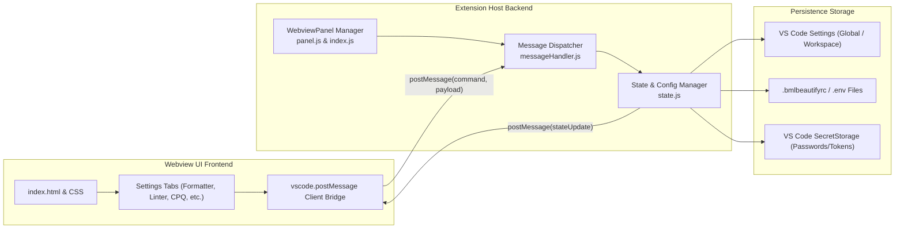
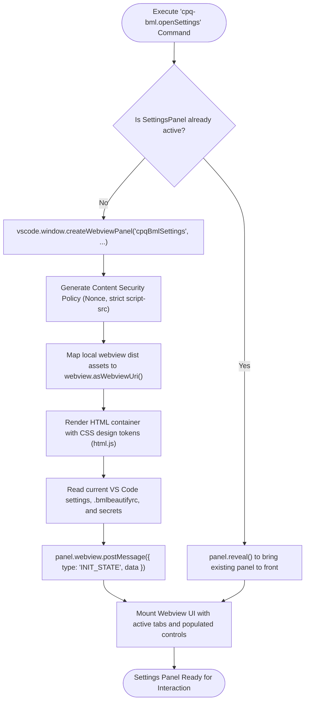
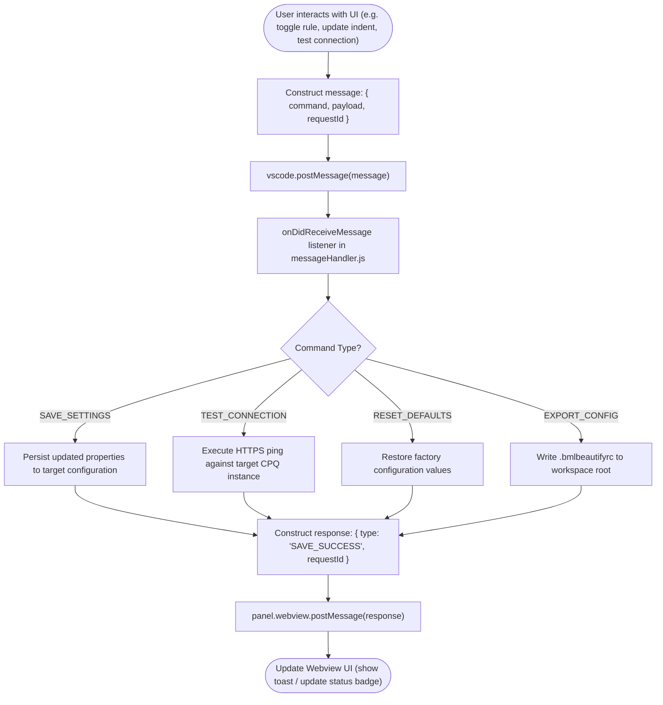
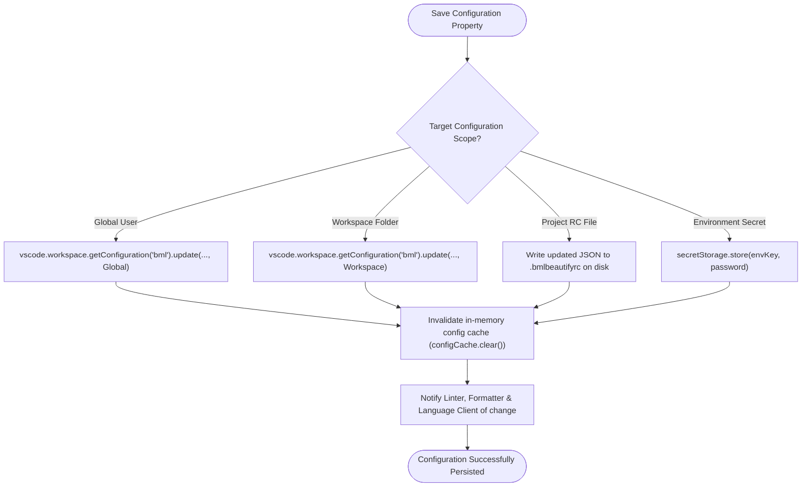
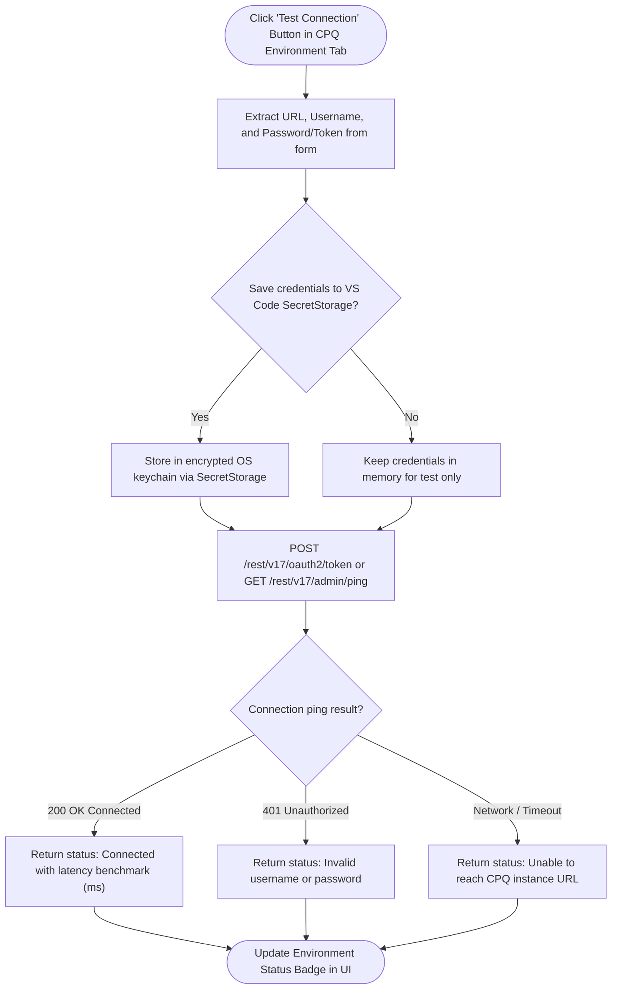
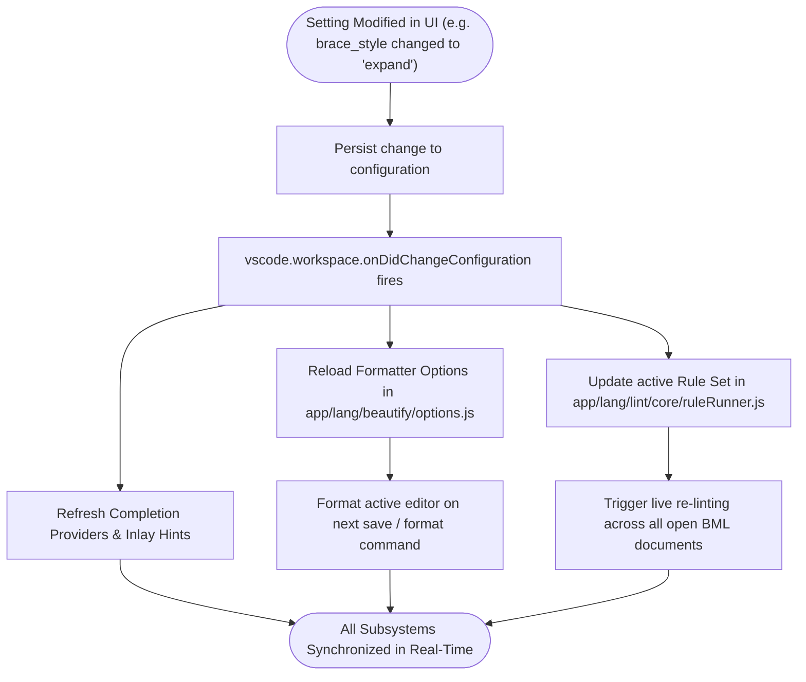

# Oracle CPQ BML Settings Panel: Architecture, Webview & Control Flow Graphs

## Table of Contents
1. [Overview & High-Level Architecture](#1-overview--high-level-architecture)
2. [Webview Initialization & Security Lifecycle (CFG 1)](#2-webview-initialization--security-lifecycle-cfg-1)
3. [Bi-Directional Message Passing & RPC Bridge (CFG 2)](#3-bi-directional-message-passing--rpc-bridge-cfg-2)
4. [Multi-Tier Configuration Persistence (CFG 3)](#4-multi-tier-configuration-persistence-cfg-3)
5. [Connection Testing & Secret Storage Flow (CFG 4)](#5-connection-testing--secret-storage-flow-cfg-4)
6. [Real-Time Formatter & Linter Settings Sync (CFG 5)](#6-real-time-formatter--linter-settings-sync-cfg-5)
7. [Settings Tab Catalog & Configuration Matrix](#7-settings-tab-catalog--configuration-matrix)

---

## 1. Overview & High-Level Architecture

The **BML Settings Panel** provides a rich, responsive graphical UI inside VS Code for configuring the entire CPQ-BML extension suite. It enables developers to tune Formatter options, toggle Linter rules, manage multi-environment CPQ cloud credentials, configure IntelliSense behavior, and manage custom spell-check dictionaries:

---

## 2. Webview Initialization & Security Lifecycle (CFG 1)

Ensures secure panel instantiation with Content Security Policy (CSP), local resource loading restrictions, and state synchronization:

---

## 3. Bi-Directional Message Passing & RPC Bridge (CFG 2)

Handles asynchronous messaging between the React/Vanilla frontend in the Webview and the Node.js backend in the Extension Host:

---

## 4. Multi-Tier Configuration Persistence (CFG 3)

Resolves setting precedence across User Settings, Workspace Settings, and project `.bmlbeautifyrc` files:

---

## 5. Connection Testing & Secret Storage Flow (CFG 4)

Securely stores CPQ environment credentials and validates connectivity live:

---

## 6. Real-Time Formatter & Linter Settings Sync (CFG 5)

Applies settings changes immediately without requiring a VS Code restart:

---

## 7. Settings Tab Catalog & Configuration Matrix

| Settings Tab | Config Keys Managed | Description |
| :--- | :--- | :--- |
| **BML Beautifier** | `indent_size`, `indent_char`, `brace_style`, `space_before_conditional`, `space_in_paren`, `space_in_empty_paren`, `preserve_newlines`, `max_preserve_newlines`, `end_with_newline`, `wrap_line_length` | Controls code indentation, brace placement, parenthesis spacing, and line wrapping. |
| **BML Linter** | `lint.enabled`, `lint.rules.*`, `lint.maxLoopDepth`, `lint.maxBlockDepth`, `lint.severityOverrides` | Configures 27 static analysis rules, nesting depth warnings, and severity thresholds. |
| **CPQ Environments** | `cpq.environments`, `cpq.activeEnvironment`, `cpq.timeout`, `cpq.retryCount` | Manages CPQ Cloud URLs, OAuth2 credentials, and active deployment targets. |
| **IntelliSense** | `intellisense.enabled`, `intellisense.inlayHints`, `intellisense.signatureHelp`, `intellisense.bmqlCompletions` | Configures autocomplete providers, hover tooltips, inlay parameter hints, and BMQL `$var` helpers. |
| **Spell Checker** | `spellcheck.enabled`, `spellcheck.customWords`, `spellcheck.checkComments` | Manages BML keywords, CPQ domain dictionary, and user-customized spelling words. |

---

## 8. Practical Usage Examples & Visual Configuration Walkthrough

### How to Open the Settings Panel
1. Press `Ctrl+Shift+P` (Windows/Linux) or `Cmd+Shift+P` (macOS).
2. Type and select `CPQ-BML: Open Settings`.
3. Or click the **CPQ-BML** status bar item in the bottom right corner.

---

### Step-by-Step UI Configuration Walkthrough

#### 1. Configuring Formatter Tab
* **Indentation Size**: Adjust between 2, 4, or 8 spaces (default: `4`).
* **Brace Style**: Choose between `collapse` (1TBS: `if (cond) {`), `expand` (Allman: braces on new lines), or `preserve-inline`.
* **Preserve Newlines**: Toggle to keep empty lines between logic blocks.
* Click **Save Beautifier Config** to write directly to `.bmlbeautifyrc`.

---

#### 2. Configuring Linter Rules Tab
* Toggle individual rules on/off (`bml-semicolon`, `bml-unsupported-operator`, etc.).
* Adjust severity drop-downs (`Error`, `Warning`, `Information`, `Hint`).
* Set max loop nesting depth threshold (default: `3`) and max block nesting depth (default: `5`).

---

#### 3. Managing CPQ Cloud Environments Tab
* Add multiple CPQ environments (e.g. `Dev`, `QA`, `Production`).
* Provide **Site URL** (e.g. `https://sitename.oracle.com`), **Username**, and **Password / Token**.
* Click the 🔌 **Test Connection** button to verify network connectivity and permissions.
* The status badge updates immediately to 🟢 `Connected (42ms)`.

---

#### 4. Customizing Spell Checker Tab
* Add domain-specific words, acronyms, or product model names to the **Custom Words** list.
* Toggle comment checking and string literal checking independently.

