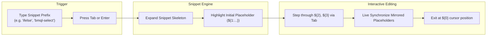

# Oracle CPQ BML Code Snippets: Architecture, Skeletons & Catalog

## Table of Contents
1. [Overview & High-Level Architecture](#1-overview--high-level-architecture)
2. [Tab-Stop Navigation & Variable Mirroring (CFG 1)](#2-tab-stop-navigation--variable-mirroring-cfg-1)
3. [Snippets Catalog by Domain Category](#3-snippets-catalog-by-domain-category)
   - [Category 1: Control Flow & Loops](#category-1-control-flow--loops)
   - [Category 2: Dictionaries (`dict`)](#category-2-dictionaries-dict)
   - [Category 3: JSON & JSON Arrays (`json`, `jsonarray`)](#category-3-json--json-arrays-json-jsonarray)
   - [Category 4: BMQL & Direct Database Access](#category-4-bmql--direct-database-access)
   - [Category 5: Web Services & REST Integrations](#category-5-web-services--rest-integrations)
   - [Category 6: XML & XSL Transformations](#category-6-xml--xsl-transformations)
   - [Category 7: Commerce & Transaction Line Item BML](#category-7-commerce--transaction-line-item-bml)
   - [Category 8: Strings & Text Manipulation](#category-8-strings--text-manipulation)
   - [Category 9: Type Safety, Math & Defensive Guards](#category-9-type-safety-math--defensive-guards)
   - [Category 10: Date & Time Handling](#category-10-date--time-handling)
   - [Category 11: JSDoc & Script File Headers](#category-11-jsdoc--script-file-headers)
4. [Keyboard Shortcuts & Usage Guide](#4-keyboard-shortcuts--usage-guide)

---

## 1. Overview & High-Level Architecture

The **CPQ-BML Snippet Engine** provides instant, production-grade code skeletons for Oracle CPQ BigMachines Language. Snippets are designed to accelerate BML authoring with zero syntactic overhead:

---

## 2. Tab-Stop Navigation & Variable Mirroring (CFG 1)

Every snippet follows strict tab-stop conventions to ensure effortless keyboard navigation:

---

## 3. Snippets Catalog by Domain Category

### Category 1: Control Flow & Loops

| Prefix | Purpose | Skeleton Template |
| :--- | :--- | :--- |
| **`if`** | Simple `if` branch | `if (${1:condition}) {\n\t${0}\n}` |
| **`ifelse`** | `if...else` branch | `if (${1:condition}) {\n\t${2}\n} else {\n\t${0}\n}` |
| **`ifelseif`** | Multi-branch `if...elif...else` | `if (${1:condition}) {\n\t${2}\n} elif (${3:condition}) {\n\t${4}\n} else {\n\t${0}\n}` |
| **`forin`** | Standard array iteration | `for ${1:item} in ${2:array} {\n\t${0}\n}` |
| **`forin-idx`** | Array iteration with index counter | `${1:idx} = 0;\nfor ${2:item} in ${3:array} {\n\t${0}\n\t${1:idx} = ${1:idx} + 1;\n}` |
| **`range`** | Numeric range index loop | `for ${1:i} in range(${2:0}, ${3:count}) {\n\t${0}\n}` |

---

### Category 2: Dictionaries (`dict`)

| Prefix | Purpose | Skeleton Template |
| :--- | :--- | :--- |
| **`dict`** | Typed dictionary initialization | `${1:dictVar} = dict("${2\|string,integer,float,string[],integer[],float[]\|}");\n${0}` |
| **`dict-iter`** | Iterate keys with `keys()` and fetch values with `get()` | `for ${1:key} in keys(${2:dictVar}) {\n\t${3:val} = get(${2:dictVar}, ${1:key});\n\t${0}\n}` |
| **`dict-get-default`** | Safe dictionary retrieval with `containskey()` fallback | `if (containskey(${1:dictVar}, ${2:key})) {\n\t${3:val} = get(${1:dictVar}, ${2:key});\n} else {\n\t${3:val} = ${4:defaultValue};\n}\n${0}` |

---

### Category 3: JSON & JSON Arrays (`json`, `jsonarray`)

| Prefix | Purpose | Skeleton Template |
| :--- | :--- | :--- |
| **`json-new`** | Create empty JSON object | `${1:jsonVar} = json();\n${0}` |
| **`json-put`** | Assign property to JSON object | `jsonput(${1:jsonVar}, "${2:key}", ${3:value});` |
| **`json-iter`** | Iterate keys with `jsonkeys()` and fetch values with `jsonget()` | `for ${1:key} in jsonkeys(${2:jsonVar}) {\n\t${3:val} = jsonget(${2:jsonVar}, ${1:key});\n\t${0}\n}` |
| **`jsonpath-get`** | Extract single nested value using JSONPath | `${1:result} = jsonpathgetsingle(${2:jsonVar}, "${3:$.path.to.field}");\n${0}` |
| **`jsonpath-get-multiple`** | Extract multiple values using JSONPath | `${1:resultArray} = jsonpathgetmultiple(${2:jsonVar}, "${3:$.path.to.array[*]}");\n${0}` |
| **`jsonarray-new`** | Create empty JSON array | `${1:arrayVar} = jsonarray();\n${0}` |
| **`jsonarray-append`**| Append element to JSON array | `jsonarrayappend(${1:arrayVar}, ${2:item});` |

---

### Category 4: BMQL & Direct Database Access

| Prefix | Purpose | Skeleton Template |
| :--- | :--- | :--- |
| **`bmql-select`** | Parameterized query with loop | `${1:records} = bmql("SELECT ${2:column} FROM ${3:table} WHERE ${4:column} = $${5:param}", ${5:param});\nfor ${6:row} in ${1:records} {\n\t${7:val} = get(${6:row}, "${2:column}");\n\t${0}\n}` |
| **`bmql-select-in`**| Parameterized query using array `IN ($arr)` | `${1:records} = bmql("SELECT ${2:column} FROM ${3:table} WHERE ${4:column} IN ($${5:arrayParam})", ${5:arrayParam});\nfor ${6:row} in ${1:records} {\n\t${7:val} = get(${6:row}, "${2:column}");\n\t${0}\n}` |
| **`bmql-safe`** | Guarded query with null and size checks | `${1:records} = bmql("SELECT ${2:column} FROM ${3:table} WHERE ${4:column} = $${5:param}", ${5:param});\nif (not(isnull(${1:records})) AND sizeofarray(${1:records}) > 0) {\n\tfor ${6:row} in ${1:records} {\n\t\t${7:val} = get(${6:row}, "${2:column}");\n\t\t${0}\n\t}\n}` |
| **`bmql-update`** | Update rows with `$variable` params | `bmql("UPDATE ${1:table} SET ${2:column} = $${3:value} WHERE ${4:keyColumn} = $${5:keyValue}", ${3:value}, ${5:keyValue});` |
| **`bmql-insert`** | Insert row with `$variable` params | `bmql("INSERT INTO ${1:table} (${2:column}) VALUES ($${3:value})", ${3:value});` |
| **`bmql-delete`** | Delete row with WHERE guard | `bmql("DELETE FROM ${1:table} WHERE ${2:keyColumn} = $${3:keyValue}", ${3:keyValue});` |

---

### Category 5: Web Services & REST Integrations

| Prefix | Purpose | Skeleton Template |
| :--- | :--- | :--- |
| **`urldata-get`** | HTTP GET with headers | `${1:headers} = dict("string");\nput(${1:headers}, "Content-Type", "application/json");\n${2:response} = urldata(${3:url}, "GET", ${1:headers});\n${0}` |
| **`urldata-post`** | HTTP POST with JSON body | `${1:headers} = dict("string");\nput(${1:headers}, "Content-Type", "application/json");\n${2:response} = urldata(${3:url}, "POST", ${1:headers}, ${4:payload});\n${0}` |
| **`urldata-auth-bearer`** | OAuth2 Bearer token headers | `${1:headers} = dict("string");\nput(${1:headers}, "Authorization", "Bearer " ~ ${2:accessToken});\nput(${1:headers}, "Content-Type", "application/json");\n${0}` |
| **`urldata-auth-basic`** | HTTP Basic Auth with Base64 encoding | `${1:authStr} = encodebase64(${2:username} ~ ":" ~ ${3:password});\n${4:headers} = dict("string");\nput(${4:headers}, "Authorization", "Basic " ~ ${1:authStr});\nput(${4:headers}, "Content-Type", "application/json");\n${0}` |

---

### Category 6: XML & XSL Transformations

| Prefix | Purpose | Skeleton Template |
| :--- | :--- | :--- |
| **`xml-read`** | Extract XML element using XPath and `readxmlsingle()` | `${1:xpaths} = string[]{"${2://node}"};\n${3:parsedXmlDict} = readxmlsingle(${4:xmlPayload}, ${1:xpaths});\n${5:val} = get(${3:parsedXmlDict}, "${2://node}");\n${0}` |
| **`xml-transform`** | Transform XML data via XSL stylesheet | `${1:transformedHtml} = transformxml(${2:xmlData}, ${3:xslTemplate});\n${0}` |

---

### Category 7: Commerce & Transaction Line Item BML

| Prefix | Purpose | Skeleton Template |
| :--- | :--- | :--- |
| **`commerce-return`** | Standard attribute dictionary return | `${1:returnMap} = dict("string");\nput(${1:returnMap}, "${2:attribute}", ${3:value});\nreturn ${1:returnMap};` |
| **`commerce-line-iter`** | Iterate `transactionLine` document array | `for ${1:line} in transactionLine {\n\t${2:docNum} = ${1:line}._document_number;\n\t${0}\n}` |
| **`commerce-delimit-return`** | Build pipe-delimited line update string | `${1:returnStr} = "";\nfor ${2:line} in transactionLine {\n\t${1:returnStr} = ${1:returnStr} ~ ${2:line}._document_number ~ "~" ~ "${3:attrName}" ~ "~" ~ ${4:value} ~ "|";\n}\nreturn ${1:returnStr};` |

---

### Category 8: Strings & Text Manipulation

| Prefix | Purpose | Skeleton Template |
| :--- | :--- | :--- |
| **`sb-concat`** | O(n) loop concatenation via `stringbuilder()` | `${1:sb} = stringbuilder();\nfor ${2:item} in ${3:array} {\n\tsbappend(${1:sb}, ${2:item});\n}\n${4:result} = sbtostring(${1:sb});\n${0}` |
| **`split-safe`** | Safe array splitting with size check | `${1:parts} = split(${2:str}, "${3:,}");\nif (sizeofarray(${1:parts}) > 0) {\n\t${4:firstPart} = ${1:parts}[0];\n\t${0}\n}` |

---

### Category 9: Type Safety, Math & Defensive Guards

| Prefix | Purpose | Skeleton Template |
| :--- | :--- | :--- |
| **`null-guard`** | Null & empty string guard | `if (isnull(${1:value}) OR trim(${1:value}) == "") {\n\t${2:// handle null/empty}\n\treturn ${3:""};\n}` |
| **`try-atoi`** | `isnumber()` guarded string-to-integer conversion | `if (isnumber(${1:str})) {\n\t${2:num} = atoi(${1:str});\n} else {\n\t${2:num} = ${3:0};\n}\n${0}` |
| **`try-atof`** | `isnumber()` guarded string-to-float conversion | `if (isnumber(${1:str})) {\n\t${2:num} = atof(${1:str});\n} else {\n\t${2:num} = ${3:0.0};\n}\n${0}` |
| **`round-currency`** | Currency rounding (2 decimal places) | `${1:roundedAmount} = round(${2:amount}, 2);\n${0}` |

---

### Category 10: Date & Time Handling

| Prefix | Purpose | Skeleton Template |
| :--- | :--- | :--- |
| **`date-format`** | Format date object to string | `${1:dateStr} = datetostr(${2:getdate()}, "${3:yyyy-MM-dd HH:mm:ss}");\n${0}` |
| **`date-parse`** | Parse string to Date object | `${1:dateObj} = strtojavadate(${2:dateStr}, "${3:yyyy-MM-dd}");\n${0}` |

---

### Category 11: JSDoc & Script File Headers

| Prefix | Purpose | Skeleton Template |
| :--- | :--- | :--- |
| **`doc-func`** | Function JSDoc comment | `/**\n * ${1:description}\n * @param {${2:String}} ${3:param}\n * @return {${4:String}}\n */\n${0}` |
| **`doc-file`** | Standard Oracle CPQ file header | `/**\n * ============================================================================\n * Function:   ${1:function_name}\n * Purpose:    ${2:description}\n * Author:     ${3:author}\n * Date:       ${4:YYYY-MM-DD}\n * ============================================================================\n */\n${0}` |

---

## 4. Keyboard Shortcuts & Usage Guide

| Action | Shortcut (Windows/Linux) | Shortcut (macOS) |
| :--- | :--- | :--- |
| **Trigger Snippet Completion** | `Ctrl+Space` | `Cmd+Space` |
| **Expand Selected Snippet** | `Tab` or `Enter` | `Tab` or `Enter` |
| **Jump to Next Tab-Stop** | `Tab` | `Tab` |
| **Jump to Previous Tab-Stop** | `Shift+Tab` | `Shift+Tab` |
| **Cancel Snippet Mode** | `Escape` | `Escape` |
