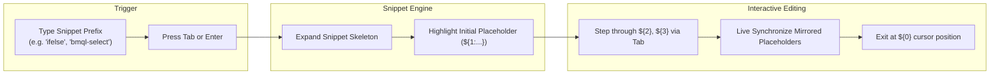
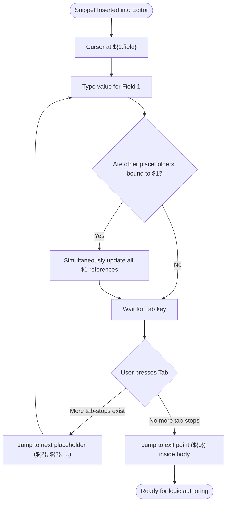

# Oracle CPQ BML Code Snippets: Architecture, Skeletons & Catalog

## Table of Contents
1. [Overview & High-Level Architecture](#1-overview--high-level-architecture)
2. [Tab-Stop Navigation & Variable Mirroring (CFG 1)](#2-tab-stop-navigation--variable-mirroring-cfg-1)
3. [Comprehensive Snippets Catalog](#3-comprehensive-snippets-catalog)
   - [Control Flow & Logic](#control-flow--logic)
   - [Dictionaries & Key-Value Stores](#dictionaries--key-value-stores)
   - [JSON & JSON Arrays](#json--json-arrays)
   - [BMQL & Database Operations](#bmql--database-operations)
   - [Web Services & REST APIs](#web-services--rest-apis)
   - [Commerce & Line Items](#commerce--line-items)
   - [Safety & Type Conversion Utilities](#safety--type-conversion-utilities)
   - [Documentation & Headers](#documentation--headers)
4. [Keyboard Shortcuts & Usage Guide](#4-keyboard-shortcuts--usage-guide)

---

## 1. Overview & High-Level Architecture

The **CPQ-BML Snippet Engine** provides instant, production-grade code skeletons for Oracle CPQ BigMachines Language. Snippets are designed to accelerate BML authoring with zero syntactic overhead:



---

## 2. Tab-Stop Navigation & Variable Mirroring (CFG 1)

Every snippet follows strict tab-stop conventions to ensure effortless keyboard navigation:



---

## 3. Comprehensive Snippets Catalog

### Control Flow & Logic

#### 1. `if` &mdash; Simple Condition
* **Prefix:** `if`
* **Skeleton Template:**
  ```javascript
  if (${1:condition}) {
      ${0}
  }
  ```

#### 2. `ifelse` &mdash; If-Else Branching
* **Prefix:** `ifelse`
* **Skeleton Template:**
  ```javascript
  if (${1:condition}) {
      ${2}
  } else {
      ${0}
  }
  ```

#### 3. `ifelseif` &mdash; Multi-Branch Condition
* **Prefix:** `ifelseif`
* **Skeleton Template:**
  ```javascript
  if (${1:condition}) {
      ${2}
  } elif (${3:condition}) {
      ${4}
  } else {
      ${0}
  }
  ```

#### 4. `forin` &mdash; Array Iteration Loop
* **Prefix:** `forin`
* **Skeleton Template:**
  ```javascript
  for ${1:item} in ${2:array} {
      ${0}
  }
  ```

---

### Dictionaries & Key-Value Stores

#### 5. `dict` &mdash; Typed Dictionary Initialization
* **Prefix:** `dict`
* **Skeleton Template:**
  ```javascript
  ${1:dictVar} = dict("${2|string,integer,float,string[],integer[],float[]|}");
  ${0}
  ```

#### 6. `dict-iter` &mdash; Dictionary Key-Value Traversal
* **Prefix:** `dict-iter`
* **Skeleton Template:**
  ```javascript
  for ${1:key} in getkeys(${2:dictVar}) {
      ${3:val} = get(${2:dictVar}, ${1:key});
      ${0}
  }
  ```
  *(Note: `$1` and `$2` mirror automatically across `getkeys()` and `get()`)*.

---

### JSON & JSON Arrays

#### 7. `json-new` &mdash; JSON Object Initialization
* **Prefix:** `json-new`
* **Skeleton Template:**
  ```javascript
  ${1:jsonVar} = json();
  ${0}
  ```

#### 8. `json-put` &mdash; JSON Property Assignment
* **Prefix:** `json-put`
* **Skeleton Template:**
  ```javascript
  jsonput(${1:jsonVar}, "${2:key}", ${3:value});
  ```

#### 9. `json-iter` &mdash; JSON Object Keys Iteration
* **Prefix:** `json-iter`
* **Skeleton Template:**
  ```javascript
  for ${1:key} in jsonkeys(${2:jsonVar}) {
      ${3:val} = jsonget(${2:jsonVar}, ${1:key});
      ${0}
  }
  ```

#### 10. `jsonarray-new` &mdash; JSON Array Initialization
* **Prefix:** `jsonarray-new`
* **Skeleton Template:**
  ```javascript
  ${1:arrayVar} = jsonarray();
  ${0}
  ```

#### 11. `jsonarray-append` &mdash; Append Item to JSON Array
* **Prefix:** `jsonarray-append`
* **Skeleton Template:**
  ```javascript
  jsonarrayappend(${1:arrayVar}, ${2:item});
  ```

---

### BMQL & Database Operations

#### 12. `bmql-select` &mdash; Parameterized SELECT with Recordset Loop
* **Prefix:** `bmql-select`
* **Skeleton Template:**
  ```javascript
  ${1:records} = bmql("SELECT ${2:column} FROM ${3:table} WHERE ${4:column} = $${5:param}", ${5:param});
  for ${6:row} in ${1:records} {
      ${7:val} = get(${6:row}, "${2:column}");
      ${0}
  }
  ```

#### 13. `bmql-safe` &mdash; Guarded BMQL Query with Null & Size Verification
* **Prefix:** `bmql-safe`
* **Skeleton Template:**
  ```javascript
  ${1:records} = bmql("SELECT ${2:column} FROM ${3:table} WHERE ${4:column} = $${5:param}", ${5:param});
  if (not(isnull(${1:records})) AND sizeofarray(${1:records}) > 0) {
      for ${6:row} in ${1:records} {
          ${7:val} = get(${6:row}, "${2:column}");
          ${0}
      }
  }
  ```

#### 14. `bmql-update` &mdash; Data Table Row Update
* **Prefix:** `bmql-update`
* **Skeleton Template:**
  ```javascript
  bmql("UPDATE ${1:table} SET ${2:column} = $${3:value} WHERE ${4:keyColumn} = $${5:keyValue}", ${3:value}, ${5:keyValue});
  ```

#### 15. `bmql-insert` &mdash; Data Table Row Insertion
* **Prefix:** `bmql-insert`
* **Skeleton Template:**
  ```javascript
  bmql("INSERT INTO ${1:table} (${2:column}) VALUES ($${3:value})", ${3:value});
  ```

#### 16. `bmql-delete` &mdash; Data Table Row Deletion
* **Prefix:** `bmql-delete`
* **Skeleton Template:**
  ```javascript
  bmql("DELETE FROM ${1:table} WHERE ${2:keyColumn} = $${3:keyValue}", ${3:keyValue});
  ```

---

### Web Services & REST APIs

#### 17. `urldata-get` &mdash; HTTP GET Request
* **Prefix:** `urldata-get`
* **Skeleton Template:**
  ```javascript
  ${1:headers} = dict("string");
  put(${1:headers}, "Content-Type", "application/json");
  ${2:response} = urldata(${3:url}, "GET", ${1:headers});
  ${0}
  ```

#### 18. `urldata-post` &mdash; HTTP POST Request with JSON Body
* **Prefix:** `urldata-post`
* **Skeleton Template:**
  ```javascript
  ${1:headers} = dict("string");
  put(${1:headers}, "Content-Type", "application/json");
  ${2:response} = urldata(${3:url}, "POST", ${1:headers}, ${4:payload});
  ${0}
  ```

---

### Commerce & Line Items

#### 19. `commerce-return` &mdash; Return Attribute Dictionary
* **Prefix:** `commerce-return`
* **Skeleton Template:**
  ```javascript
  ${1:returnMap} = dict("string");
  put(${1:returnMap}, "${2:attribute}", ${3:value});
  return ${1:returnMap};
  ```

#### 20. `commerce-line-iter` &mdash; Transaction Line Items Loop
* **Prefix:** `commerce-line-iter`
* **Skeleton Template:**
  ```javascript
  for ${1:line} in transactionLine {
      ${2:docNum} = ${1:line}._document_number;
      ${0}
  }
  ```

---

### Safety & Type Conversion Utilities

#### 21. `sb-concat` &mdash; StringBuilder Accumulation Loop
* **Prefix:** `sb-concat`
* **Skeleton Template:**
  ```javascript
  ${1:sb} = stringbuilder();
  for ${2:item} in ${3:array} {
      sbappend(${1:sb}, ${2:item});
  }
  ${4:result} = sbtostring(${1:sb});
  ${0}
  ```

#### 22. `null-guard` &mdash; String Null & Empty Guard
* **Prefix:** `null-guard`
* **Skeleton Template:**
  ```javascript
  if (isnull(${1:value}) OR trim(${1:value}) == "") {
      ${2:// handle null/empty}
      return ${3:""};
  }
  ```

#### 23. `split-safe` &mdash; Safe Array Splitting
* **Prefix:** `split-safe`
* **Skeleton Template:**
  ```javascript
  ${1:parts} = split(${2:str}, "${3:,}");
  if (sizeofarray(${1:parts}) > 0) {
      ${4:firstPart} = ${1:parts}[0];
      ${0}
  }
  ```

#### 24. `try-atoi` &mdash; Safe String to Integer Conversion
* **Prefix:** `try-atoi`
* **Skeleton Template:**
  ```javascript
  if (isnumber(${1:str})) {
      ${2:num} = atoi(${1:str});
  } else {
      ${2:num} = ${3:0};
  }
  ${0}
  ```

#### 25. `try-atof` &mdash; Safe String to Float Conversion
* **Prefix:** `try-atof`
* **Skeleton Template:**
  ```javascript
  if (isnumber(${1:str})) {
      ${2:num} = atof(${1:str});
  } else {
      ${2:num} = ${3:0.0};
  }
  ${0}
  ```

---

### Documentation & Headers

#### 26. `doc-func` &mdash; JSDoc Function Comment Block
* **Prefix:** `doc-func`
* **Skeleton Template:**
  ```javascript
  /**
   * ${1:description}
   * @param {${2:String}} ${3:param}
   * @return {${4:String}}
   */
  ${0}
  ```

---

## 4. Keyboard Shortcuts & Usage Guide

| Action | Shortcut (Windows/Linux) | Shortcut (macOS) |
| :--- | :--- | :--- |
| **Trigger Snippet Completion** | `Ctrl+Space` | `Cmd+Space` |
| **Expand Selected Snippet** | `Tab` or `Enter` | `Tab` or `Enter` |
| **Jump to Next Tab-Stop** | `Tab` | `Tab` |
| **Jump to Previous Tab-Stop** | `Shift+Tab` | `Shift+Tab` |
| **Cancel Snippet Mode** | `Escape` | `Escape` |
