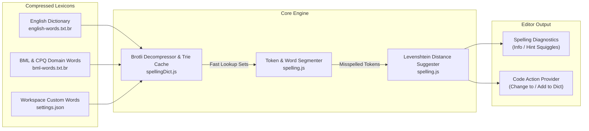
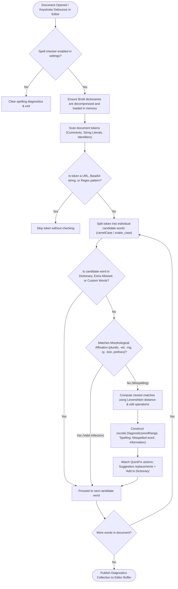
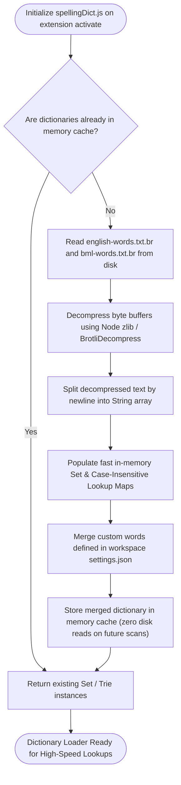
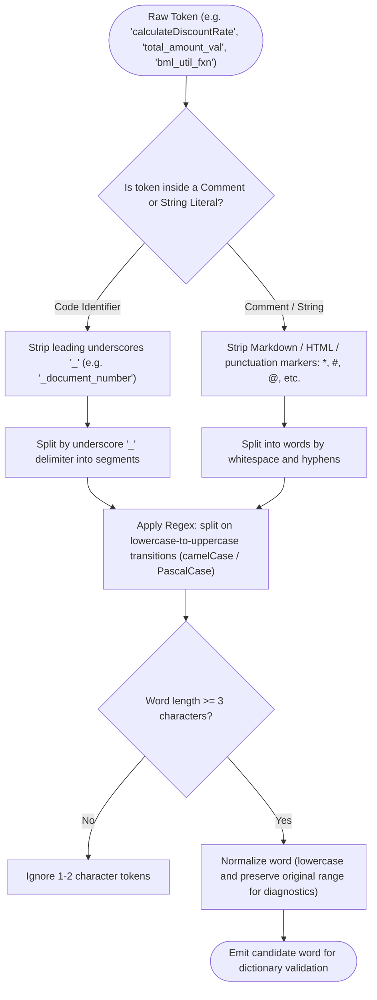
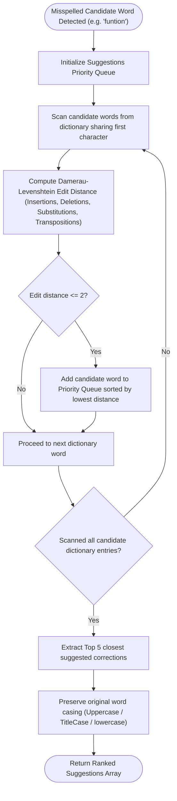
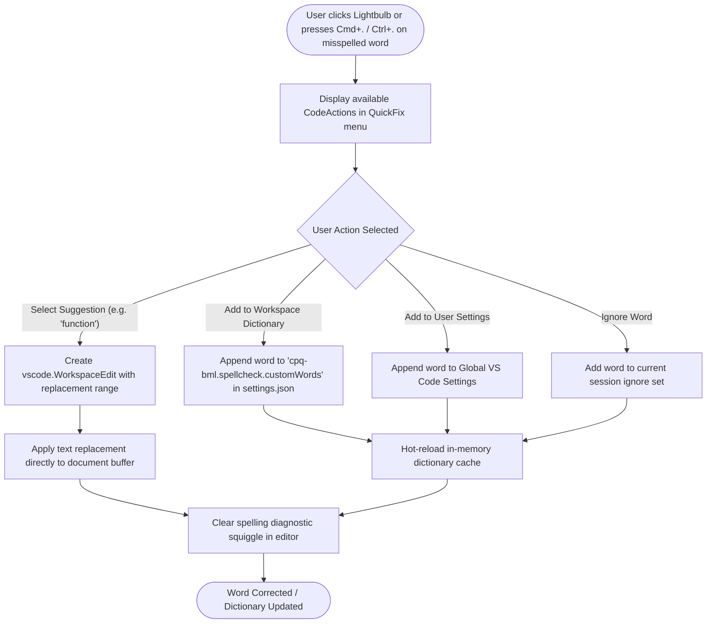

# Oracle CPQ BML Spell Check: Architecture, Lexicons & Control Flow Graphs

## Table of Contents
1. [Overview & High-Level Architecture](#1-overview--high-level-architecture)
2. [Document Spell Check Lifecycle (CFG 1)](#2-document-spell-check-lifecycle-cfg-1)
3. [Brotli Dictionary Loading & Caching Flow (CFG 2)](#3-brotli-dictionary-loading--caching-flow-cfg-2)
4. [Identifier & Comment Word Segmentation Flow (CFG 3)](#4-identifier--comment-word-segmentation-flow-cfg-3)
5. [Typo Detection & Levenshtein Suggestion Flow (CFG 4)](#5-typo-detection--levenshtein-suggestion-flow-cfg-4)
6. [Quick Fix & Custom Dictionary Addition Flow (CFG 5)](#6-quick-fix--custom-dictionary-addition-flow-cfg-5)
7. [Lexicons & Configuration Reference](#7-lexicons--configuration-reference)

---

## 1. Overview & High-Level Architecture

The **BML Spell Checker** is an offline, domain-aware spell checking engine designed specifically for Oracle CPQ developers. It validates words inside comments, string literals, and identifiers against both standard English and CPQ/BML domain dictionaries:



---

## 2. Document Spell Check Lifecycle (CFG 1)

This control flow graph shows how documents are scanned for spelling errors:



---

## 3. Brotli Dictionary Loading & Caching Flow (CFG 2)

Efficient startup initialization and memory caching of Brotli-compressed dictionary assets:



---

## 4. Identifier & Comment Word Segmentation Flow (CFG 3)

Breaks complex code symbols into natural language words:



---

## 5. Typo Detection & Levenshtein Suggestion Flow (CFG 4)

Computes top suggested corrections for misspelled words:



---

## 6. Quick Fix & Custom Dictionary Addition Flow (CFG 5)

Applies single-click corrections or adds words to the user/workspace dictionary:



---

## 7. Lexicons & Configuration Reference

| Lexicon Asset | Uncompressed / Compressed Size | Purpose |
| :--- | :--- | :--- |
| **`english-words.txt.br`** | 281 KB &rarr; 74.2 KB | Standard English vocabulary (~25,000+ words). |
| **`bml-words.txt.br`** | 38.5 KB &rarr; 12.3 KB | Oracle CPQ, BML built-ins, BMQL keywords, and domain terminology. |
| **Workspace Settings** | User-defined | Project-specific abbreviations, acronyms, and product codes. |

### Configuration Properties

| Setting Key | Type | Default | Description |
| :--- | :--- | :--- | :--- |
| `bml.spellcheck.enabled` | `Boolean` | `true` | Enables or disables live spell checking. |
| `bml.spellcheck.checkComments` | `Boolean` | `true` | Enables spell checking inside line (`//`) and block (`/* */`) comments. |
| `bml.spellcheck.checkStrings` | `Boolean` | `true` | Enables spell checking inside double-quoted string literals. |
| `bml.spellcheck.checkIdentifiers` | `Boolean` | `false` | Enables spell checking for variable and function names (split by camelCase/snake_case). |
| `bml.spellcheck.customWords` | `Array<String>` | `[]` | List of user-approved custom words. |
| `bml.spellcheck.minWordLength` | `Integer` | `3` | Minimum character length before a word is spell checked. |

---

## 8. Practical Usage Examples & Quick Fix Workflows

### Example 1: Smart Morphology In Action (Zero False Positives)

The spell checker automatically accepts regular inflections and compound prefixes without flagging them:

```javascript
// Accepted naturally via Smart Morphology (root word derived):
// • categories (plural of category)
// • recalculating (prefix 're-' + root 'calculate' + '-ing')
// • unformatted (prefix 'un-' + root 'format' + '-ed')
// • configurable (root 'configure' + '-able')
// • deployment (root 'deploy' + '-ment')
// • subdocumentKey (prefix 'sub-' + 'document' + 'key')
categoriesList = ["Enterprise", "MidMarket"];
recalculatingTotal = true;
isConfigurableItem = true;
```

---

### Example 2: Typo Detection & Lightbulb Quick Fix

#### Problematic Code:
```javascript
// SQUIGGLE ON: 'calclate', 'servcie', 'struture'
calclateDiscount = 0.15;
servcieStatus = "ACTIVE";
docStruture = dict();
```

#### Quick Fix Lightbulb Actions (`Ctrl+.` or `Cmd+.`):
* `calclate` &rarr; Select `"Change to 'calculate'"`
* `servcie` &rarr; Select `"Change to 'service'"`
* `struture` &rarr; Select `"Change to 'structure'"`

#### Corrected Code:
```javascript
calculateDiscount = 0.15;
serviceStatus = "ACTIVE";
docStructure = dict();
```

---

### Example 3: Adding Custom Workspace Terms

When a project uses custom company terms or model codes (e.g. `XPS9500`, `OptiPlex`, `SaaS`):

1. Put cursor on the flagged word.
2. Press `Ctrl+.` / `Cmd+.`.
3. Select `"Add 'SaaS' to workspace dictionary"`.
4. The term is automatically appended to `.vscode/settings.json`:

```json
{
  "cpqBml.spelling.userWords": [
    "saas",
    "xps9500",
    "optiplex"
  ]
}
```

