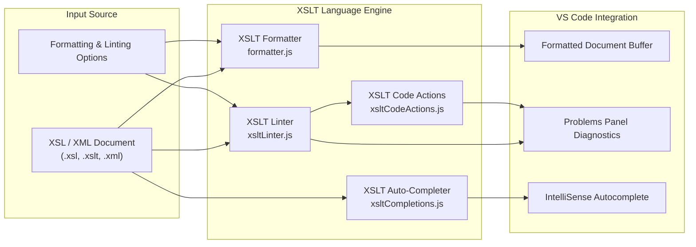
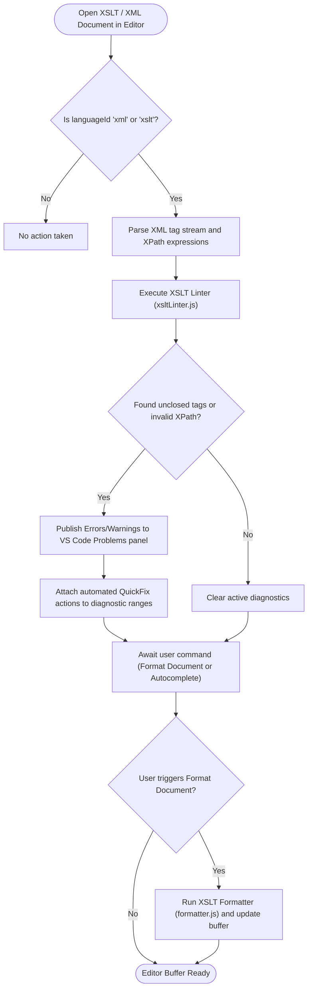
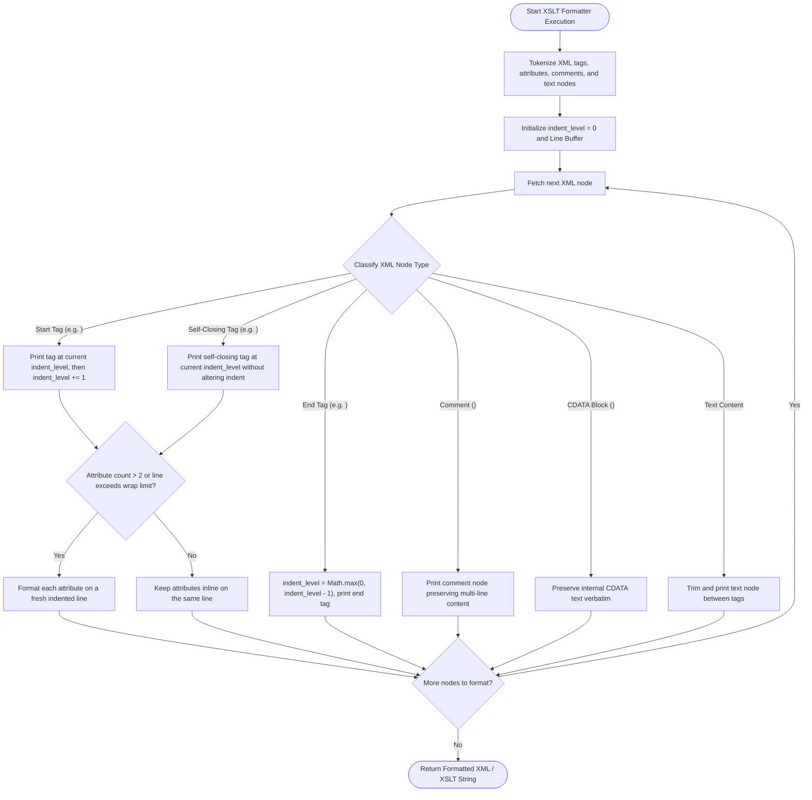
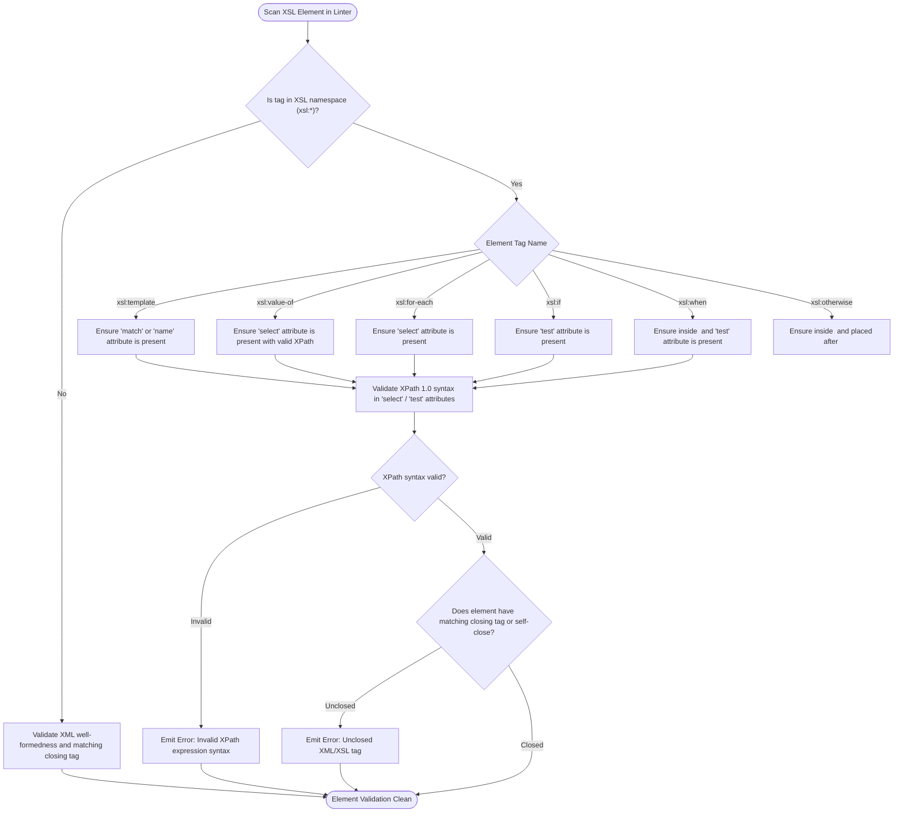
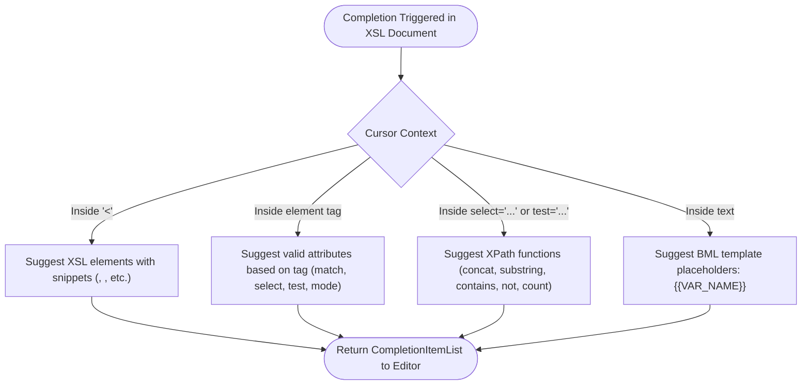
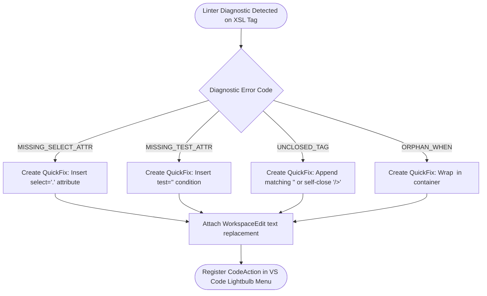

# Oracle CPQ XSLT & XML Subsystem: Architecture, Tools & Control Flow Graphs

## Table of Contents
1. [Overview & High-Level Architecture](#1-overview--high-level-architecture)
2. [XSLT Document Processing Lifecycle (CFG 1)](#2-xslt-document-processing-lifecycle-cfg-1)
3. [XSLT XML Formatter & Tag Indentation (CFG 2)](#3-xslt-xml-formatter--tag-indentation-cfg-2)
4. [XSLT Static Analysis & XPath Validation (CFG 3)](#4-xslt-static-analysis--xpath-validation-cfg-3)
5. [XSLT Tag & XPath Function Completions (CFG 4)](#5-xslt-tag--xpath-function-completions-cfg-4)
6. [XSLT Diagnostic Quick Fix Provider (CFG 5)](#6-xslt-diagnostic-quick-fix-provider-cfg-5)
7. [Supported XSL Elements & XPath Functions Catalog](#7-supported-xsl-elements--xpath-functions-catalog)
8. [Practical Usage Examples & Snippets](#8-practical-usage-examples--snippets)

---

## 1. Overview & High-Level Architecture

The **XSLT Subsystem** provides dedicated IDE capabilities for XSL stylesheets and XML templates used throughout Oracle CPQ (e.g. Doc Engine, Transaction XML, and BML `transformxml()` workflows). It includes an XML formatter, static syntax analyzer, autocomplete engine, and quick fix provider:



---

## 2. XSLT Document Processing Lifecycle (CFG 1)

This control flow graph shows how XSL/XML documents are validated, formatted, and analyzed in the editor:



---

## 3. XSLT XML Formatter & Tag Indentation (CFG 2)

Formats XML/XSL tags, aligns attributes, preserves CDATA, and handles self-closing tags:



---

## 4. XSLT Static Analysis & XPath Validation (CFG 3)

Validates required XSL attributes, template matching, and XPath expression syntax:



---

## 5. XSLT Tag & XPath Function Completions (CFG 4)

Provides intelligent suggestions for XSL elements, attributes, and XPath 1.0 built-in functions:



---

## 6. XSLT Diagnostic Quick Fix Provider (CFG 5)

Generates automated single-click Quick Fixes for common stylesheet errors:



---

## 7. Supported XSL Elements & XPath Functions Catalog

### Core XSL Elements
| Element | Required Attributes | Purpose |
| :--- | :--- | :--- |
| `<xsl:stylesheet>` | `version="1.0"`, `xmlns:xsl` | Root element of all XSL transformations. |
| `<xsl:template>` | `match` or `name` | Defines a template rule matching XML nodes. |
| `<xsl:value-of>` | `select` | Extracts and outputs the text value of an XML node. |
| `<xsl:for-each>` | `select` | Loops over an XML node-set matching an XPath expression. |
| `<xsl:if>` | `test` | Conditional block evaluated if test expression is true. |
| `<xsl:choose>` | _none_ | Multi-branch container for `<xsl:when>` and `<xsl:otherwise>`. |
| `<xsl:when>` | `test` | Evaluated branch inside `<xsl:choose>`. |
| `<xsl:otherwise>` | _none_ | Default fallback branch inside `<xsl:choose>`. |
| `<xsl:apply-templates>` | `select` (optional) | Applies template rules to children or selected nodes. |
| `<xsl:variable>` | `name`, `select` (optional) | Declares a local or global stylesheet variable. |
| `<xsl:param>` | `name` | Declares a parameter passed into a template. |
| `<xsl:with-param>` | `name`, `select` | Passes an argument to a called template. |
| `<xsl:call-template>` | `name` | Invokes a named template directly. |

### Built-in XPath 1.0 Functions
| Function | Return Type | Description |
| :--- | :--- | :--- |
| `concat(s1, s2, ...)` | `String` | Concatenates two or more strings together. |
| `substring(s, start, [len])` | `String` | Extracts a substring from a string. |
| `string-length(s)` | `Number` | Returns the character count of a string. |
| `contains(s, sub)` | `Boolean` | Returns true if string contains substring. |
| `starts-with(s, sub)` | `Boolean` | Returns true if string starts with substring. |
| `translate(s, from, to)` | `String` | Replaces characters in string. |
| `count(node-set)` | `Number` | Counts nodes in a node-set. |
| `position()` | `Number` | Returns 1-indexed position of current node in context. |
| `last()` | `Number` | Returns total count of nodes in current context. |
| `not(boolean)` | `Boolean` | Inverts a boolean condition. |
| `number(expr)` | `Number` | Converts expression into numeric float/integer. |
| `format-number(n, pattern)` | `String` | Formats a number with a custom decimal pattern. |

---

## 8. Practical Usage Examples & Snippets

### Example 1: Formatting an Oracle CPQ XSLT Template

#### Before Formatting:
```xml
<?xml version="1.0" encoding="utf-8"?>
<xsl:stylesheet version="1.0" xmlns:xsl="http://www.w3.org/1999/XSL/Transform">
<xsl:template match="/transaction">
<table border="1">
<tr><th>Item</th><th>Price</th></tr>
<xsl:for-each select="line_items/line">
<tr><td><xsl:value-of select="_part_number"/></td>
<td><xsl:value-of select="format-number(_price,'$#,##0.00')"/></td></tr>
</xsl:for-each>
</table>
</xsl:template>
</xsl:stylesheet>
```

#### After Formatting (`Shift+Alt+F`):
```xml
<?xml version="1.0" encoding="utf-8"?>
<xsl:stylesheet version="1.0" xmlns:xsl="http://www.w3.org/1999/XSL/Transform">
    <xsl:template match="/transaction">
        <table border="1">
            <tr>
                <th>Item</th>
                <th>Price</th>
            </tr>
            <xsl:for-each select="line_items/line">
                <tr>
                    <td>
                        <xsl:value-of select="_part_number" />
                    </td>
                    <td>
                        <xsl:value-of select="format-number(_price, '$#,##0.00')" />
                    </td>
                </tr>
            </xsl:for-each>
        </table>
    </xsl:template>
</xsl:stylesheet>
```

---

### Example 2: XSLT Autocompletion & XPath Snippets

* Typing `<xsl:` triggers auto-suggestions for all valid XSL elements with tab-stop snippets:
  * `<xsl:for-each select="$1">$0</xsl:for-each>`
  * `<xsl:choose><xsl:when test="$1">$2</xsl:when><xsl:otherwise>$0</xsl:otherwise></xsl:choose>`
* Inside `select="..."` attributes, typing `format` auto-completes `format-number(value, pattern)`.

---

### Example 3: Integration with BML `transformxml()`

In BML scripts, apply XSL transformations dynamically to convert raw XML transaction payloads:

```javascript
xmlInput = "<transaction><line_items><line><_part_number>XPS-15</_part_number><_price>1499.00</_price></line></line_items></transaction>";
xslTemplate = readxml("transaction_table_template");

// Execute XSL transformation in BML
htmlTableOutput = transformxml(xmlInput, xslTemplate);
return htmlTableOutput;
```

